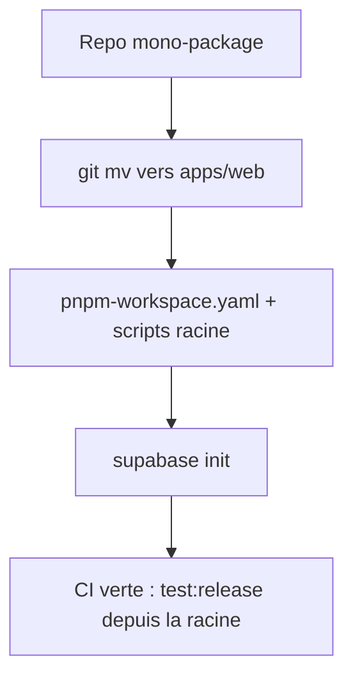

# Instruction: Fondations monorepo + tooling Supabase

## Architecture projection

> Tree of the final files. ✅ create · ✏️ modify · ❌ delete

```txt
.
├── pnpm-workspace.yaml                       ✅ apps/web (+ apps/api en phase 4)
├── package.json                              ✏️ scripts racine → délèguent à pnpm --filter web
├── .env.example                              ✅ VITE_SUPABASE_URL / VITE_SUPABASE_ANON_KEY (vides)
├── supabase/
│   ├── config.toml                           ✅ supabase init (dev local via CLI)
│   └── migrations/                           ✅ vide, accueillera le schéma (phase 2)
├── apps/
│   └── web/                                  ✅ déplacement intégral de l'app existante
│       ├── package.json                      ✏️ name: "web", scripts inchangés
│       ├── index.html / vite.config.ts       ✏️ déplacés tels quels
│       ├── tsconfig*.json                    ✏️ chemins ajustés à apps/web
│       ├── src/ …                            ✏️ déplacé, contenu inchangé
│       ├── e2e/ + playwright.config.ts       ✏️ webServer → pnpm --filter web dev
│       └── components.json                   ✏️ déplacé
├── scripts/
│   ├── contrast-audit.mjs                    ✏️ chemin ../src/index.css → ../apps/web/src/index.css
│   ├── export-probe.mjs / visual-probe.mjs   ✏️ ports/commandes dev ajustés
│   └── validate-export.mjs                   (inchangé, standalone)
├── Makefile                                  ✏️ cibles pointent les scripts racine
└── .github/workflows/
    └── quality.yml                           ✏️ refonte : jobs séparés web / db / e2e + concurrency
```

## User Journey



## Tasks to do

### `1)` Déplacer l'app dans `apps/web`

> Aucun contenu modifié, uniquement des chemins

1. Créer `pnpm-workspace.yaml` avec `packages: ["apps/*"]`
2. `git mv` de `src`, `e2e`, `public`, `index.html`, `vite.config.ts`, `tsconfig*.json`, `components.json`, `playwright.config.ts` vers `apps/web/`
3. Renommer `apps/web/package.json` en `"web"` et y déplacer toutes les deps actuelles

### `2)` Réparer les références de chemins

> Tout ce qui pointait `src/` depuis la racine

1. `e2e/helpers.ts` : imports `../src/types` → `../src/types` (désormais relatif à `apps/web/e2e`, vérifier)
2. `scripts/contrast-audit.mjs` : `../src/index.css` → `../apps/web/src/index.css`
3. `playwright.config.ts` : webServer `pnpm --filter web dev --port 5199`
4. `tsconfig.tools.json` : includes `e2e/**`, `scripts/**` depuis `apps/web`

### `3)` Scripts racine

> La racine reste le point d'entrée unique

1. `package.json` racine : `dev`/`build`/`lint`/`typecheck`/`test*` → `pnpm --filter web <script>`
2. Mettre à jour le `Makefile` et `AGENTS.md` (section Commands + Architecture)

### `4)` CI cible : jobs séparés et prête pour la suite

> Structure finale posée dès maintenant — chaque phase suivante ne fait que remplir sa case

1. `concurrency: { group: <workflow>-<ref>, cancel-in-progress: true }` — annule les runs obsolètes
2. Job `web` : install workspace (cache pnpm) → `pnpm --filter web test:unit && pnpm typecheck && pnpm lint && pnpm --filter web build`
3. Job `e2e` : playwright install chromium → `pnpm test:e2e` + audits (`contrast`, `scale`), artifacts en cas d'échec
4. Job `db` : `supabase start` dans le runner → `supabase migration up` (vérifie que les migrations s'appliquent ; les tests RLS viendront ici en phase 2)
5. Emplacement réservé documenté pour un futur job `api` (phase 4) et les secrets (`SUPABASE_*`, `STRIPE_*` — GitHub Secrets uniquement, jamais dans le repo)
6. Vérifier le réglage GitHub : `main` exige la CI verte (branch protection)

### `5)` Initialiser Supabase local

> Tooling uniquement, aucun schéma

1. `supabase init` à la racine (config.toml, migrations/)
2. Vérifier `supabase start` local OK (Studio accessible)
3. Créer `.env.example` avec `VITE_SUPABASE_URL=` et `VITE_SUPABASE_ANON_KEY=` ; documenter dans `AGENTS.md`

## Test acceptance criteria

| Task | Acceptance criteria                                                                                |
| ---- | -------------------------------------------------------------------------------------------------- |
| 1    | `pnpm dev` depuis la racine lance l'app exactement comme avant (même UI, mêmes projets IDB)        |
| 2    | `pnpm test:release` (unit + typecheck + lint + build + e2e + audits) est vert depuis la racine     |
| 3    | La CI passe avec les jobs `web`, `e2e`, `db` visibles séparément ; un second push sur la même branche annule le run précédent |
| 4    | Le job `db` prouve que `supabase migration up` s'applique sur une base vierge                      |
| 5    | `supabase start` démarre un stack local ; `.env.example` documente les deux variables `VITE_*`     |
