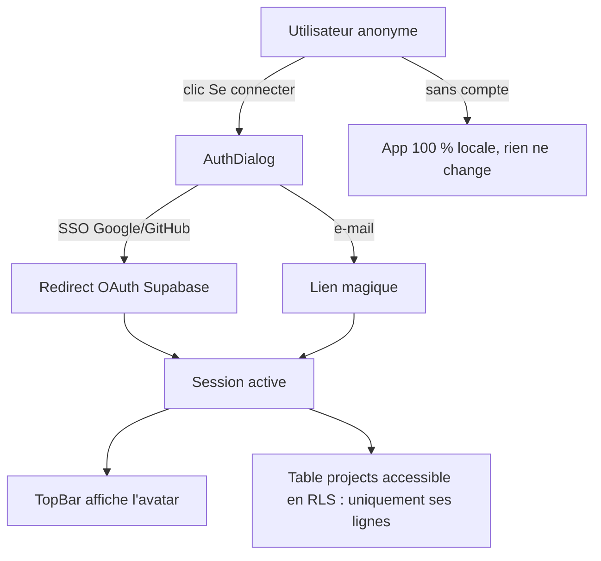

# Instruction: Auth SSO + schéma DB + RLS

## Architecture projection

> Tree of the final files. ✅ create · ✏️ modify · ❌ delete

```txt
.
├── supabase/
│   └── migrations/
│       └── 0001_projects.sql                 ✅ table projects + RLS + policies + index user_id
├── apps/web/
│   ├── .env.example                          ✏️ VITE_SUPABASE_URL / VITE_SUPABASE_ANON_KEY documentés
│   ├── package.json                          ✏️ + @supabase/supabase-js
│   └── src/
│       ├── lib/
│       │   ├── supabase.ts                   ✅ client (absent si env manquantes → mode local)
│       │   └── auth.ts                       ✅ helpers signInWithOAuth / signInWithOtp / signOut
│       ├── stores/
│       │   └── auth.store.ts                 ✅ session, user, status (zustand, init via onAuthStateChange)
│       ├── components/
│       │   ├── auth-dialog/
│       │   │   └── AuthDialog.tsx            ✅ SSO Google/GitHub + magic link e-mail
│       │   └── toolbar/
│       │       └── TopBar.tsx                ✏️ bouton compte (avatar si connecté, "Se connecter" sinon)
│       ├── types/
│       │   └── database.types.ts             ✅ généré par supabase gen types (ne pas éditer)
│       └── stores/ui.store.ts                ✏️ flag showAuthDialog + setter
└── supabase/tests/
    └── rls_projects.test.mjs                 ✅ 2 users locaux : A ne lit/écrit jamais les lignes de B
```

## User Journey



## Wireframe

```txt
┌──────────────────────────────────────────────┐
│  Connexion à ScreenForge                 [x] │  (1)
│                                              │
│  ┌────────────────────────────────────────┐  │
│  │  Continuer avec Google                 │  │  (2)
│  └────────────────────────────────────────┘  │
│  ┌────────────────────────────────────────┐  │
│  │  Continuer avec GitHub                 │  │  (3)
│  └────────────────────────────────────────┘  │
│  ────────────────── ou ──────────────────    │
│  ┌────────────────────────────────────────┐  │
│  │  Adresse e-mail                        │  │  (4)
│  └────────────────────────────────────────┘  │
│  [ Recevoir un lien magique ]                │  (5)
│                                              │
│  Sans compte, tout reste local à ce          │  (6)
│  navigateur.                                 │
└──────────────────────────────────────────────┘

(1) Dialog existant (pattern ui.store flag + composant ui/dialog)
(2) signInWithOAuth({ provider: 'google' })
(3) signInWithOAuth({ provider: 'github' })
(4) Input e-mail pour magic link
(5) signInWithOtp — état de confirmation "vérifie ta boîte"
(6) Mention rassurante : le compte est optionnel
```

## Tasks to do

### `1)` Migration SQL : table `projects` + RLS

> Une ligne = un projet cloud ; jamais lisible par un autre user

1. Table `projects` : `id uuid pk default gen_random_uuid()`, `user_id uuid references auth.users not null`, `name text not null`, `data jsonb not null`, `created_at timestamptz default now()`, `updated_at timestamptz default now()`
2. `enable row level security` + policies `to authenticated` : select/insert/update/delete avec `(select auth.uid()) = user_id` (insert/update en `with check`)
3. Index btree sur `user_id`
4. Grant minimal : `authenticated` uniquement, rien pour `anon`

### `2)` Client Supabase côté web

> Le client n'existe que si les env sont présentes — sinon mode local pur

1. `lib/supabase.ts` : `createClient(VITE_SUPABASE_URL, VITE_SUPABASE_ANON_KEY)` exporté nullable
2. `lib/auth.ts` : wrappers OAuth Google/GitHub, OTP e-mail, signOut
3. Script `gen:types` : `supabase gen types typescript --local > src/types/database.types.ts`, ajouté à la CI

### `3)` Store auth + dialog de connexion

> Pattern existant : flag ui.store + Dialog lazy dans Overlays()

1. `stores/auth.store.ts` : `session`, `user`, `status: 'unknown'|'signed-out'|'signed-in'`, init par `onAuthStateChange`
2. `components/auth-dialog/AuthDialog.tsx` selon le wireframe (Button, Input, Dialog des primitives existantes)
3. Flag `showAuthDialog` dans `ui.store` ; montage lazy dans `Overlays()` ; ouverture depuis `TopBar` et `lib/commands.ts`

### `4)` TopBar : identité

> Un seul point d'entrée compte

1. Bouton "Se connecter" (ghost) si `signed-out`, avatar + menu (Dropdown : e-mail, Se déconnecter) si `signed-in`
2. Si env Supabase absentes : le bouton n'apparaît pas du tout

### `5)` Test RLS

> Le garde-fou non contournable par l'IA

1. Script `supabase/tests/rls_projects.test.mjs` contre le stack local : user A insère un projet, user B ne peut ni le lire, ni le modifier, ni le supprimer ; anonyme ne peut rien faire
2. Intégré à `pnpm test` (skip gracieux si le stack local n'est pas démarré)

## Test acceptance criteria

| Task | Acceptance criteria                                                                                            |
| ---- | -------------------------------------------------------------------------------------------------------------- |
| 1    | `supabase migration up` applique le schéma ; toute requête `anon` sur `projects` ne retourne rien              |
| 2    | Sans variables d'env, l'app se comporte exactement comme aujourd'hui (aucune trace d'UI auth)                  |
| 3    | Connexion Google et GitHub fonctionnelles en local ; après redirect, la TopBar affiche l'identité              |
| 4    | Le magic link e-mail aboutit à une session active ; "Se déconnecter" revient à l'état anonyme sans perte locale |
| 5    | Le test RLS prouve qu'un user B ne peut pas lire/modifier/supprimer les projets du user A                      |
| 6    | `database.types.ts` est régénéré en CI et toute divergence casse le typecheck                                  |

## Vérifié

- **1** — `supabase migration up` applique `20260807183549_projects.sql` ; le CLI impose `<horodatage>_nom.sql`, d'où le nom réel au lieu de `0001_projects.sql`.
- **2** — sans `.env`, aucun bouton de compte dans la barre du haut et aucun `@supabase/supabase-js` dans `dist/` (`grep GoTrueClient` sur les 13 assets : rien). Avec `.env`, le SDK part dans son propre morceau de 204 Ko et `main` ne grossit que de 1,4 Ko.
- **4** — lien magique de bout en bout sur le stack local : `POST /auth/v1/otp` → 200, message capté dans Mailpit, `verify` suivi, la barre du haut affiche `Connecté : maxime@screenforge.test`, le fragment de l'URL est consommé. Déconnexion : retour à « Se connecter », projet local intact.
- **5** — `pnpm run test:rls` : 7 tests verts.
- **6** — la CI régénère les types et casse sur `git diff --exit-code`.

## Reste bloqué

- **3** — Google et GitHub demandent la création d'applications OAuth dans la Google Cloud Console et sur GitHub, sous l'identité du propriétaire du produit. Le code des deux fournisseurs est en place (`signInWithProvider`) et ne sera vérifiable qu'une fois les deux jeux `client_id`/`client_secret` posés dans `supabase/config.toml` et dans les secrets du projet distant.

## Écarts assumés

- **Task 4** prévoyait « avatar + menu (Dropdown : e-mail, Se déconnecter) ». L'entrée de compte est une action secondaire simple : « Se déconnecter », avec l'adresse dans son infobulle. Sous `TOP_BAR_COMPACT_WIDTH` les actions secondaires se replient déjà dans un `Dropdown`, et un menu dans un menu n'y tient pas — c'est la même raison qui fait tomber le sous-menu de modèle d'iPhone dans la forme repliée.
