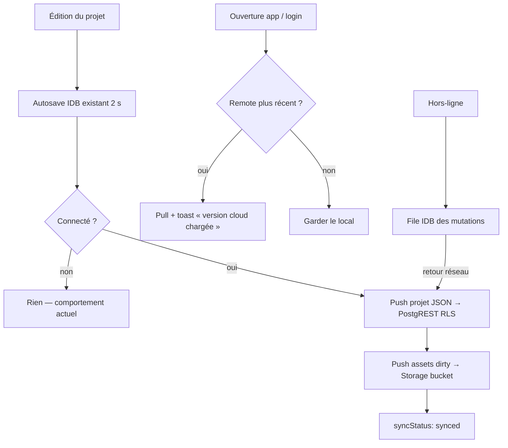

# Instruction: Sync cloud (projets + assets)

> **Amendée le 2026-08-07.** La sync n'est plus un acquis du compte : elle est
> l'add-on **Cloud** à 39 $/an de
> [`pricing.md`](../2026_08_06_offre-commerciale/pricing.md), et c'est la seule
> fonction du produit qui consomme du serveur tous les mois — donc la seule qui
> justifie un paiement récurrent. Un compte Licence est un compte **local**.
>
> Cette phase construit la mécanique ; la porte qui la garde est posée en
> [phase 5](./phase-5.md) (`middleware/cloud.ts` côté API, `sync.ts` qui ne
> démarre pas sans le droit). Deux conséquences ici : le `C{Connecté ?}` du
> parcours ci-dessous se lit désormais **« droit cloud actif ? »**, et la sortie
> `non` reste exactement le comportement actuel — aucune tentative réseau, aucun
> `syncStatus`, jamais un état d'erreur pour une fonction que l'utilisateur n'a
> pas achetée.
>
> Les phases 3 et 4 peuvent donc être développées dans l'ordre inverse sans
> conflit : tant que la vente n'existe pas, le droit est simplement absent.

## Architecture projection

> Tree of the final files. ✅ create · ✏️ modify · ❌ delete

```txt
supabase/
└── migrations/
    └── 0002_storage.sql                        ✅ bucket "assets" privé + policies storage par user
apps/web/src/
├── lib/
│   ├── sync.ts                                 ✅ orchestrateur push/pull, last-write-wins sur updatedAt
│   ├── sync-queue.ts                           ✅ file offline (IDB) des mutations en attente
│   ├── storage.ts                              ✏️ le funnel autosave notifie sync.ts après commitProject
│   └── assets.ts                               ✏️ résolution : IDB local d'abord, Storage en fallback
├── stores/
│   └── ui.store.ts                             ✏️ syncStatus: 'synced'|'syncing'|'offline'|'error'
├── components/
│   └── toolbar/TopBar.tsx                      ✏️ indicateur discret de syncStatus à côté du compte
└── e2e/
    └── sync.spec.ts                            ✅ sync inter-contextes (2 navigateurs simulés)
```

## User Journey



## Tasks to do

### `1)` Bucket assets + policies Storage

> Binaires hors DB, isolés par utilisateur

1. Migration : bucket privé `assets`, objets nommés `{user_id}/{asset_id}`
2. Policies `storage.objects` : un user ne lit/écrit que sous son préfixe `auth.uid()::text`
3. Jamais de base64 en Postgres — la colonne `projects.data` ne contient que des `assetId`

### `2)` Push : brancher sync.ts sur le funnel autosave

> Un seul point d'entrée — là où `commitProject` réussit déjà

1. `storage.ts` notifie `sync.ts` après chaque commit local (projet + `readDirtyAssets`)
2. Upsert `projects.data` (JSON complet) via supabase-js ; l'updatedAt remote = `project.updatedAt`
3. Upload des assets dirty vers Storage puis `markAssetsClean`

### `3)` Pull : last-write-wins à l'ouverture

> Simple et prévisible — le conflit fin est explicitement hors scope v1

1. Au login / au démarrage connecté : comparer `updatedAt` local vs remote par projet
2. Remote plus récent → hydrater IDB + registry assets depuis Storage, toast d'info
3. Remote absent → push initial du projet local

### `4)` File offline

> Aucune perte quand le réseau tombe

1. `sync-queue.ts` : mutations en attente persistées en IDB (store dédié)
2. Rejeu séquentiel au retour réseau / à la prochaine session, `syncStatus: 'offline'` affiché entre-temps

### `5)` Indicateur de sync

> Discret, jamais bloquant

1. `syncStatus` dans `ui.store` ; pastille dans la TopBar (synced / syncing / offline / error)
2. Erreur de sync = toast avec action "Réessayer", jamais de blocage de l'édition

### `6)` E2E inter-contextes

> La preuve de la valeur : deux navigateurs, un même compte

1. `e2e/sync.spec.ts` : contexte A crée un projet et le modifie ; contexte B (même user, stack local) le voit après pull
2. Coupure réseau simulée : modification offline, reconnexion, le remote finit à jour

## Test acceptance criteria

| Task | Acceptance criteria                                                                                          |
| ---- | ------------------------------------------------------------------------------------------------------------ |
| 1    | Un objet Storage d'un user A est inaccessible à un user B (policy vérifiée comme en phase 2)                 |
| 2    | Modifier un screenshot connecté → la ligne `projects` remote porte le nouvel `updatedAt` en moins de 5 s     |
| 3    | Ouvrir l'app dans un second navigateur avec le même compte → le projet et ses images apparaissent            |
| 4    | `projects.data` ne contient aucune data URL (audit : seuls des `assetId` courts)                             |
| 5    | Couper le réseau, éditer, reconnecter → la modification finit dans le cloud sans action de l'utilisateur     |
| 6    | Déconnecté ou sans env : l'autosave IDB actuel fonctionne exactement comme avant (zéro régression e2e)       |

## Vérifié

- **1** — `pnpm run test:rls` : 15 tests verts, dont les 8 de
  `supabase/tests/rls_storage.test.mjs`. B ne télécharge pas, ne liste pas,
  n'écrit pas, n'écrase pas et ne supprime pas sous le préfixe de A ; un client
  sans session n'obtient rien. Le huitième est le contre-test — B dépose bien
  chez lui, sans quoi quatre policies qui refusent tout passeraient les sept
  premiers en cassant la fonctionnalité en silence.
- **2** — `e2e/sync.spec.ts` : après le renommage et l'import d'une image, la
  ligne distante existe sous son nouveau nom avant la borne de 7 s (2 s
  d'autosave local, puis le push).
- **3** — même test : un second contexte de navigateur, profil et IndexedDB
  neufs, même session, retrouve le nom du projet, sa couche image, et une data
  URL résolvable pour celle-ci — donc le binaire est bien redescendu de Storage.
- **4** — assertion `not.toContain('data:image')` sur `projects.data`. Elle a
  échoué au premier jet et a trouvé un vrai défaut : les vignettes d'écran
  partaient dans la colonne. Corrigé en réutilisant `projectWithoutThumbnails`,
  que le fichier portable appliquait déjà.
- **5** — même fichier : hors ligne, l'ajout d'une couche fait passer le témoin
  à « Hors ligne », et le retour du réseau seul fait avancer l'`updated_at`
  distant. Aucune action de l'utilisateur.
- **6** — `pnpm run test:e2e` sans `.env` : 71 passés, 3 sautés (les deux tests
  de sync se sautent d'eux-mêmes en constatant l'absence de compte). Avec
  `.env` : 73 passés, 1 sauté. Build sans env : aucun des fichiers de `dist/`
  ne contient `GoTrueClient`.

## Écarts assumés

- **Task 4** prévoyait « une file IDB des mutations en attente ». `sync-queue.ts`
  persiste un accusé de réception — `pushedUpdatedAt` plus la liste des
  `assetId` confirmés — et non un journal. Le modèle de sync est le document
  entier en dernier-écrivain-gagne : rejouer une suite de mutations périmées
  par-dessus ne reconstruirait rien de cohérent, alors que le document complet
  est déjà persisté par l'autosave. Ce qui manquait pour survivre à un
  rechargement hors-ligne était de savoir jusqu'où le serveur avait été mis à
  jour, et c'est exactement ce que ces deux champs disent.
- La base IndexedDB est séparée (`screenforge-sync`) plutôt qu'un magasin de
  plus dans `screenforge`. Un état de synchronisation se reconstruit tout seul ;
  faire monter la version du schéma qui porte les projets de l'utilisateur pour
  le loger ferait risquer son travail à une migration ratée.
- **Task 5** plaçait la pastille « à côté du compte ». Elle vit dans le segment
  Projet de la barre du haut, juste après l'état d'enregistrement : ce n'est pas
  une action mais le même fait dit un cran plus loin — « Enregistré ·
  Synchronisé » — et qui cherche où est son travail regarde un seul endroit.
- `lib/supabase.ts` fixe un `storageKey` explicite (`screenforge-auth`) au lieu
  du `sb-{hôte}-auth-token` que le SDK dérive de l'URL. C'est ce qui rend la
  session semable par `e2e/sync.spec.ts`, faute de pouvoir automatiser un lien
  magique reçu par courrier — et l'emplacement cesse de changer avec l'hôte.
- Les vignettes d'écran ne montent pas dans le cloud : cache de rendu, régénéré
  au premier rendu du canevas côté receveur.
- La sync ne porte que le projet ouvert. L'interface n'a pas de sélecteur de
  projets, donc un compte qui a plusieurs lignes distantes n'en voit qu'une :
  celle de son `id` local, ou la plus récente quand le projet local vient d'être
  créé et n'a jamais été modifié. C'est la condition stricte du second
  navigateur, et le seul cas où un document en remplace un autre sans demande
  explicite.
- Un binaire qu'un projet cesse de référencer reste dans Storage. Le balayage
  local (`sweepAssets`) n'a pas d'équivalent distant, et un objet orphelin ne
  coûte que de la place dans l'espace de son propre propriétaire.

## Reste hors périmètre

- La porte commerciale. `syncAllowed()` dit aujourd'hui « instance configurée et
  session ouverte » ; la phase 5 y ajoutera « et le droit `cloud` est actif ».
  C'est le seul endroit à resserrer, et la sortie `non` est déjà exactement le
  comportement d'un compte sans cloud : aucune requête, aucun `syncStatus`.
