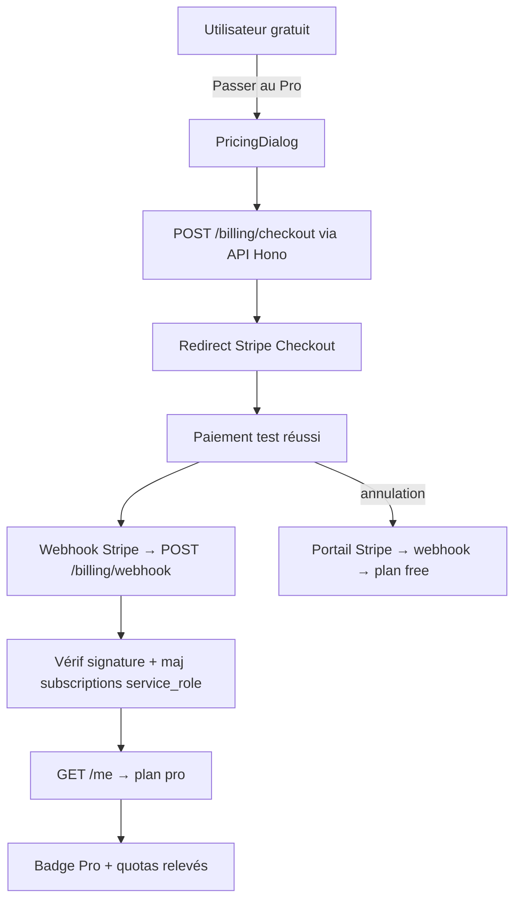

# Instruction: Backend Hono + billing Stripe

## Architecture projection

> Tree of the final files. ✅ create · ✏️ modify · ❌ delete

```txt
.
├── apps/
│   └── api/                                    ✅ nouveau package workspace
│       ├── package.json                        ✅ "api" : hono, stripe, @supabase/supabase-js, zod
│       ├── tsconfig.json                       ✅
│       ├── .env.example                        ✅ SUPABASE_URL, SUPABASE_SERVICE_ROLE_KEY, STRIPE_*
│       └── src/
│           ├── index.ts                        ✅ app Hono, export des types AppType (pour hc)
│           ├── middleware/
│           │   └── auth.ts                     ✅ vérif JWT Supabase via auth.getUser(token)
│           └── routes/
│               ├── health.ts                   ✅ GET /health
│               ├── me.ts                       ✅ GET /me → plan courant
│               └── billing.ts                  ✅ POST /billing/checkout, /billing/portal, /billing/webhook
├── supabase/
│   └── migrations/
│       └── 0003_subscriptions.sql              ✅ table subscriptions + RLS (lecture seule user)
├── apps/web/src/
│   ├── lib/
│   │   ├── api.ts                              ✅ client hc<AppType> typé depuis apps/api
│   │   └── plans.ts                            ✅ définition des plans (id, prix, limites)
│   └── components/
│       ├── pricing-dialog/
│       │   └── PricingDialog.tsx               ✅ Gratuit vs Pro → redirect Stripe Checkout
│       └── toolbar/TopBar.tsx                  ✏️ badge plan quand connecté
└── .github/workflows/quality.yml               ✏️ typecheck + tests de apps/api
```

## User Journey



## Tasks to do

### `1)` Squelette `apps/api`

> Le plus petit backend déployable qui vérifie l'identité

1. Package Hono + route `GET /health`
2. Middleware auth : header `Authorization: Bearer <jwt>` → `supabase.auth.getUser(token)` → 401 sinon
3. `GET /me` retourne `{ userId, plan }` depuis `subscriptions`
4. Client web `lib/api.ts` : `hc<AppType>` — le type traverse la frontière

### `2)` Table `subscriptions`

> Écrite uniquement par le backend (service_role), lue par l'user

1. Colonnes : `user_id uuid pk references auth.users`, `stripe_customer_id`, `stripe_subscription_id`, `plan text`, `status text`, `current_period_end timestamptz`
2. RLS : policy `select` own-row `to authenticated` uniquement — aucun insert/update/delete pour le rôle authenticated

### `3)` Checkout + portail

1. `POST /billing/checkout { priceId }` → session Stripe Checkout (success/cancel URLs) — client : redirect
2. `POST /billing/portal` → session Stripe Billing Portal
3. `PricingDialog.tsx` (primitives existantes) : plans depuis `lib/plans.ts`, CTA unique "Passer au Pro"

### `4)` Webhook Stripe

> Le seul chemin qui fait passer un user en Pro

1. `POST /billing/webhook` : vérif signature (`constructEventAsync`), idempotence sur `event.id`
2. `checkout.session.completed` / `customer.subscription.updated|deleted` → upsert `subscriptions` via service_role
3. Tests unitaires : payload signé de fixture, rejeu du même event = pas de double effet

### `5)` Déploiement Railway

1. Service Railway depuis `apps/api` (railpack/Dockerfile minimal), variables d'env en secrets
2. Webhook Stripe pointé sur l'URL publique ; `stripe listen` documenté pour le dev local
3. CI : nouveau job `api` (typecheck + tests unitaires) dans l'emplacement réservé en phase 1, + grep CI vérifiant que `service_role` n'apparaît pas dans `apps/web`

## Test acceptance criteria

| Task | Acceptance criteria                                                                                       |
| ---- | --------------------------------------------------------------------------------------------------------- |
| 1    | `GET /me` sans token → 401 ; avec le JWT d'un user → son plan ; `hc` refuse à la compile un champ inconnu |
| 2    | Un user authentifié ne peut pas écrire dans `subscriptions` (test RLS)                                    |
| 3    | Achat en mode test Stripe → `subscriptions.plan = 'pro'` sans rechargement manuel ; badge Pro visible     |
| 4    | Rejouer le même webhook deux fois → une seule transition d'état                                           |
| 5    | Résiliation via le portail → retour au plan gratuit à la fin de période                                   |
| 6    | La clé `service_role` n'apparaît nulle part dans `apps/web` (grep CI)                                     |
