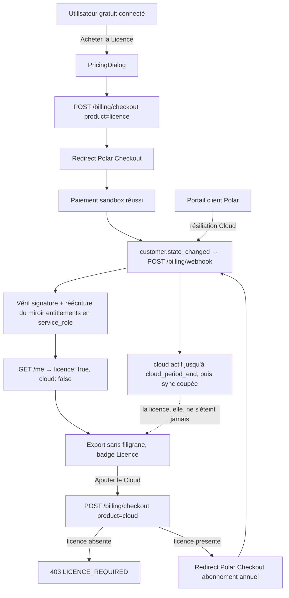

# Instruction: Backend Hono + vente via Polar (Merchant of Record)

> **Réécrite le 2026-08-07.** La version initiale vendait un abonnement Pro
> mensuel via Stripe direct. [`pricing.md`](../2026_08_06_offre-commerciale/pricing.md)
> a remplacé ce modèle par une Licence à 49 $ payée une fois plus un add-on Cloud
> à 39 $/an, et a tranché pour un Merchant of Record dès la première vente.

## Architecture projection

> Tree of the final files. ✅ create · ✏️ modify · ❌ delete

```txt
.
├── apps/
│   └── api/                                    ✅ nouveau package workspace
│       ├── package.json                        ✅ "api" : hono, @polar-sh/sdk, @supabase/supabase-js, zod
│       ├── tsconfig.json                       ✅
│       ├── .env.example                        ✅ SUPABASE_URL, SUPABASE_SERVICE_ROLE_KEY, POLAR_*
│       └── src/
│           ├── index.ts                        ✅ app Hono, export des types AppType (pour hc)
│           ├── middleware/
│           │   └── auth.ts                     ✅ vérif JWT Supabase via auth.getUser(token)
│           ├── entitlements.ts                 ✅ projection customer state → droits (licence, cloud)
│           └── routes/
│               ├── health.ts                   ✅ GET /health
│               ├── me.ts                       ✅ GET /me → droits courants
│               └── billing.ts                  ✅ POST /billing/checkout, /billing/portal, /billing/webhook
├── supabase/
│   └── migrations/
│       └── 0003_entitlements.sql               ✅ table entitlements + RLS (lecture seule user)
├── apps/web/src/
│   ├── lib/
│   │   ├── api.ts                              ✅ client hc<AppType> typé depuis apps/api
│   │   └── plans.ts                            ✅ les trois paliers (id produit Polar, prix, droits)
│   └── components/
│       ├── pricing-dialog/
│       │   └── PricingDialog.tsx               ✅ Gratuit / Licence / Cloud → redirect Polar Checkout
│       └── toolbar/TopBar.tsx                  ✏️ badge du palier quand connecté
└── .github/workflows/quality.yml               ✏️ typecheck + tests de apps/api
```

## User Journey



## Le modèle de droits

Deux droits indépendants, jamais un « plan » :

| Droit     | Origine                              | Forme                                    | S'éteint |
| --------- | ------------------------------------ | ---------------------------------------- | -------- |
| `licence` | achat unique du produit Licence      | perpétuel, sans date de fin              | seulement sur remboursement |
| `cloud`   | abonnement annuel au produit Cloud   | actif jusqu'à `cloud_period_end`         | à la fin de période après résiliation |

Une colonne `plan text` ne peut pas porter les deux : « a payé une fois, et est
abonné depuis mars » n'est pas une valeur d'énumération. C'est la raison pour
laquelle la table `subscriptions` du plan initial devient `entitlements`.

**La règle « le Cloud exige la Licence » vit à deux endroits, volontairement.**
Au checkout, pour donner une erreur lisible avant le paiement. Et à la
projection, parce qu'un achat effectué depuis Polar sans passer par notre
checkout contournerait le premier contrôle — le miroir n'accorde jamais `cloud`
à un compte sans `licence`, quoi qu'en dise la source.

## Tasks to do

### `1)` Squelette `apps/api`

> Le plus petit backend déployable qui vérifie l'identité

1. Package Hono + route `GET /health`
2. Middleware auth : header `Authorization: Bearer <jwt>` → `supabase.auth.getUser(token)` → 401 sinon
3. `GET /me` retourne `{ userId, licence: boolean, cloud: boolean, cloudPeriodEnd: string | null }` depuis `entitlements`
4. Client web `lib/api.ts` : `hc<AppType>` — le type traverse la frontière

### `2)` Table `entitlements`

> Un miroir des droits, écrit uniquement par le backend (service_role), lu par l'user

1. Colonnes : `user_id uuid pk references auth.users`, `polar_customer_id text`, `licence_granted_at timestamptz null`, `cloud_status text null`, `cloud_period_end timestamptz null`, `updated_at timestamptz`
2. RLS : policy `select` own-row `to authenticated` uniquement — aucun insert/update/delete pour le rôle `authenticated`
3. `licence_granted_at` n'est jamais remis à `null` par une résiliation Cloud — seul un remboursement de la Licence l'efface

### `3)` Checkout + portail client

1. `POST /billing/checkout { product: 'licence' | 'cloud' }` → session Polar Checkout (success URL), `customer_external_id` = `user.id` Supabase — c'est ce qui relie le client Polar au compte sans table de correspondance à tenir
2. `product: 'cloud'` sans `licence_granted_at` → **403 `LICENCE_REQUIRED`**, aucune session créée
3. `POST /billing/portal` → session du portail client Polar (factures, moyen de paiement, résiliation)
4. `PricingDialog.tsx` (primitives existantes) : les trois paliers depuis `lib/plans.ts`, le Cloud désactivé avec sa raison tant que la Licence n'est pas acquise

### `4)` Webhook : projeter l'état, ne pas le reconstituer

> Le seul chemin qui accorde un droit

1. `POST /billing/webhook` : validation de signature via le SDK Polar (spec Standard Webhooks), idempotence sur l'id d'événement
2. S'abonner à **`customer.state_changed`** : Polar y sert les abonnements actifs et les bénéfices accordés du client en un objet. La projection écrit le miroir en entier à chaque réception, en service_role
3. Ne pas écouter `order.paid` + `subscription.canceled` pour recomposer l'état à la main : c'est réimplémenter une machine que le fournisseur expose déjà, et diverger au premier webhook perdu
4. La projection refuse `cloud` si la licence est absente, et journalise le cas — il signifie soit un achat hors checkout, soit un remboursement de Licence à traiter
5. Tests unitaires : payload signé de fixture, rejeu du même événement = pas de double effet, état Cloud sans licence = droit refusé

### `5)` Déploiement Railway

1. Service Railway depuis `apps/api` (railpack/Dockerfile minimal), variables d'env en secrets
2. Webhook Polar pointé sur l'URL publique ; environnement **sandbox** Polar documenté pour le dev local
3. CI : nouveau job `api` (typecheck + tests unitaires) dans l'emplacement réservé en phase 1, + grep CI vérifiant que `service_role` n'apparaît pas dans `apps/web`

## Test acceptance criteria

| Task | Acceptance criteria                                                                                                  |
| ---- | ---------------------------------------------------------------------------------------------------------------------- |
| 1    | `GET /me` sans token → 401 ; avec le JWT d'un user → ses droits ; `hc` refuse à la compile un champ inconnu           |
| 2    | Un user authentifié ne peut pas écrire dans `entitlements` (test RLS)                                                |
| 3    | Achat Licence en sandbox Polar → `licence_granted_at` renseigné sans rechargement manuel ; badge Licence visible      |
| 4    | `POST /billing/checkout { product: 'cloud' }` sans licence → 403 `LICENCE_REQUIRED`, aucune session Polar créée       |
| 5    | Achat Cloud avec licence → `cloud_status = 'active'` et `cloud_period_end` à un an                                    |
| 6    | Rejouer le même webhook deux fois → une seule transition d'état                                                      |
| 7    | Résiliation du Cloud via le portail → sync active jusqu'à `cloud_period_end`, puis coupée ; **la licence survit**    |
| 8    | Un état Polar accordant le Cloud à un compte sans licence → droit refusé par la projection, cas journalisé            |
| 9    | La clé `service_role` n'apparaît nulle part dans `apps/web` (grep CI)                                                |

## Vérifié

- **1** — `src/routes/billing.checkout.test.ts` : `GET /me` sans en-tête et avec
  un jeton que Supabase ne reconnaît pas répondent tous deux 401 ; avec un jeton
  valide, la réponse porte les droits du **porteur du jeton**, jamais d'un id
  lu ailleurs. Le refus à la compilation a été mesuré et non supposé : un fichier
  jetable lisant `entitlements.licenceForever` a produit
  `TS2339: Property 'licenceForever' does not exist on type 'Entitlements'`.
- **2** — `supabase/tests/rls_entitlements.test.mjs`, six tests depuis le point
  de vue de l'attaquant : Bob ne lit pas les droits d'Alice ni ne s'en insère,
  Alice ne se prolonge pas le Cloud ni ne supprime sa ligne, un visiteur sans
  session ne voit rien. Le test a trouvé un vrai défaut au premier jet — voir
  plus bas.
- **4** — même fichier de test : `{ product: 'cloud' }` sans licence répond 403
  `LICENCE_REQUIRED`, et l'assertion qui compte est
  `expect(polarClient.checkouts.create).not.toHaveBeenCalled()`. Une session
  ouverte est une page de paiement qu'un client peut aller au bout de remplir.
  Contre-épreuve dans le même fichier : la licence posée, le checkout Cloud
  s'ouvre.
- **6** — `src/routes/billing.webhook.test.ts` : signature Standard Webhooks
  réelle, analyse réelle du SDK Polar, projection réelle, seule la base est en
  mémoire. Deux livraisons du même événement donnent `written` puis `unchanged`,
  et le compteur d'écritures reste à 1. Une troisième assertion vérifie l'inverse
  — un état qui change écrit bien une seconde fois. Deux tests de signature
  complètent : corps signé avec un autre secret, et corps altéré après signature,
  tous deux 403 sans aucune écriture.
- **8** — deux niveaux. `entitlements.test.ts` sur la projection pure : un
  abonnement Cloud sans octroi de Licence donne `cloud_status: null` et
  `cloudRefusedWithoutLicence: true`. Et de bout en bout dans le test du webhook,
  où l'assertion porte aussi sur le journal (`console.warn` contient l'id du
  client Polar).
- **9** — le grep de la CI, exécuté localement sur l'état committé :
  `grep -rn -e service_role -e SERVICE_ROLE apps/web` ne remonte rien.
- **Le badge et la boîte de tarifs, sur la pile réelle** — sonde jetable :
  éditeur, API Hono et Postgres local, avec un compte à qui une Licence a été
  posée par le même chemin que le webhook (`service_role`). Le badge de la barre
  du haut rend `Licence`, la carte Licence affiche « Acquise le 12 mars 2026 »,
  le bouton Cloud devient actif, le lien du portail apparaît, et la console ne
  produit aucune erreur. Sans session, les deux boutons d'achat sont désactivés,
  le Cloud porte « Nécessite la Licence » et la boîte explique qu'il faut un
  compte.
- **Le retour de checkout** — même sonde, avec `?checkout=success` : la page
  charge sans droit, le droit est inséré 2,5 s plus tard comme le ferait un
  webhook en retard, et le badge passe de `Gratuit` à `Licence` avec le toast
  « Merci — palier Licence actif. », sans rechargement. Le paramètre est retiré
  de l'URL dès la consommation, vérifié séparément.
- **Non-régression** — `pnpm test` : 30 tests unitaires `api`, 81 `web`, 21 RLS,
  typecheck des deux paquets, lint. `pnpm run test:e2e` : 73 passés, 1 sauté,
  identique à avant la phase. `pnpm run build` : `hono/client` sort dans son
  propre morceau de 4,6 ko et `PricingDialog` dans un morceau de 3,6 ko — ni
  l'un ni l'autre n'entre dans le paquet principal.

## Écarts assumés

- **Un défaut trouvé par le test RLS, pas par la revue.** La migration accordait
  `select` à `authenticated` et révoquait le reste, mais `service_role` n'avait
  sur cette table que `REFERENCES`, `TRIGGER` et `TRUNCATE` — les privilèges par
  défaut du schéma ne s'appliquent pas aux tables créées par les migrations. Le
  webhook aurait répondu `permission denied for table entitlements` **après un
  paiement encaissé**. La migration porte désormais le `grant` explicite, avec
  la mesure en commentaire.
- **`realtime` est désactivé dans `supabase/config.toml`**, pour la même raison
  qu'`analytics` l'était déjà : son conteneur ne passe pas son health check
  quand un autre stack Supabase tourne sur la machine, et son échec annule tout
  le démarrage. Rien du projet ne s'y abonne.
- **`apps/api/.env.example` n'existe pas.** L'arborescence du plan le prévoyait,
  mais le dépôt tient un seul fichier d'environnement à la racine — sa propre
  première ligne dit « jamais dans un paquet ». Les variables du backend y ont
  été ajoutées, séparées de celles préfixées `VITE_`, avec la raison de la
  séparation. `apps/api` le lit par `--env-file-if-exists=../../.env`.
- **`apps/api` n'a pas d'étape de compilation** : Node 24 retire les types à
  l'exécution, donc les sources sont ce qui tourne, et `exports` les expose
  telles quelles. `apps/web` n'en importe que `AppType` et `Entitlements`, en
  `import type` — rien du backend n'atteint le navigateur, seule sa forme, et
  une route retirée casse le client à la compilation.
- **Les droits vivent dans `auth.store` et non dans un store à eux.** Ils sont
  en un-pour-un avec la session et s'éteignent avec elle ; les garder ailleurs
  ferait exister une fenêtre où les droits du compte précédent survivent au
  suivant.
- **`ui.store` a cessé d'énumérer les modales à la main.** Chaque setter listait
  ses cinq voisines : vingt lignes à tenir d'accord, et la sixième en aurait
  demandé cinq de plus dans cinq fonctions. Une seule liste `MODALS` et une
  fonction `onlyModal` les remplacent, à API publique identique.
- **La boîte de tarifs ne rend pas de bouton sur un palier détenu.** Le bouton
  désactivé qui tenait cette place répétait le badge « Actif » et rendait, grisé
  sur le fond citron, le contrôle le plus pâle de la boîte. À sa place, la date :
  « Acquise le … » pour la Licence, « Actif jusqu'au … » pour le Cloud — la
  distinction entre les deux droits, dite là où on vient la vérifier. Le gabarit
  est conservé pour que les deux cartes payantes gardent leur ligne de base.
- **Aucun test e2e ne couvre l'interface de vente.** Le job `e2e` de la CI ne
  démarre pas le service `api`, donc un tel test se sauterait toujours — un test
  qui ne s'exécute jamais vaut moins que la sonde qui a servi ici. La couverture
  automatique s'arrête aux tests unitaires du backend, qui passent par
  l'application Hono réelle.
- **Une API injoignable fait retomber le compte au palier gratuit**, avec un
  `console.warn` et rien de plus. C'est le bon comportement tant que rien n'est
  bridé ; la phase 5 y ajoutera un filigrane et un quota, et il faudra alors
  décider si une panne réseau doit filigraner l'export de quelqu'un qui a payé.

## Reste bloqué

Rien de ce qui suit ne peut être fait sans un compte Polar et un compte Railway,
qui appartiennent au propriétaire du projet.

- **Critères 3, 5 et 7** demandent des achats réels en bac à sable : ils
  vérifient ce que Polar envoie, pas ce que le code en fait. Le chemin de
  réception est testé de bout en bout avec des charges signées, et l'interface
  a été vue avec un droit réellement posé en base. Ce qui reste à établir, c'est
  la forme exacte du `customer.state_changed` produit par un vrai achat — en
  particulier que le produit Licence porte bien un bénéfice, sans quoi
  `POLAR_LICENCE_BENEFIT_ID` n'a rien à lire.
- **Task 5.1 et 5.2, le déploiement Railway.** Aucun `railway.json` n'a été
  écrit : un fichier de configuration invérifiable, pour une plateforme sur
  laquelle rien n'existe encore, est une supposition committée. Ce qu'il faudra :
  service pointé sur `apps/api`, `pnpm --filter api run start` en commande de
  démarrage, `/health` en sonde, les variables du bloc `apps/api` de
  `.env.example` en secrets d'environnement, puis le webhook Polar pointé sur
  `<url publique>/billing/webhook` avec le secret que Polar affiche à sa
  création.
