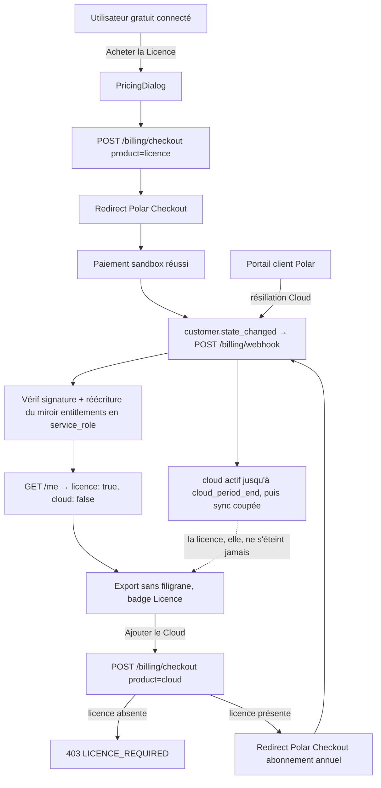

# Instruction: Backend Hono + vente via Polar (Merchant of Record)

> **Réécrite le 2026-08-07.** La version initiale vendait un abonnement Pro
> mensuel via Stripe direct. [`pricing.md`](../2026_08_06_offre-commerciale/pricing.md)
> a remplacé ce modèle par une Licence à 49 $ payée une fois plus un add-on Cloud
> à 39 $/an, et a tranché pour un Merchant of Record dès la première vente.

## Architecture projection

> Tree of the final files. ✅ create · ✏️ modify · ❌ delete

```txt
.
├── apps/
│   └── api/                                    ✅ nouveau package workspace
│       ├── package.json                        ✅ "api" : hono, @polar-sh/sdk, @supabase/supabase-js, zod
│       ├── tsconfig.json                       ✅
│       ├── .env.example                        ✅ SUPABASE_URL, SUPABASE_SERVICE_ROLE_KEY, POLAR_*
│       └── src/
│           ├── index.ts                        ✅ app Hono, export des types AppType (pour hc)
│           ├── middleware/
│           │   └── auth.ts                     ✅ vérif JWT Supabase via auth.getUser(token)
│           ├── entitlements.ts                 ✅ projection customer state → droits (licence, cloud)
│           └── routes/
│               ├── health.ts                   ✅ GET /health
│               ├── me.ts                       ✅ GET /me → droits courants
│               └── billing.ts                  ✅ POST /billing/checkout, /billing/portal, /billing/webhook
├── supabase/
│   └── migrations/
│       └── 0003_entitlements.sql               ✅ table entitlements + RLS (lecture seule user)
├── apps/web/src/
│   ├── lib/
│   │   ├── api.ts                              ✅ client hc<AppType> typé depuis apps/api
│   │   └── plans.ts                            ✅ les trois paliers (id produit Polar, prix, droits)
│   └── components/
│       ├── pricing-dialog/
│       │   └── PricingDialog.tsx               ✅ Gratuit / Licence / Cloud → redirect Polar Checkout
│       └── toolbar/TopBar.tsx                  ✏️ badge du palier quand connecté
└── .github/workflows/quality.yml               ✏️ typecheck + tests de apps/api
```

## User Journey



## Le modèle de droits

Deux droits indépendants, jamais un « plan » :

| Droit     | Origine                              | Forme                                    | S'éteint |
| --------- | ------------------------------------ | ---------------------------------------- | -------- |
| `licence` | achat unique du produit Licence      | perpétuel, sans date de fin              | seulement sur remboursement |
| `cloud`   | abonnement annuel au produit Cloud   | actif jusqu'à `cloud_period_end`         | à la fin de période après résiliation |

Une colonne `plan text` ne peut pas porter les deux : « a payé une fois, et est
abonné depuis mars » n'est pas une valeur d'énumération. C'est la raison pour
laquelle la table `subscriptions` du plan initial devient `entitlements`.

**La règle « le Cloud exige la Licence » vit à deux endroits, volontairement.**
Au checkout, pour donner une erreur lisible avant le paiement. Et à la
projection, parce qu'un achat effectué depuis Polar sans passer par notre
checkout contournerait le premier contrôle — le miroir n'accorde jamais `cloud`
à un compte sans `licence`, quoi qu'en dise la source.

## Tasks to do

### `1)` Squelette `apps/api`

> Le plus petit backend déployable qui vérifie l'identité

1. Package Hono + route `GET /health`
2. Middleware auth : header `Authorization: Bearer <jwt>` → `supabase.auth.getUser(token)` → 401 sinon
3. `GET /me` retourne `{ userId, licence: boolean, cloud: boolean, cloudPeriodEnd: string | null }` depuis `entitlements`
4. Client web `lib/api.ts` : `hc<AppType>` — le type traverse la frontière

### `2)` Table `entitlements`

> Un miroir des droits, écrit uniquement par le backend (service_role), lu par l'user

1. Colonnes : `user_id uuid pk references auth.users`, `polar_customer_id text`, `licence_granted_at timestamptz null`, `cloud_status text null`, `cloud_period_end timestamptz null`, `updated_at timestamptz`
2. RLS : policy `select` own-row `to authenticated` uniquement — aucun insert/update/delete pour le rôle `authenticated`
3. `licence_granted_at` n'est jamais remis à `null` par une résiliation Cloud — seul un remboursement de la Licence l'efface

### `3)` Checkout + portail client

1. `POST /billing/checkout { product: 'licence' | 'cloud' }` → session Polar Checkout (success URL), `customer_external_id` = `user.id` Supabase — c'est ce qui relie le client Polar au compte sans table de correspondance à tenir
2. `product: 'cloud'` sans `licence_granted_at` → **403 `LICENCE_REQUIRED`**, aucune session créée
3. `POST /billing/portal` → session du portail client Polar (factures, moyen de paiement, résiliation)
4. `PricingDialog.tsx` (primitives existantes) : les trois paliers depuis `lib/plans.ts`, le Cloud désactivé avec sa raison tant que la Licence n'est pas acquise

### `4)` Webhook : projeter l'état, ne pas le reconstituer

> Le seul chemin qui accorde un droit

1. `POST /billing/webhook` : validation de signature via le SDK Polar (spec Standard Webhooks), idempotence sur l'id d'événement
2. S'abonner à **`customer.state_changed`** : Polar y sert les abonnements actifs et les bénéfices accordés du client en un objet. La projection écrit le miroir en entier à chaque réception, en service_role
3. Ne pas écouter `order.paid` + `subscription.canceled` pour recomposer l'état à la main : c'est réimplémenter une machine que le fournisseur expose déjà, et diverger au premier webhook perdu
4. La projection refuse `cloud` si la licence est absente, et journalise le cas — il signifie soit un achat hors checkout, soit un remboursement de Licence à traiter
5. Tests unitaires : payload signé de fixture, rejeu du même événement = pas de double effet, état Cloud sans licence = droit refusé

### `5)` Déploiement Railway

1. Service Railway depuis `apps/api` (railpack/Dockerfile minimal), variables d'env en secrets
2. Webhook Polar pointé sur l'URL publique ; environnement **sandbox** Polar documenté pour le dev local
3. CI : nouveau job `api` (typecheck + tests unitaires) dans l'emplacement réservé en phase 1, + grep CI vérifiant que `service_role` n'apparaît pas dans `apps/web`

## Test acceptance criteria

| Task | Acceptance criteria                                                                                                  |
| ---- | ---------------------------------------------------------------------------------------------------------------------- |
| 1    | `GET /me` sans token → 401 ; avec le JWT d'un user → ses droits ; `hc` refuse à la compile un champ inconnu           |
| 2    | Un user authentifié ne peut pas écrire dans `entitlements` (test RLS)                                                |
| 3    | Achat Licence en sandbox Polar → `licence_granted_at` renseigné sans rechargement manuel ; badge Licence visible      |
| 4    | `POST /billing/checkout { product: 'cloud' }` sans licence → 403 `LICENCE_REQUIRED`, aucune session Polar créée       |
| 5    | Achat Cloud avec licence → `cloud_status = 'active'` et `cloud_period_end` à un an                                    |
| 6    | Rejouer le même webhook deux fois → une seule transition d'état                                                      |
| 7    | Résiliation du Cloud via le portail → sync active jusqu'à `cloud_period_end`, puis coupée ; **la licence survit**    |
| 8    | Un état Polar accordant le Cloud à un compte sans licence → droit refusé par la projection, cas journalisé            |
| 9    | La clé `service_role` n'apparaît nulle part dans `apps/web` (grep CI)                                                |
