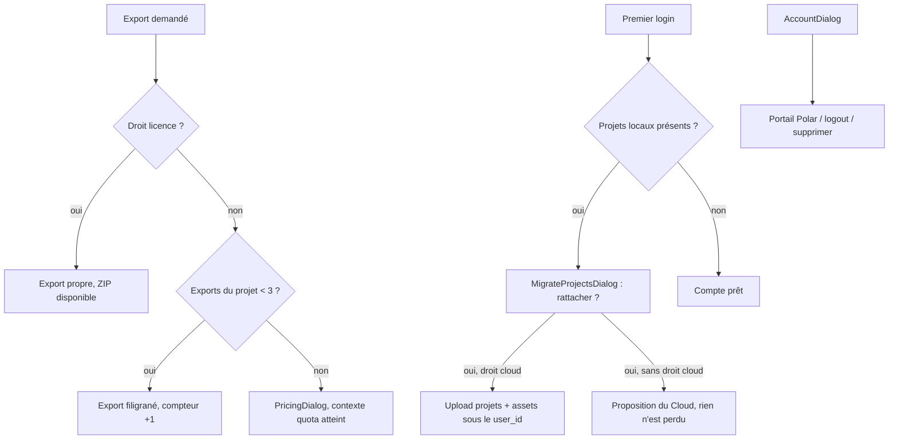

# Instruction: Filigrane et quota d'export, compte & migration anonyme → compte

> **Réécrite le 2026-08-07.** La version initiale limitait le palier gratuit à
> trois **projets cloud**. [`pricing.md`](../2026_08_06_offre-commerciale/pricing.md)
> a déplacé la limite sur l'**export** : projets locaux illimités, trois exports
> filigranés par projet. Le stockage local ne coûte rien, donc le limiter ne
> défend aucune marge ; seul l'export distingue les paliers.

## Ce que chaque palier débloque

| | Gratuit | Licence | Cloud |
| --- | --- | --- | --- |
| Exports par projet | 3, filigranés | illimités, sans filigrane | illimités, sans filigrane |
| ZIP groupé App Store Connect | non | oui | oui |
| Sync des projets | non | non | oui |

## Le filigrane est une politesse, pas un verrou

L'export tourne entièrement dans le navigateur — c'est la promesse du produit et
la raison de sa marge à 98 %. Le compteur vit donc en IndexedDB et le filigrane
est peint côté client : les deux se contournent avec la console ouverte.

**C'est assumé, et ça ne doit pas être « corrigé ».** Faire valider un export par
le serveur y ferait remonter le rendu ou au minimum le fichier, ce qui détruirait
d'un coup le coût marginal nul, la promesse local-first et l'usage hors ligne.
Le modèle est celui du logiciel indépendant : on rend le paiement facile et
honnête, pas le contournement impossible. Toute proposition ultérieure de DRM
côté serveur se heurte à cette ligne.

Ce que le serveur garde, lui, c'est le seul droit qui a un coût récurrent : la
**sync**, refusée par la RLS et par l'API à un compte sans droit `cloud`.

## Architecture projection

> Tree of the final files. ✅ create · ✏️ modify · ❌ delete

```txt
apps/
├── api/src/
│   ├── middleware/
│   │   └── cloud.ts                            ✅ refuse toute route de sync sans droit cloud
│   └── routes/
│       ├── projects.ts                         ✅ POST /projects (création cloud, droit cloud requis)
│       └── account.ts                          ✅ DELETE /account (suppression service_role)
└── web/src/
    ├── lib/
    │   ├── plans.ts                            ✏️ droits par palier (exports, filigrane, ZIP, sync)
    │   ├── export.ts                           ✏️ filigrane peint dans le rendu quand le droit manque
    │   ├── entitlements.ts                     ✅ droits courants + compteur d'exports par projet
    │   └── sync.ts                             ✏️ ne démarre pas sans droit cloud
    ├── hooks/
    │   └── use-export.ts                       ✏️ vérifie le quota avant lot, incrémente après succès
    ├── components/
    │   ├── export-dialog/ExportDialog.tsx      ✏️ exports restants, ZIP désactivé sans Licence
    │   ├── account-dialog/AccountDialog.tsx    ✅ identité, palier, droits, portail, logout, suppression
    │   └── migrate-dialog/MigrateProjectsDialog.tsx  ✅ rattacher les projets locaux au premier login
    └── stores/ui.store.ts                      ✏️ flags showAccountDialog / showMigrateDialog
```

## User Journey



## Wireframe

```txt
┌──────────────────────────────────────────────┐
│  Compte                                  [x] │
│                                              │
│  ○  utilisateur@example.com                  │  (1)
│                                              │
│  Licence            acquise le 12 mars 2026  │  (2)
│  Cloud                    [ Ajouter 39 $/an ]│  (3)
│                                              │
│  [ Factures et paiement ]                    │  (4)
│  [ Se déconnecter ]                          │  (5)
│  ────────────────────────────────────────    │
│  [ Supprimer mon compte ]                    │  (6)
└──────────────────────────────────────────────┘

(1) Identité de session (avatar + e-mail)
(2) Licence : perpétuelle, donc une date d'acquisition et jamais d'échéance.
    Absente → CTA « Acheter la Licence, 49 $ » vers PricingDialog
(3) Cloud : actif → « renouvellement le <date> » ; résilié → « actif jusqu'au
    <date> » ; absent → CTA, désactivé avec sa raison tant que la Licence manque
(4) Redirect portail client Polar via POST /billing/portal
(5) signOut — les données locales IDB sont conservées
(6) Variant danger + confirmation ; appelle DELETE /account
```

## Tasks to do

### `1)` Droits côté client

> Une seule source, lue partout ailleurs

1. `lib/entitlements.ts` : droits courants depuis `GET /me`, et sans compte tout est `false` — le mode anonyme est le palier gratuit, il n'interroge pas l'API
2. Compteur d'exports par projet en IDB (store dédié, clé `projectId`) ; jamais dans le document projet, qu'un partage de fichier remettrait à zéro
3. `lib/plans.ts` : les trois paliers, leurs identifiants produit Polar et leurs droits

### `2)` Filigrane et quota dans le chemin d'export

> Le chemin critique reste pixel-exact : les dimensions ne bougent pas, le filigrane est peint dedans

1. `exportScreenToBlob` peint le filigrane quand le droit `licence` manque — après le rendu des calques, avant l'encodage, jamais en redimensionnant la cible
2. `use-export.ts` : refus avant le lot si le projet a atteint 3 exports, incrément après succès seulement — un export échoué ne consomme rien
3. `ExportDialog` affiche les exports restants et désactive le ZIP groupé sans Licence, avec sa raison
4. 403 quota → `PricingDialog` avec contexte « limite atteinte »

### `3)` La sync est réservée au droit `cloud`

1. Middleware `cloud.ts` côté Hono : toute route de projet cloud sans droit `cloud` → **403 `CLOUD_REQUIRED`**
2. `sync.ts` ne démarre pas sans le droit : aucune tentative réseau, aucun `syncStatus` affiché — un compte Licence est un compte local, pas un compte cloud en erreur
3. Fin de période Cloud : la sync s'arrête, **rien n'est supprimé côté client** ; les projets restent en IDB et éditables

### `4)` AccountDialog

> Un seul endroit pour tout ce qui concerne le compte

1. Wireframe ci-dessus, primitives existantes (Dialog, Button variants dont `danger`)
2. Licence et Cloud affichés séparément, avec leurs formes propres — date d'acquisition d'un côté, échéance de l'autre
3. Suppression : double confirmation → `DELETE /account` (service_role supprime auth.users + cascades) → retour mode local

### `5)` Migration anonyme → compte

> Le premier login ne doit jamais faire perdre un projet local

1. Au premier login avec droit `cloud` : si projets IDB non rattachés → `MigrateProjectsDialog` listant les projets locaux
2. « Tout rattacher » : upload des projets + assets sous `user_id`
3. Sans droit `cloud` : la dialog explique que la sync est un add-on et propose le Cloud — elle ne bloque rien
4. « Plus tard » : rien ne se perd, la dialog ressurgit au prochain login

### `6)` Cohérence des états

1. Logout : la session cloud se ferme, les projets locaux restent éditables, `syncStatus` disparaît
2. Suppression de compte : purge cloud confirmée par toast, l'app reste utilisable en local
3. Achat de la Licence en cours de session : le filigrane disparaît et le ZIP s'active sans rechargement

## Test acceptance criteria

| Task | Acceptance criteria                                                                                                       |
| ---- | --------------------------------------------------------------------------------------------------------------------------- |
| 1    | Sans compte, aucun appel réseau n'est tenté pour connaître les droits                                                      |
| 2    | Gratuit : le 4e export d'un même projet est refusé et propose la Licence ; un autre projet repart à 3                     |
| 3    | Gratuit : le PNG exporté porte le filigrane et **exactement** 1320×2868 — `assertAppStorePng` passe                        |
| 4    | Un export en échec ne consomme pas de crédit                                                                              |
| 5    | Licence : aucun filigrane, ZIP groupé disponible, aucune limite de nombre                                                 |
| 6    | Licence sans Cloud : aucune tentative de sync, aucun indicateur d'erreur                                                  |
| 7    | Compte Licence appelant une route de projet cloud → 403 `CLOUD_REQUIRED`                                                  |
| 8    | Cloud : premier login avec 2 projets locaux → après « Tout rattacher », visibles depuis un autre navigateur               |
| 9    | Fin de période Cloud : la sync s'arrête, aucun projet local n'est supprimé                                                |
| 10   | Refuser la migration ne supprime rien ; la proposition réapparaît au login suivant                                        |
| 11   | Suppression de compte : les données cloud sont purgées, l'app reste fonctionnelle en local immédiatement                  |
| 12   | Logout puis édition : aucun appel réseau n'est tenté, aucune erreur n'apparaît                                            |
