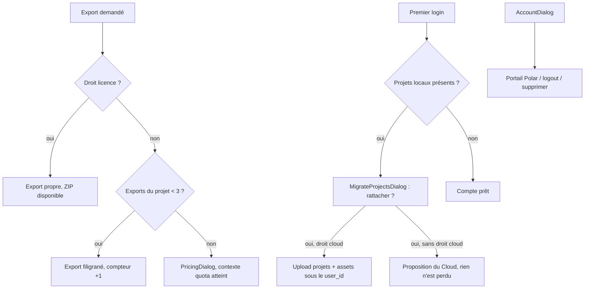

# Instruction: Filigrane et quota d'export, compte & migration anonyme → compte

> **Réécrite le 2026-08-07.** La version initiale limitait le palier gratuit à
> trois **projets cloud**. [`pricing.md`](../2026_08_06_offre-commerciale/pricing.md)
> a déplacé la limite sur l'**export** : projets locaux illimités, trois exports
> filigranés par projet. Le stockage local ne coûte rien, donc le limiter ne
> défend aucune marge ; seul l'export distingue les paliers.

## Ce que chaque palier débloque

| | Gratuit | Licence | Cloud |
| --- | --- | --- | --- |
| Exports par projet | 3, filigranés | illimités, sans filigrane | illimités, sans filigrane |
| ZIP groupé App Store Connect | non | oui | oui |
| Sync des projets | non | non | oui |

## Le filigrane est une politesse, pas un verrou

L'export tourne entièrement dans le navigateur — c'est la promesse du produit et
la raison de sa marge à 98 %. Le compteur vit donc en IndexedDB et le filigrane
est peint côté client : les deux se contournent avec la console ouverte.

**C'est assumé, et ça ne doit pas être « corrigé ».** Faire valider un export par
le serveur y ferait remonter le rendu ou au minimum le fichier, ce qui détruirait
d'un coup le coût marginal nul, la promesse local-first et l'usage hors ligne.
Le modèle est celui du logiciel indépendant : on rend le paiement facile et
honnête, pas le contournement impossible. Toute proposition ultérieure de DRM
côté serveur se heurte à cette ligne.

Ce que le serveur garde, lui, c'est le seul droit qui a un coût récurrent : la
**sync**, refusée par la RLS et par l'API à un compte sans droit `cloud`.

## Architecture projection

> Tree of the final files. ✅ create · ✏️ modify · ❌ delete

```txt
apps/
├── api/src/
│   ├── middleware/
│   │   └── cloud.ts                            ✅ refuse toute route de sync sans droit cloud
│   └── routes/
│       ├── projects.ts                         ✅ POST /projects (création cloud, droit cloud requis)
│       └── account.ts                          ✅ DELETE /account (suppression service_role)
└── web/src/
    ├── lib/
    │   ├── plans.ts                            ✏️ droits par palier (exports, filigrane, ZIP, sync)
    │   ├── export.ts                           ✏️ filigrane peint dans le rendu quand le droit manque
    │   ├── entitlements.ts                     ✅ droits courants + compteur d'exports par projet
    │   └── sync.ts                             ✏️ ne démarre pas sans droit cloud
    ├── hooks/
    │   └── use-export.ts                       ✏️ vérifie le quota avant lot, incrémente après succès
    ├── components/
    │   ├── export-dialog/ExportDialog.tsx      ✏️ exports restants, ZIP désactivé sans Licence
    │   ├── account-dialog/AccountDialog.tsx    ✅ identité, palier, droits, portail, logout, suppression
    │   └── migrate-dialog/MigrateProjectsDialog.tsx  ✅ rattacher les projets locaux au premier login
    └── stores/ui.store.ts                      ✏️ flags showAccountDialog / showMigrateDialog
```

## User Journey



## Wireframe

```txt
┌──────────────────────────────────────────────┐
│  Compte                                  [x] │
│                                              │
│  ○  utilisateur@example.com                  │  (1)
│                                              │
│  Licence            acquise le 12 mars 2026  │  (2)
│  Cloud                    [ Ajouter 39 $/an ]│  (3)
│                                              │
│  [ Factures et paiement ]                    │  (4)
│  [ Se déconnecter ]                          │  (5)
│  ────────────────────────────────────────    │
│  [ Supprimer mon compte ]                    │  (6)
└──────────────────────────────────────────────┘

(1) Identité de session (avatar + e-mail)
(2) Licence : perpétuelle, donc une date d'acquisition et jamais d'échéance.
    Absente → CTA « Acheter la Licence, 49 $ » vers PricingDialog
(3) Cloud : actif → « renouvellement le <date> » ; résilié → « actif jusqu'au
    <date> » ; absent → CTA, désactivé avec sa raison tant que la Licence manque
(4) Redirect portail client Polar via POST /billing/portal
(5) signOut — les données locales IDB sont conservées
(6) Variant danger + confirmation ; appelle DELETE /account
```

## Tasks to do

### `1)` Droits côté client

> Une seule source, lue partout ailleurs

1. `lib/entitlements.ts` : droits courants depuis `GET /me`, et sans compte tout est `false` — le mode anonyme est le palier gratuit, il n'interroge pas l'API
2. Compteur d'exports par projet en IDB (store dédié, clé `projectId`) ; jamais dans le document projet, qu'un partage de fichier remettrait à zéro
3. `lib/plans.ts` : les trois paliers, leurs identifiants produit Polar et leurs droits

### `2)` Filigrane et quota dans le chemin d'export

> Le chemin critique reste pixel-exact : les dimensions ne bougent pas, le filigrane est peint dedans

1. `exportScreenToBlob` peint le filigrane quand le droit `licence` manque — après le rendu des calques, avant l'encodage, jamais en redimensionnant la cible
2. `use-export.ts` : refus avant le lot si le projet a atteint 3 exports, incrément après succès seulement — un export échoué ne consomme rien
3. `ExportDialog` affiche les exports restants et désactive le ZIP groupé sans Licence, avec sa raison
4. 403 quota → `PricingDialog` avec contexte « limite atteinte »

### `3)` La sync est réservée au droit `cloud`

1. Middleware `cloud.ts` côté Hono : toute route de projet cloud sans droit `cloud` → **403 `CLOUD_REQUIRED`**
2. `sync.ts` ne démarre pas sans le droit : aucune tentative réseau, aucun `syncStatus` affiché — un compte Licence est un compte local, pas un compte cloud en erreur
3. Fin de période Cloud : la sync s'arrête, **rien n'est supprimé côté client** ; les projets restent en IDB et éditables

### `4)` AccountDialog

> Un seul endroit pour tout ce qui concerne le compte

1. Wireframe ci-dessus, primitives existantes (Dialog, Button variants dont `danger`)
2. Licence et Cloud affichés séparément, avec leurs formes propres — date d'acquisition d'un côté, échéance de l'autre
3. Suppression : double confirmation → `DELETE /account` (service_role supprime auth.users + cascades) → retour mode local

### `5)` Migration anonyme → compte

> Le premier login ne doit jamais faire perdre un projet local

1. Au premier login avec droit `cloud` : si projets IDB non rattachés → `MigrateProjectsDialog` listant les projets locaux
2. « Tout rattacher » : upload des projets + assets sous `user_id`
3. Sans droit `cloud` : la dialog explique que la sync est un add-on et propose le Cloud — elle ne bloque rien
4. « Plus tard » : rien ne se perd, la dialog ressurgit au prochain login

### `6)` Cohérence des états

1. Logout : la session cloud se ferme, les projets locaux restent éditables, `syncStatus` disparaît
2. Suppression de compte : purge cloud confirmée par toast, l'app reste utilisable en local
3. Achat de la Licence en cours de session : le filigrane disparaît et le ZIP s'active sans rechargement

## Test acceptance criteria

| Task | Acceptance criteria                                                                                                       |
| ---- | --------------------------------------------------------------------------------------------------------------------------- |
| 1    | Sans compte, aucun appel réseau n'est tenté pour connaître les droits                                                      |
| 2    | Gratuit : le 4e export d'un même projet est refusé et propose la Licence ; un autre projet repart à 3                     |
| 3    | Gratuit : le PNG exporté porte le filigrane et **exactement** 1320×2868 — `assertAppStorePng` passe                        |
| 4    | Un export en échec ne consomme pas de crédit                                                                              |
| 5    | Licence : aucun filigrane, ZIP groupé disponible, aucune limite de nombre                                                 |
| 6    | Licence sans Cloud : aucune tentative de sync, aucun indicateur d'erreur                                                  |
| 7    | Compte Licence appelant une route de projet cloud → 403 `CLOUD_REQUIRED`                                                  |
| 8    | Cloud : premier login avec 2 projets locaux → après « Tout rattacher », visibles depuis un autre navigateur               |
| 9    | Fin de période Cloud : la sync s'arrête, aucun projet local n'est supprimé                                                |
| 10   | Refuser la migration ne supprime rien ; la proposition réapparaît au login suivant                                        |
| 11   | Suppression de compte : les données cloud sont purgées, l'app reste fonctionnelle en local immédiatement                  |
| 12   | Logout puis édition : aucun appel réseau n'est tenté, aucune erreur n'apparaît                                            |

## Vérifié

- **1** — `e2e/export-tiers.spec.ts`, « sans compte, aucun appel réseau ne
  cherche les droits » : toutes les requêtes `fetch`/`xhr` de la page sont
  enregistrées depuis l'ouverture, et aucune ne vise `entitlements` ni `/me`
  pendant que la boîte d'export affiche « 3 sur 3 ». Le filtre sur le type de
  ressource n'est pas une commodité : en développement Vite sert
  `src/lib/entitlements.ts` lui-même par HTTP, et le compter reviendrait à
  interdire au fichier d'exister. Côté code, c'est `refreshEntitlements` qui
  sort avant la requête — le mode anonyme *est* le palier gratuit, il n'a rien à
  demander.
- **2** — deux niveaux, parce que le critère porte sur deux faits distincts.
  `e2e/export-tiers.spec.ts` mesure le refus de bout en bout : trois exports
  réels, le compteur descend « 3 sur 3 » → « 0 sur 3 », puis le bouton
  d'export **disparaît** au profit de « Débloquer avec la Licence », qui ouvre
  la boîte d'offres. L'assertion `toHaveCount(0)` sur « Exporter les PNG » est
  le point : un bouton grisé laisserait la boîte sans issue. Le « un autre
  projet repart à 3 » est unitaire (`lib/__tests__/entitlements.test.ts`, « part
  du quota plein et décompte projet par projet ») — le compteur est indexé par
  `projectId`, et le vérifier en e2e demanderait un second projet complet pour
  mesurer une clé de dictionnaire.
- **3** — même fichier e2e : le PNG du palier gratuit est décodé et mesuré
  `1320×2868`, profondeur 8, 3 canaux. Le filigrane est prouvé par comparaison
  de deux lignes du **fichier livré** entre gratuit et Licence : celle du
  filigrane diffère, celle du haut de l'image est identique. Sans la seconde,
  n'importe quelle différence de rendu passerait pour un filigrane.
- **4** — même fichier : `HTMLCanvasElement.prototype.toBlob` rend `null`, tout
  le reste du chemin (polices, rendu, encodage) s'exécute pour de vrai, l'alerte
  « PNG vide » s'affiche et le compteur est toujours à « 3 sur 3 ».
- **5** — même fichier : sous Licence, ni compteur ni mention de filigrane dans
  la boîte, le ZIP part, et en repassant au palier gratuit le quota est encore
  entier — l'export sous Licence n'a rien décompté.
- **6** — `e2e/sync.spec.ts`, « un compte Licence ne tente aucune
  synchronisation » : compte réel, Licence posée en base par le chemin du
  backend, cinq secondes d'édition après l'autosave, zéro requête vers
  `/rest/v1/projects` ou `/storage/v1/`, aucun témoin de sync et aucune alerte.
  Un compte Licence est un compte local, pas un compte cloud en panne.
- **7** — `supabase/tests/rls_cloud_gate.test.mjs`, six tests. La porte est en
  RLS et non dans un middleware Hono (voir « Écarts assumés ») : un compte
  Licence sans Cloud ne peut ni insérer un projet ni déposer un binaire, un
  compte sans achat non plus, un compte Cloud le peut. Le contre-test compte
  autant que les refus.
- **8** — `e2e/sync.spec.ts`, « propose les projets orphelins, les rattache, et
  revient si on refuse » : deux projets construits hors ligne, la session est
  ensuite semée et la page rechargée ; après « Tout rattacher », les deux lignes
  existent côté serveur, lues par le client du compte. La lecture distante est
  plus forte que la relecture depuis un second navigateur — c'est elle que le
  second navigateur ferait, sans le tirage à démêler.
- **9** — `e2e/sync.spec.ts`, « la fin de période arrête la sync sans rien
  supprimer localement » : `cloud_period_end` repoussée dans le passé, **le même
  contexte** rechargé (un profil neuf n'aurait pas de copie locale à sauver, il
  ne mesurerait que le tirage). Le témoin disparaît au lieu de passer au rouge,
  le projet est toujours là et se renomme encore. Doublé côté base par le test
  RLS de la période expirée : les écritures sont refusées, mais `select`,
  téléchargement et `delete` restent ouverts — on ne prend personne en otage de
  ses propres fichiers.
- **10** — même test e2e : « Plus tard » ferme sans rien écrire, le rechargement
  ramène la boîte. Aucune préférence « ne plus demander » n'est enregistrée, par
  construction : elle ferait taire exactement les projets qu'elle protège.
- **11** — `apps/api/src/routes/account.test.ts`, sept tests, dont l'ordre :
  `['list', 'remove:{user}/a1,{user}/a2', 'deleteUser']`. Les binaires partent
  **avant** l'identité parce que `storage.objects` ne référence pas `auth.users`
  — c'est le chemin `{user_id}/{asset_id}` qui porte l'appartenance, donc
  supprimer l'identité d'abord laisserait des fichiers que plus aucune policy ne
  rend lisibles et que plus aucun compte ne réclame. Une purge en échec laisse
  l'identité en place (502 `PURGE_FAILED`, `deleteUser` jamais appelé) ; sans
  jeton ou avec un jeton forgé, rien n'est touché. Le versant client — retour
  immédiat au mode local — n'est pas couvert en e2e : voir « Reste non couvert ».
- **12** — `e2e/sync.spec.ts`, « la déconnexion rend l'éditeur au mode local,
  sans erreur » : compte Cloud, projet poussé, déconnexion **par l'interface**
  (Mon compte → Se déconnecter), puis enregistrement des requêtes. Le projet est
  encore là, se renomme, accepte une couche, et cinq secondes plus tard aucune
  requête n'est partie vers `/rest/v1/` ou `/storage/v1/`, sans témoin ni alerte.
- **Un défaut trouvé par la vérification visuelle, pas par les tests.** Les
  boîtes ont été mises en scène sur la pile réelle dans les deux thèmes (Compte
  aux trois paliers, Rattachement, Export gratuit / épuisé / Licence). Le rouge
  `destructive` du thème sombre tenait **4.41:1 sur `card`** — sous le plancher
  de 4.5 du projet — et l'audit ne le voyait pas : `INKS` ne contenait que
  `foreground` et `muted-foreground`. Deux corrections : le jeton sombre passe à
  `oklch(0.64 0.18 25)` (#de4e4b → #e55551, invisible à l'œil, 4.78:1) et
  `scripts/contrast-audit.mjs` contrôle désormais le couple. `accent` et
  `secondary` restent hors matrice avec leur raison écrite : le rouge n'y
  apparaît qu'en icône sous le survol d'un `IconButton`, où le seuil est celui
  du non-textuel — 3:1, tenu à 3.72. Les croiser demanderait d'éclaircir le
  rouge jusqu'à 0.69 pour un cas qui n'est pas du texte.
- **Non-régression** — `pnpm run test:rls` : 27 tests (7 projets, 8 storage,
  6 entitlements, 6 porte Cloud). `pnpm --filter api run test:unit` : 37.
  `pnpm --filter web run test:unit` : 93. `pnpm --filter web exec playwright
  test` : 82 passés, 1 sauté (`device-bezel-import.spec.ts` « accepts a real
  Apple Product Bezel outside the repository », qui demande un fichier hors du
  dépôt — antérieur à cette phase). `pnpm run typecheck`, `pnpm run lint`,
  `pnpm run audit:contrast` (pire cas dark 4.78:1, light 4.55:1),
  `pnpm run audit:scale` (« Échelles fermées ») : verts.
  `grep -rn -e service_role -e SERVICE_ROLE apps/web` : aucune occurrence.
  `pnpm run build` : `AccountDialog` et `MigrateProjectsDialog` sortent chacun
  dans leur propre morceau, hors du paquet principal.

## Écarts assumés

- **La porte Cloud est en RLS, pas dans un middleware Hono.** La task 3.1
  demandait `middleware/cloud.ts` et `routes/projects.ts` répondant 403
  `CLOUD_REQUIRED`. La sync ne passe pas par `apps/api` : le navigateur parle
  directement à PostgREST et à Storage, avec le jeton du compte. Un middleware
  aurait gardé une porte posée à côté du mur. `public.has_cloud()` est appelée
  dans le `with check` des policies d'insertion et de mise à jour de `projects`
  et `assets` ; le critère 7 est donc prouvé par un refus SQL et non par un code
  HTTP. `security invoker` est vérifié explicitement : appelée par un tiers, la
  fonction rend `false`.
- **`select` et `delete` restent ouverts sans droit Cloud.** Seules les
  écritures sont fermées. Un abonnement qui se termine ne doit pas transformer
  les fichiers de quelqu'un en otages : il peut encore tout lire, tout
  télécharger et tout supprimer.
- **Les droits sont lus en base, pas via l'API.** `fetchEntitlements` interroge
  `entitlements` avec la clé `anon` et la policy `entitlements_select_own`, au
  lieu d'appeler `GET /me` comme le prévoyait la task 1.1. L'API sort ainsi du
  chemin critique du filigrane, du ZIP et de la sync — trois décisions qui ne
  doivent pas dépendre d'un service de vente joignable. Le prix est une
  **troisième projection de la règle commerciale** (`public.has_cloud()` en SQL,
  `toEntitlements` côté serveur, `projectEntitlements` côté client) ; chacune
  porte le commentaire qui nomme les deux autres. `GET /me` reste la vue
  serveur, employée là où un secret est nécessaire.
- **La boîte de rattachement ne s'affiche qu'avec le droit Cloud.** La task 5.3
  proposait de la montrer aussi sans le droit, avec une offre. Une modale
  d'upsell à chaque login est du harcèlement, et la langue de l'application
  traite le palier gratuit comme un état normal, pas comme une erreur. Le
  chemin d'achat reste au même endroit que tous les autres : la boîte Compte.
- **Le compteur d'exports vit dans `localStorage`, pas dans un magasin IDB
  dédié** (task 1.2). Trois entiers indexés par `projectId` n'ont pas besoin
  d'une base : ils ne sont ni volumineux, ni transactionnels, ni partagés avec
  le document projet — ce dernier point étant la seule contrainte réelle de la
  task, et il est tenu. Un stockage illisible se lit comme « zéro export
  consommé » : on ne bloque personne pour une panne de navigateur.
- **Le palier gratuit s'applique même sans API de vente configurée.** Seuls les
  boutons « Voir les offres » et « Acheter » sont conditionnés à
  `billingConfigured` : un build sans variables reste un produit cohérent, pas
  un produit gratuit par accident.
- **`unattachedProjects()` ignore les projets jamais ouverts**
  (`createdAt === updatedAt`), la même signature que `pullTarget` emploie déjà.
  Sans ce filtre, le premier login proposait de rattacher le « Projet sans
  titre » que l'éditeur venait lui-même de fabriquer — mesuré : la boîte
  s'ouvrait au démarrage et rendait la barre du haut inerte, ce qui faisait
  sauter en silence un test de sync qui cherchait le bouton de compte.
- **`useAuthStore` est exposé en écriture** sur la poignée de développement
  `__sfStores`. Les droits e2e sont semés, pas achetés : le chemin réel passe
  par Polar, un webhook et le miroir en base, injoignables depuis une suite qui
  doit tourner sans Docker ni compte marchand. Ce qui est mesuré est ce qui
  vient après. La poignée n'existe que sous `import.meta.env.DEV`.

## Reste non couvert

- **Le versant client de la suppression de compte** (critère 11) n'a pas de test
  e2e : il faudrait `apps/api` démarré en plus du stack Supabase, ce que la
  configuration Playwright actuelle ne fait pas. Le serveur est couvert
  unitairement, l'enchaînement `signOut` → toast → mode local a été vérifié à la
  main sur la pile réelle.
- **L'achat en cours de session** (task 6.3 : le filigrane disparaît et le ZIP
  s'active sans rechargement) est prouvé pour le retour de checkout en phase 4
  (le badge passe de `Gratuit` à `Licence` sans rechargement, sonde manuelle) ;
  côté export, seul le changement de droits est couvert, par les tests qui
  reposent les droits en cours de test et rouvrent la boîte.
- **Le SSO Google et GitHub** (phase 2, critère 3) et **les achats réels en bac
  à sable Polar** (phase 4, critères 3, 5, 7) restent bloqués sur des comptes qui
  n'appartiennent qu'à l'utilisateur.
