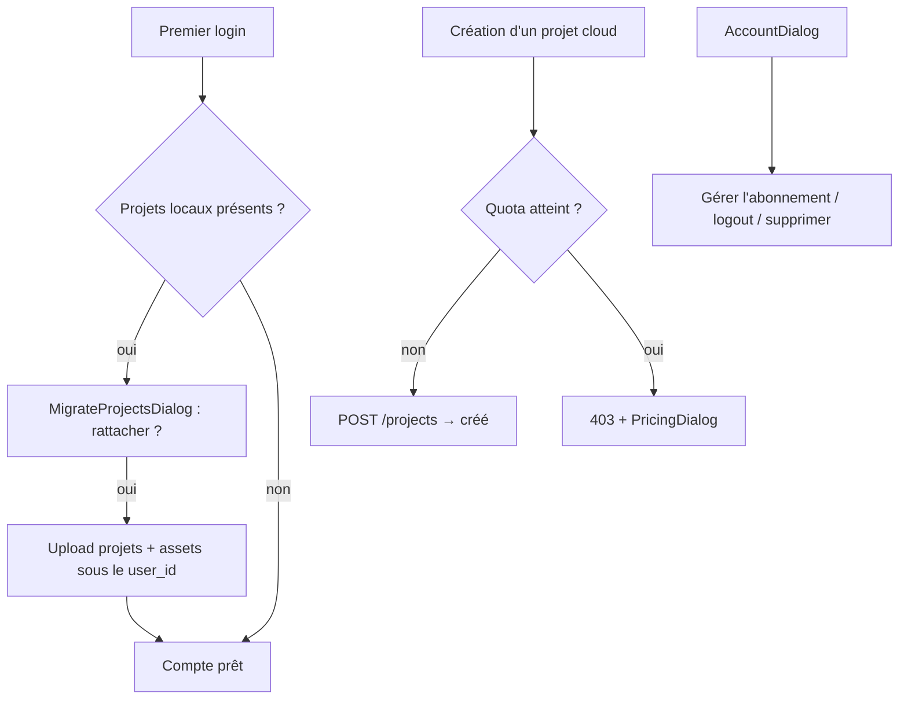

# Instruction: Quotas, compte & migration anonyme → compte

## Architecture projection

> Tree of the final files. ✅ create · ✏️ modify · ❌ delete

```txt
apps/
├── api/src/
│   ├── middleware/
│   │   └── quota.ts                            ✅ vérif plan + comptage avant création cloud
│   └── routes/
│       ├── projects.ts                         ✅ POST /projects (création cloud soumise à quota)
│       └── account.ts                          ✅ DELETE /account (suppression service_role)
└── web/src/
    ├── lib/
    │   ├── plans.ts                            ✏️ limites par plan (ex. free: 3 projets cloud)
    │   └── sync.ts                             ✏️ création cloud via API (quota), updates en direct RLS
    ├── components/
    │   ├── account-dialog/
    │   │   └── AccountDialog.tsx               ✅ identité, plan, usage, portail, logout, suppression
    │   └── migrate-dialog/
    │       └── MigrateProjectsDialog.tsx       ✅ rattacher les projets locaux au premier login
    └── stores/ui.store.ts                      ✏️ flags showAccountDialog / showMigrateDialog
```

## User Journey



## Wireframe

```txt
┌──────────────────────────────────────────────┐
│  Compte                                  [x] │
│                                              │
│  ○  utilisateur@example.com                  │  (1)
│                                              │
│  Plan : Gratuit        [ Passer au Pro ]     │  (2)
│  Projets cloud : 2 / 3                       │  (3)
│                                              │
│  [ Gérer l'abonnement ]                      │  (4)
│  [ Se déconnecter ]                          │  (5)
│  ────────────────────────────────────────    │
│  [ Supprimer mon compte ]                    │  (6)
└──────────────────────────────────────────────┘

(1) Identité de session (avatar + e-mail)
(2) Plan courant ; CTA unique vers PricingDialog si gratuit
(3) Compteur d'usage lisible (projets cloud / limite du plan)
(4) Redirect Stripe Billing Portal via POST /billing/portal
(5) signOut — les données locales IDB sont conservées
(6) Variant danger + confirmation ; appelle DELETE /account
```

## Tasks to do

### `1)` Création cloud soumise à quota

> Règle de partage : création via API, mises à jour en direct RLS

1. `POST /projects` côté Hono : auth + comptage des projets du user vs limite du plan → 403 `QUOTA_EXCEEDED` sinon insert service_role
2. `sync.ts` route la création via `lib/api.ts` ; les updates restent en direct PostgREST
3. Côté web : 403 → ouverture de `PricingDialog` avec contexte "limite atteinte"

### `2)` AccountDialog

> Un seul endroit pour tout ce qui concerne le compte

1. Wireframe ci-dessus, primitives existantes (Dialog, Button variants dont `danger`)
2. Usage = count des projets cloud vs `lib/plans.ts`
3. Suppression : double confirmation → `DELETE /account` (service_role supprime auth.users + cascades) → retour mode local

### `3)` Migration anonyme → compte

> Le premier login ne doit jamais faire perdre un projet local

1. Au premier login : si projets IDB non rattachés → `MigrateProjectsDialog` listant les projets locaux
2. "Tout rattacher" : upload des projets + assets sous `user_id` (respecte le quota, propose Pro si dépassé)
3. "Plus tard" : rien ne se perd, la dialog ressurgit au prochain login

### `4)` Cohérence des états

1. Logout : la session cloud se ferme, les projets locaux restent éditables, `syncStatus` disparaît
2. Suppression de compte : purge cloud confirmée par toast, l'app reste utilisable en local

## Test acceptance criteria

| Task | Acceptance criteria                                                                                          |
| ---- | ------------------------------------------------------------------------------------------------------------ |
| 1    | User gratuit avec 3 projets cloud : la 4e création est refusée (403) et propose le plan Pro                  |
| 2    | User Pro : aucune limite de création ; les mises à jour continuent de passer en direct (pas par l'API)       |
| 3    | Premier login avec 2 projets locaux → après "Tout rattacher", ils sont visibles depuis un autre navigateur   |
| 4    | Refuser la migration ne supprime rien ; la proposition réapparaît au login suivant                           |
| 5    | Suppression de compte : les données cloud sont purgées, l'app reste fonctionnelle en local immédiatement     |
| 6    | Logout puis édition : aucun appel réseau n'est tenté, aucune erreur n'apparaît                               |
