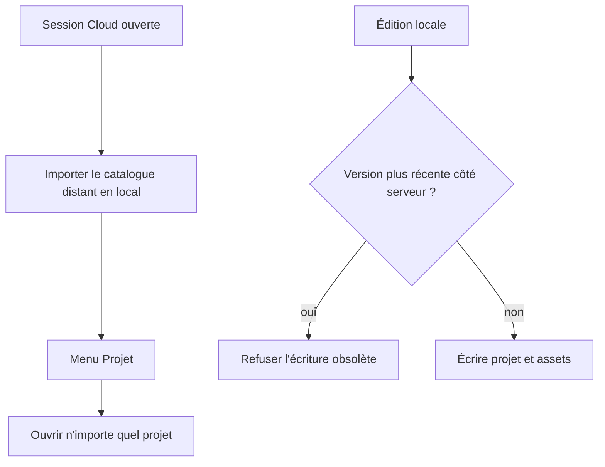

# Instruction: Corrections de revue et validation finale

## Architecture projection

> Tree of the final files. ✅ create · ✏️ modify · ❌ delete

```txt
.
├── .github/workflows/quality.yml                         ✏️ exécuter les E2E cloud avec Supabase
├── supabase/migrations/
│   └── *_project_lww.sql                                 ✅ écriture projet atomique et monotone
├── apps/api/src/
│   ├── mirror.ts                                         ✏️ ignorer les états Polar obsolètes
│   ├── routes/billing.webhook.test.ts                    ✏️ couvrir l'ordre inverse
│   ├── routes/account.ts                                 ✏️ purger toutes les pages Storage
│   └── routes/account.test.ts                            ✏️ couvrir plus de 100 assets
└── apps/web/
    ├── e2e/sync.spec.ts                                  ✏️ conflits et accès multi-projets
    └── src/
        ├── components/toolbar/TopBar.tsx                 ✏️ ouvrir un projet local/cloud
        ├── landing/copy.ts                               ✏️ retirer l'historique non livré
        ├── lib/
        │   ├── api.ts                                    ✏️ normaliser les pannes réseau
        │   ├── entitlements.ts                           ✏️ cache local par utilisateur
        │   ├── plans.ts                                  ✏️ retirer l'historique non livré
        │   ├── storage.ts                                ✏️ installer sans polluer le registre actif
        │   ├── sync.ts                                   ✏️ LWW atomique, assets et catalogue distant
        │   └── __tests__/entitlements.test.ts            ✏️ cache et changement de compte
        └── stores/auth.store.ts                          ✏️ droits cohérents avec la session courante
```

## User Journey



## Wireframe

```txt
┌────────────────────────────────────┐
│ Projet courant                  [⌄] │
├────────────────────────────────────┤
│ Renommer le projet                  │
│ Nouveau projet                      │
│ ────────────────────────────────── │
│ Ouvrir « Projet A »                 │
│ Ouvrir « Projet B »                 │
│ ────────────────────────────────── │
│ Importer un fichier…                │
└────────────────────────────────────┘
```

1. Le menu Projet existant liste les projets présents en IndexedDB, y compris ceux tirés du cloud.

## Tasks to do

### `1)` Rendre la synchronisation monotone et complète

1. Remplacer l'upsert projet inconditionnel par une écriture SQL atomique qui n'accepte que `updated_at` strictement plus récent.
2. Tester deux clients qui livrent leurs versions dans l'ordre inverse.
3. Considérer un asset absent du registre comme un upload échoué et ne jamais le marquer confirmé.
4. Rattacher plusieurs projets sans laisser le registre binaire global sur le dernier projet parcouru.
5. Installer tout le catalogue distant dans IndexedDB et permettre d'ouvrir chaque projet depuis le menu Projet.

### `2)` Conserver des droits cohérents hors ligne et entre comptes

1. Mettre en cache les derniers droits par `userId` et les restaurer avant la lecture réseau.
2. Effacer les droits au changement de compte et ignorer une réponse appartenant à une ancienne session.
3. Transformer les rejets réseau checkout, portail et suppression de compte en résultats gérés afin que les dialogues quittent toujours leur état pending.

### `3)` Fiabiliser billing et suppression de compte

1. Empêcher un ancien état Polar livré en retard d'écraser le miroir plus récent, en se fondant sur une source monotone vérifiable.
2. Paginer la liste Storage jusqu'à épuisement avant de supprimer l'utilisateur.
3. Tester un compte avec plus de 100 assets et l'échec d'une page intermédiaire.

### `4)` Aligner l'offre et la CI sur ce qui existe

1. Retirer les promesses FR/EN d'« historique 30 jours » tant qu'aucun mécanisme de versions restaurables n'est livré.
2. Démarrer Supabase dans le job E2E, injecter ses variables publiques et exécuter les scénarios cloud au lieu de les sauter.

### `5)` Valider la release

1. Ajouter les tests unitaires, RLS et E2E minimaux couvrant chaque correction.
2. Exécuter `pnpm run test:release` depuis la racine et documenter tout contrôle externe non applicable.

## Test acceptance criteria

| Task | Acceptance criteria |
| ---- | ------------------- |
| 1 | Une version projet plus ancienne livrée en dernier ne remplace jamais la version récente. |
| 1 | Un asset local absent reste non confirmé et la synchronisation signale l'échec. |
| 1 | Après rattachement de plusieurs projets, les assets du projet actif restent résolubles. |
| 1 | Sur un navigateur neuf, tous les projets distants deviennent ouvrables depuis le menu Projet. |
| 2 | Une Licence déjà lue reste disponible après rechargement hors ligne pour le même utilisateur. |
| 2 | Changer de compte n'expose jamais, même temporairement, les droits du compte précédent. |
| 2 | Une panne réseau rend checkout, portail et suppression réessayables sans spinner bloqué. |
| 3 | Un ancien webhook Polar livré en dernier ne réaccorde aucun droit révoqué. |
| 3 | La suppression d'un compte possédant plus de 100 assets ne laisse aucun objet Storage. |
| 4 | Aucune UI FR/EN ne promet d'historique cloud tant que la restauration n'existe pas. |
| 4 | Les scénarios Playwright cloud ne sont plus sautés dans la CI. |
| 5 | `pnpm run test:release` est vert, hors intégrations OAuth/Polar nécessitant les comptes du propriétaire. |

## Validation

- `pnpm run test:release` : vert. Les suites unitaires comptent 40 tests API et
  97 tests web ; les 28 tests RLS passent sans aucun saut ; typecheck, lint et
  build passent.
- Playwright : 85 tests passent, aucun n'échoue. Le seul test sauté est la
  sonde historique d'un Apple Product Bezel réel, qui exige volontairement un
  fichier externe au dépôt.
- Les audits passent : contraste (pire cas dark 4.78:1, light 4.55:1), échelles
  fermées et landing conforme.
- Les contrôles OAuth Google/GitHub, achat/annulation Polar en bac à sable et
  déploiement Railway restent non applicables localement : ils nécessitent les
  comptes et secrets du propriétaire. Leurs frontières techniques sont
  couvertes par les tests automatisés du dépôt.
