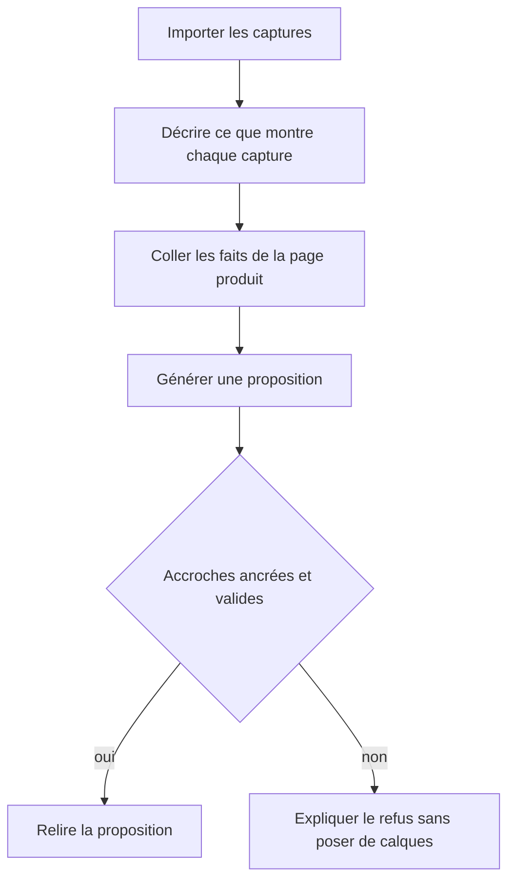
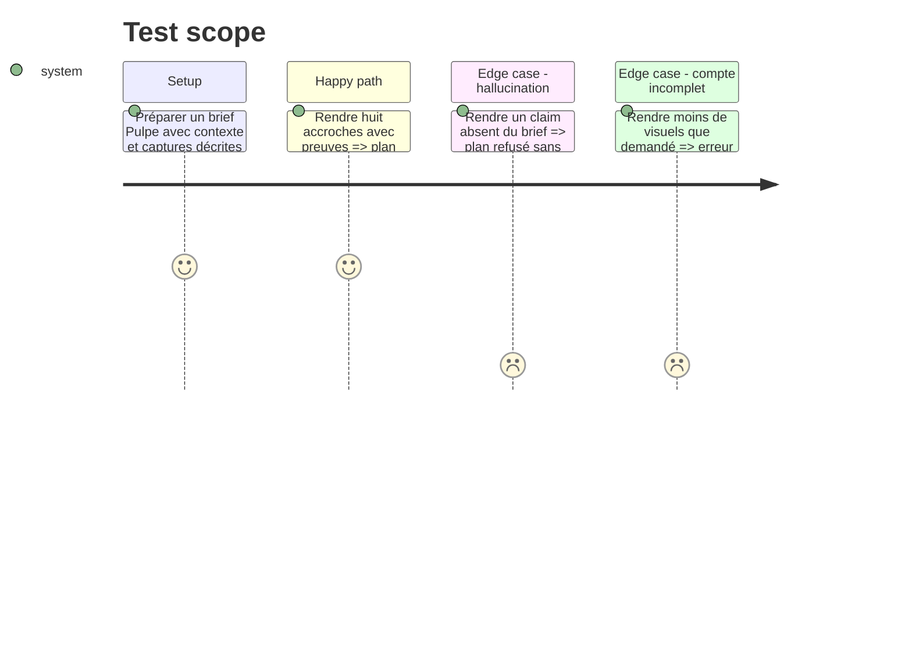

# Instruction: Ancrer et contraindre les accroches

## Architecture projection

> Tree of the final files. ✅ create · ✏️ modify · ❌ delete

```txt
apps/
├── bridge/src/
│   ├── ✏️ protocol.ts        # transporte le contexte produit, les descriptions et les preuves
│   ├── ✏️ server.ts          # aligne le prompt et la validation du pont
│   └── ✏️ bridge.test.ts     # verrouille le nouveau contrat
└── web/src/
    ├── e2e/
    │   ├── ✏️ canvas-editing.spec.ts # verrouille la multisélection inter-écrans
    │   └── ✏️ locale.spec.ts         # rend visible la langue courante
    ├── components/campaign-dialog/
    │   └── ✏️ CampaignDialog.tsx # collecte le contexte et permet de décrire les captures
    ├── components/
    │   ├── canvas/✏️ SelectionToolbar.tsx # applique les réglages communs au lot
    │   └── ui/✏️ select.tsx                # représente explicitement la valeur vide
    └── lib/
        ├── ai/
        │   ├── ✏️ plan.ts         # contrat, validation de copy et preuves
        │   └── ✏️ direct-api.ts   # prompt ancré et compte exact
        ├── ✏️ fonts.ts            # replie une graisse absente sans masquer la famille
        ├── ✏️ bridge-client.ts    # sérialise le même brief vers le pont
        └── __tests__/
            ├── ✏️ direct-api.test.ts
            ├── ✏️ ai-provider.test.ts
            └── ✏️ fonts.test.ts
    └── stores/✏️ canvas.store.ts  # mutation atomique d’une sélection
```

## User Journey



## Test Scope



## Wireframe

```txt
┌──────────────────────────────────────────────────────┐
│ (1) En-tête du dialogue                              │
├──────────────────────────────────────────────────────┤
│ (2) Application · phrase courte                      │
│ (3) Captures · logo · nombre                         │
│     ▸ descriptions des captures                      │
├──────────────────────────────────────────────────────┤
│ (4) Page produit · contexte factuel                  │
├──────────────────────────────────────────────────────┤
│ (5) Direction · auteur des accroches                 │
├──────────────────────────────────────────────────────┤
│ (6) Annuler                         Proposer le lot   │
└──────────────────────────────────────────────────────┘
```

1. En-tête : nom de la tâche et fermeture.
2. Application : identité et résumé d’une phrase.
3. Captures : import compact, descriptions repliables.
4. Produit : URL de provenance et faits réellement transmis au modèle.
5. Direction : style visuel et fournisseur déjà existants.
6. Actions : une seule action primaire.

## Tasks to do

### `1)` Étendre le brief

> Donner au modèle les faits dont il a besoin sans envoyer les images.

1. Ajouter un contexte produit borné et une description bornée par capture.
2. Transporter les mêmes champs dans les chemins API directe et pont.
3. Les rendre éditables avec les primitives existantes.

### `2)` Contraindre la proposition

> Empêcher les slogans génériques, les claims inventés et les lots incomplets.

1. Demander une preuve issue du brief pour chaque accroche.
2. Valider compte, longueur, unicité, preuve et index de capture.
3. Refuser proprement le plan entier quand une règle échoue.

### `3)` Fermer les régressions éditeur déjà engagées

> Garder les correctifs existants dans le premier candidat propre.

1. Appliquer une propriété commune à tous les textes sélectionnés, en une transaction.
2. Représenter la langue du projet dans le Select Radix sans valeur invisible.
3. Replier une graisse Google Fonts absente sur la famille disponible.

## Test acceptance criteria

| Task | Acceptance criteria |
| ---- | ------------------- |
| 1 | Le corps envoyé contient les faits et descriptions, mais aucun asset, logo ni data URL. |
| 2 | Un lot valide contient exactement le nombre demandé ; une hallucination ou une accroche générique ne rejoint jamais le projet. |
| 3 | La multisélection, la langue courante et Space Grotesk passent leurs régressions ciblées. |
