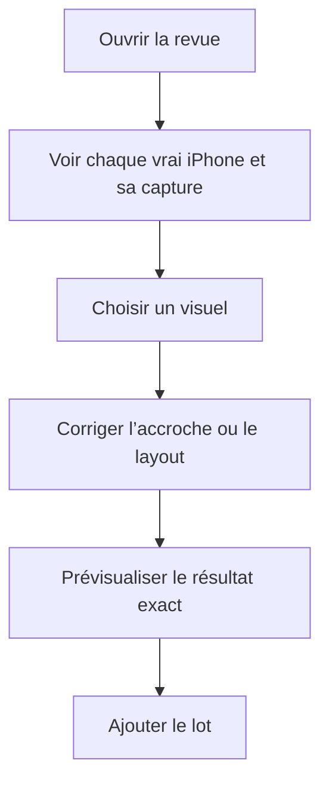
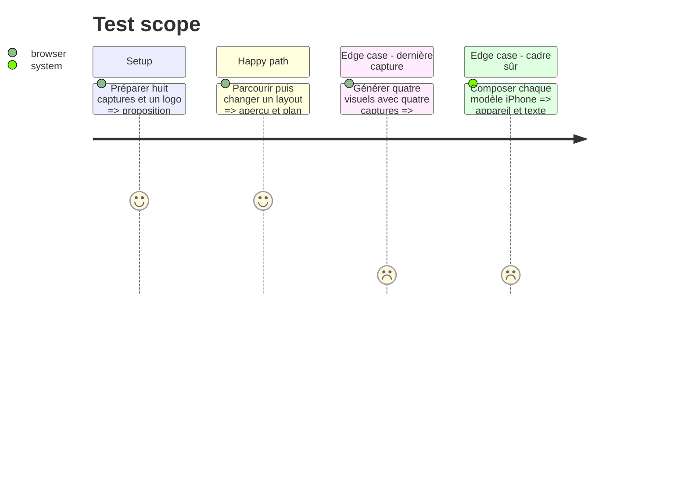

# Instruction: Rendre les compositions lisibles et contrôlables

## Architecture projection

> Tree of the final files. ✅ create · ✏️ modify · ❌ delete

```txt
apps/web/
├── e2e/
│   └── ✏️ ai-campaign.spec.ts
└── src/
    ├── components/campaign-dialog/
    │   ├── ✏️ CampaignDialog.tsx
    │   └── ✏️ PlanPreview.tsx
    └── lib/
        ├── ai/
        │   ├── ✏️ archetypes.ts
        │   └── ✏️ plan.ts
        └── __tests__/
            ├── ✏️ archetypes.test.ts
            └── ✏️ ai-builder.test.ts
```

## User Journey



## Test Scope



## Wireframe

```txt
┌──────────────────────────────────────────────────────┐
│ (1) Vérifier la proposition              palette     │
│ (2) [1] [2] [3] [4] [5] …                           │
├───────────────────┬──────────────────────────────────┤
│ (3) Aperçu exact  │ (4) Accroche                     │
│     avec châssis  │     Mise en page                 │
│     ScreenForge   │     Source factuelle             │
│                   │     Réécrire · Retirer           │
├───────────────────┴──────────────────────────────────┤
│ (5) Modifier le brief             Ajouter les visuels│
└──────────────────────────────────────────────────────┘
```

1. Titre : état de revue et palette.
2. Bande : navigation compacte entre les visuels.
3. Aperçu : composition réellement posée.
4. Réglages : texte, layout, provenance et actions secondaires.
5. Actions : retour au brief ou insertion atomique.

## Tasks to do

### `1)` Sécuriser les archétypes

> Faire de la lisibilité le défaut de composition.

1. Garder au moins 90 % de l’appareil visible et limiter la rotation.
2. Supprimer les superpositions automatiques titre/appareil.
3. Réserver le bas au filigrane et ne choisir le mur que sans capture.
4. Mesurer les boîtes réelles ou borner les textes avant composition.

### `2)` Donner le contrôle en revue

> Permettre un changement de layout avant toute écriture du projet.

1. Porter le layout choisi dans le plan.
2. Ajouter le Select correspondant dans la revue.
3. Continuer à rendre le vrai SVG d’appareil ScreenForge dans l’aperçu.

## Test acceptance criteria

| Task | Acceptance criteria |
| ---- | ------------------- |
| 1 | Aucun archétype automatique ne masque la capture, le titre ou le filigrane ; une capture disponible n’est jamais remplacée par un mur. |
| 2 | Changer de mise en page modifie immédiatement l’aperçu et la même géométrie est posée dans le projet. |

