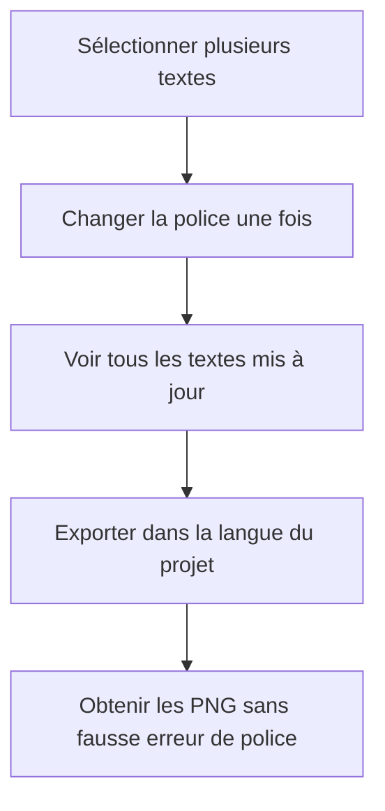
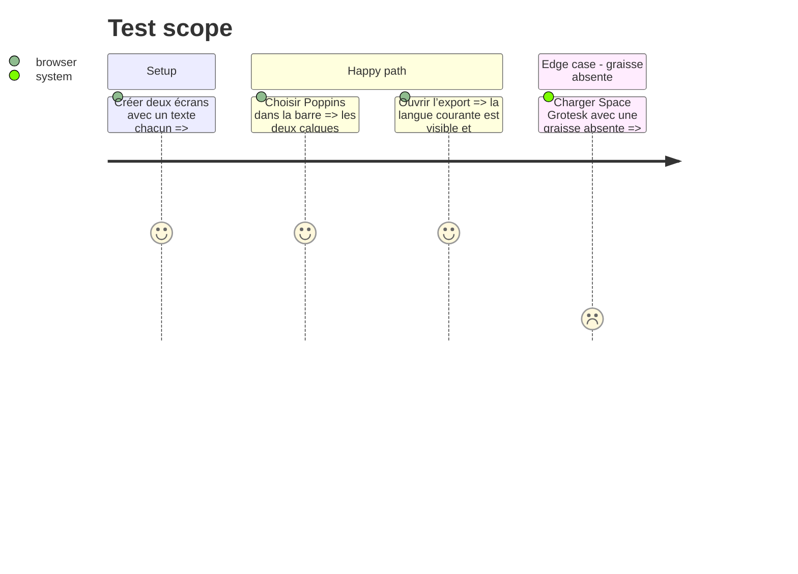

# Instruction: Fermer les régressions éditeur et le parcours réel

## Architecture projection

> Tree of the final files. ✅ create · ✏️ modify · ❌ delete

```txt
apps/web/
└── e2e/
    └── ✏️ ai-campaign.spec.ts # ferme le parcours campagne complet si nécessaire
```

## User Journey



## Test Scope



## Tasks to do

### `1)` Rejouer les correctifs éditeur engagés

> Conserver une mutation atomique pour la multisélection et des contrôles lisibles.

1. Rejouer la mise à jour multi-écrans et son unique pas d’annulation.
2. Rejouer la valeur vide du Select Radix utilisée par la langue du projet.
3. Rejouer le repli de graisse Google Fonts sans masquer une vraie police absente.

### `2)` Exécuter le parcours final

> Prouver les correctifs ensemble dans le navigateur réel.

1. Lancer unités, types, lint et build.
2. Lancer en dernier les parcours Playwright concernés puis la suite requise.

## Test acceptance criteria

| Task | Acceptance criteria |
| ---- | ------------------- |
| 1 | Une édition commune touche tous les textes sélectionnés et s’annule en un geste ; la langue courante reste visible ; Space Grotesk ne produit plus de faux blocage. |
| 2 | Le parcours campagne → revue → insertion → export passe dans Chromium sans régression d’accessibilité ni de dimensions. |
