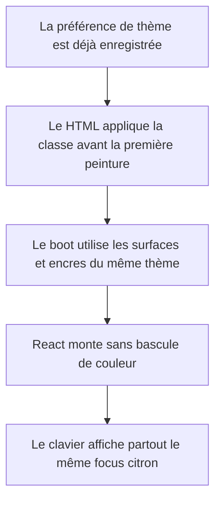
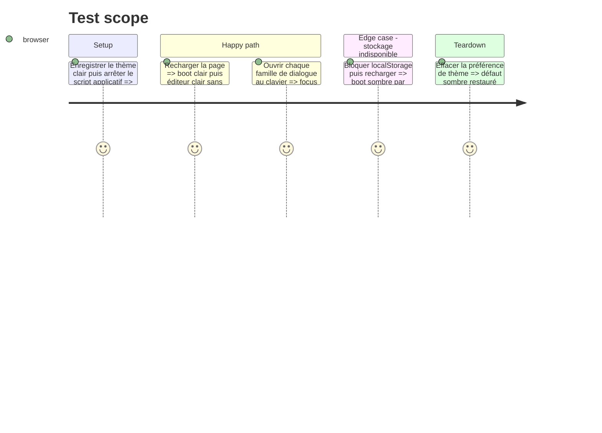

# Instruction: premier rendu et focus cohérents en sombre comme en clair

## Architecture projection

> Tree of the final files. ✅ create · ✏️ modify · ❌ delete

```txt
.
├── ✏️ .impeccable.md
└── apps/web
    ├── ✏️ index.html
    ├── e2e
    │   ├── ✏️ boot-shell.spec.ts
    │   └── ✏️ dialogs-a11y.spec.ts
    └── src/components
        ├── campaign-dialog
        │   ├── ✏️ AssistantSetup.tsx
        │   └── ✏️ CampaignDialog.tsx
        ├── export-dialog
        │   └── ✏️ ExportDialog.tsx
        ├── locale-dialog
        │   └── ✏️ LocaleDialog.tsx
        ├── publish-dialog
        │   └── ✏️ PublishDialog.tsx
        └── release-dialog
            └── ✏️ ReleaseDialog.tsx
```

## User Journey



## Test Scope



## Wireframe

```txt
Premier rendu clair                         Éditeur monté, structure inchangée
┌──────────────────────────────────────┐   ┌──────────────────────────────────────┐
│                                      │   │ TopBar                         Export │
│              ScreenForge             │   ├──────────┬─────────────────┬─────────┤
│              ━━━━━━━━                │ → │ Calques  │     Canvas      │ Propriétés│
│       fond + encre du thème clair     │   │          │                 │          │
│                                      │   ├──────────┴─────────────────┴─────────┤
└──────────────────────────────────────┘   │ Écrans                         Zoom    │
                                           └──────────────────────────────────────┘
Focus clavier : contour citron unique sur toute surface interactive.
```

## Tasks to do

### `1)` Appliquer le thème avant la première peinture

> Supprimer le flash sombre des sessions claires sans ajouter de provider.

1. Lire `screenforge-theme` dans un script inline placé avant les styles de boot.
2. Appliquer uniquement la classe `light` pour une valeur valide ; garder sombre en défaut ou en erreur.
3. Aligner fond, encre et barre du boot sur les tokens courants des deux thèmes.
4. Conserver le chargement Inter non bloquant et `prefers-reduced-motion`.

### `2)` Rebrancher les focus locaux sur le token global

> Une seule grammaire de focus doit survivre dans tous les dialogues.

1. Remplacer les overrides `ring-foreground` par `ring-ring` ou supprimer l'override quand l'outline global suffit.
2. Vérifier les cartes radio, les onglets, la divulgation Assistance et les actions composites dans les six dialogues touchés.
3. Ne modifier ni couleurs d'état, ni layout, ni ordre de tabulation dans ce lot.

### `3)` Réconcilier la vérité design

> Empêcher les futurs changements de repartir des constantes v4 obsolètes.

1. Passer `.impeccable.md` à la direction v5 réellement rendue.
2. Aligner focus, échelle typographique, rayons et six niveaux de z-index avec `index.css` et la mémoire projet.
3. Retirer les phrases contredites plutôt que documenter deux variantes.

### `4)` Verrouiller le premier rendu et le focus

> Les scénarios doivent échouer si le flash ou le double langage de focus revient.

1. Étendre `boot-shell.spec.ts` aux préférences clair, sombre et stockage indisponible avant montage.
2. Étendre `dialogs-a11y.spec.ts` avec un contrôle de focus visible dans chaque famille de dialogue touchée.
3. Rejouer les captures sombre/clair vide et peuplé.

## Test acceptance criteria

| Task | Acceptance criteria |
| --- | --- |
| 1 | Une préférence claire produit une première peinture claire ; une préférence sombre ou absente produit une première peinture sombre ; aucune bascule inverse n'est visible au montage |
| 2 | Tous les éléments personnalisés touchés montrent le même focus citron en sombre et en clair, avec un contraste visible sur leur surface |
| 3 | `.impeccable.md` décrit exactement les tailles, rayons, focus et z-levels présents dans `index.css` sans référence v4 contradictoire |
| 4 | Les tests échouent si la classe de thème arrive après peinture ou si une carte de dialogue réintroduit un focus foreground |
