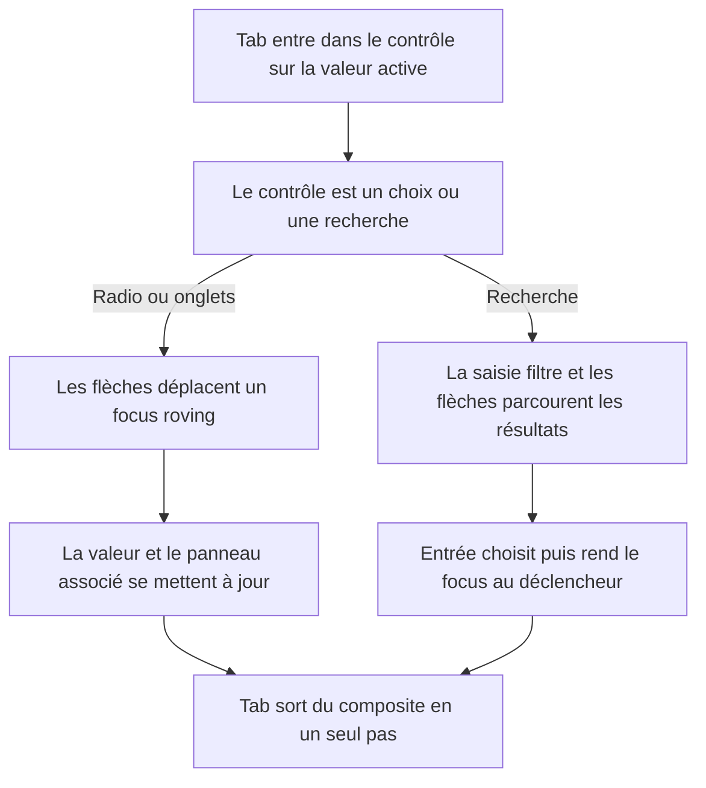
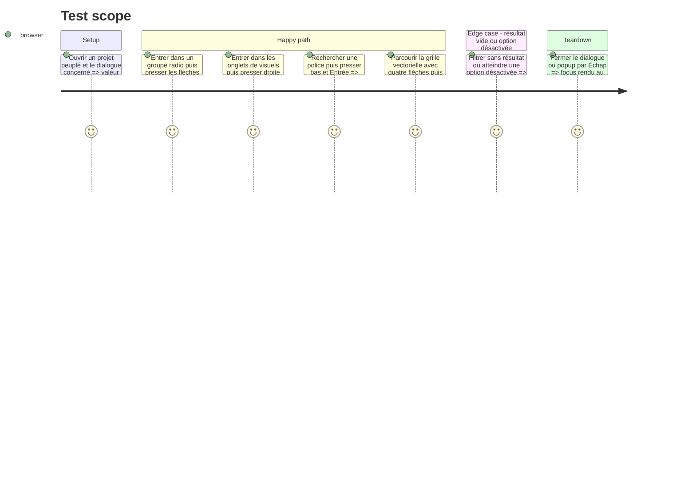

# Instruction: contrôles composites réellement utilisables au clavier

## Architecture projection

> Tree of the final files. ✅ create · ✏️ modify · ❌ delete

```txt
apps/web
├── e2e
│   ├── ✏️ ai-campaign.spec.ts
│   ├── ✏️ ai-provider.spec.ts
│   ├── ✏️ canvas-editing.spec.ts
│   ├── ✏️ locale.spec.ts
│   └── ✏️ vector-catalog.spec.ts
└── src/components
    ├── campaign-dialog
    │   ├── ✏️ AssistantSetup.tsx
    │   └── ✏️ CampaignDialog.tsx
    ├── locale-dialog
    │   └── ✏️ LocaleDialog.tsx
    ├── text-editor
    │   └── ✏️ FontPicker.tsx
    └── vector-picker
        └── ✏️ VectorPicker.tsx
```

## User Journey



## Test Scope



## Wireframe

```txt
Choix radio                              Picker recherché
┌──────────────────────────────────┐     ┌──────────────────────────────────┐
│ Qui écrit les accroches          │     │ Police : Inter              ▾    │
│ ┌──────────────────────────────┐ │     ├──────────────────────────────────┤
│ │ ◉ Composition locale         │ │     │ 🔎 Rechercher une police…        │
│ ├──────────────────────────────┤ │     ├──────────────────────────────────┤
│ │ ○ Codex local                │ │     │ Populaires                       │
│ ├──────────────────────────────┤ │     │  Inter                    ✓      │
│ │ ○ OpenAI                     │ │     │  Manrope                         │
│ └──────────────────────────────┘ │     │  SF Pro                          │
└──────────────────────────────────┘     └──────────────────────────────────┘
Tab entre/sort ; ↑↓ ou ←→ naviguent.    Saisie filtre ; ↑↓ cible ; ↵ choisit.
```

## Tasks to do

### `1)` Rendre les groupes radio natifs

> Les rôles radio doivent fournir le comportement annoncé aux technologies d'assistance.

1. Recomposer les choix de langue, fournisseur IA et style avec des `input type="radio"` contrôlés et leurs labels carte.
2. Garder les options désactivées, descriptions et classes métier actuelles sans réimplémenter leur clavier en JavaScript.
3. Laisser le navigateur gérer l'unique arrêt Tab, les flèches, le focus et l'état checked.

### `2)` Relier les onglets de revue à leur panneau

> La bande de visuels doit être un vrai tablist, pas une rangée de boutons seulement renommée.

1. Ajouter localement `tabIndex`, gauche/droite, Home et End sur la bande horizontale existante.
2. Ajouter des identifiants stables, `aria-controls`, `aria-labelledby` et un `tabpanel` actif.
3. Activer l'aperçu au focus fléché puisque son contenu est déjà en mémoire et instantané.

### `3)` Rendre les pickers recherchables cohérents au clavier

> Reprendre les bénéfices d'Appica/Coss avec les dépendances déjà installées.

1. Utiliser `cmdk` dans `FontPicker` pour filtrage, option active, flèches, Entrée, état vide et fermeture.
2. Conserver le chargement paresseux des aperçus de polices par IntersectionObserver.
3. Ajouter dans `VectorPicker` un roving 2D local adapté aux cinq colonnes ; ne pas créer une abstraction générique pour ce seul grid picker.
4. Garder les portails, le thème hérité de `<html>`, Échap et le retour de focus existants.

### `4)` Tester les gestes clavier, pas seulement les rôles

> Chaque modèle ARIA doit être prouvé par son interaction observable.

1. Étendre les specs métier existantes plutôt que créer une suite transversale supplémentaire.
2. Vérifier un seul arrêt Tab par composite, navigation fléchée, sélection, panneau associé, résultat vide et retour de focus.
3. Conserver les assertions souris existantes pour prévenir une régression croisée.

## Test acceptance criteria

| Task | Acceptance criteria |
| --- | --- |
| 1 | Tab atteint uniquement le choix actif de chaque radiogroup ; les flèches contournent le groupe, ignorent les options désactivées et mettent à jour `aria-checked` |
| 2 | Chaque tab contrôle un tabpanel nommé ; gauche/droite changent le tab actif et l'aperçu sans étape Entrée ni latence visible |
| 3 | Police et vecteur sont entièrement sélectionnables sans souris ; Échap ferme sans changer la valeur et rend le focus au déclencheur |
| 4 | Les specs échouent si les flèches ne déplacent plus le focus, si Tab visite chaque option ou si le panneau n'est plus relié à son tab |
