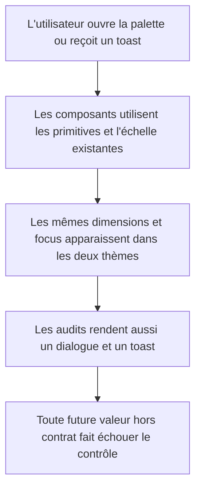
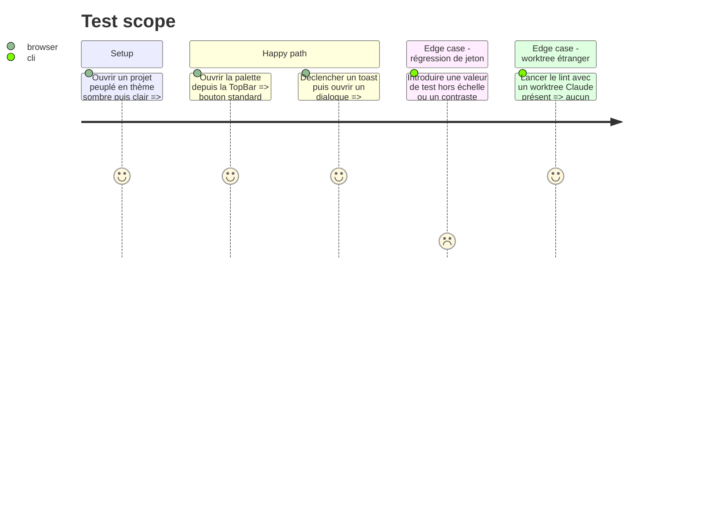

# Instruction: primitives et garde-fous visuels refermés

## Architecture projection

> Tree of the final files. ✅ create · ✏️ modify · ❌ delete

```txt
.
├── ✏️ eslint.config.js
├── scripts
│   ├── ✏️ contrast-audit.mjs
│   └── ✏️ scale-audit.mjs
└── apps/web
    ├── e2e
    │   ├── ✏️ boot-shell.spec.ts
    │   └── ✏️ command-palette.spec.ts
    └── src
        ├── ✏️ App.tsx
        └── components
            ├── toolbar
            │   └── ✏️ TopBar.tsx
            └── ui
                └── ✏️ command-palette.tsx
```

## User Journey



## Test Scope



## Wireframe

```txt
TopBar inchangée                          Feedback contrôlé par les audits
┌──────────────────────────────────────┐  ┌──────────────────────────────────────┐
│ ScreenForge  outils  [⌘ K]  Export  │  │ Dialogue                             │
└──────────────────────────────────────┘  │ ┌──────────────────────────────────┐ │
Le bouton ⌘K devient IconButton.          │ │ contrôles 32/36 px, focus token │ │
                                          │ └──────────────────────────────────┘ │
                                          │ Toast — texte sur l'échelle fermée  │
                                          └──────────────────────────────────────┘
```

## Tasks to do

### `1)` Réutiliser la primitive de palette

> Supprimer le dernier bouton toolbar dupliqué sans changer son rendu ou son raccourci.

1. Remplacer le bouton maison de `TopBar` par `IconButton` avec le `Kbd` existant comme contenu.
2. Garder label accessible, tooltip, raccourci et paliers responsive.
3. Ne pas généraliser les autres boutons natifs sémantiques qui ne partagent pas ce contrat.

### `2)` Refermer l'échelle des toasts

> Sonner doit utiliser un token typographique mesuré, jamais une valeur intermédiaire inline.

1. Remplacer `12.5px` par le token fermé approprié sans wrapper supplémentaire autour de Sonner.
2. Faire rendre à `scale-audit.mjs` la vue principale, un dialogue représentatif et un toast réel.
3. Conserver ombre, rayon, z-index et couleurs Sonner déjà tokenisés.

### `3)` Étendre seulement les contrastes réellement utilisés

> Verrouiller les textes sémantiques présents sans transformer l'audit en crawler DOM fragile.

1. Ajouter les couples `warning/card` et `success/card` à `contrast-audit.mjs` pour sombre et clair.
2. Garder le seuil 4,5:1 et les couples ink/surface existants.
3. Échouer avec le nom exact du couple fautif.

### `4)` Exclure les worktrees étrangers du lint

> Le lint produit doit ignorer le code généré qui n'appartient pas au workspace courant.

1. Ajouter `.claude/worktrees/**` aux ignores du flat config racine.
2. Ne pas masquer les avertissements de `apps/**`, `scripts/**` ou `supabase/**`.

### `5)` Rejouer le filet complet sans optimisation spéculative

> Prouver que le durcissement n'a déplacé ni layout, ni performance, ni export.

1. Exécuter tests, typecheck, lint, build, audits contraste/échelle et la sélection Playwright UX.
2. Reprendre les quatre captures dark/light × vide/peuplé et comparer focus, toast et dialogue.
3. Ne modifier Fabric, le chunking ou les gros composants que si une régression mesurée apparaît pendant ces contrôles.

## Test acceptance criteria

| Task | Acceptance criteria |
| --- | --- |
| 1 | Le déclencheur de palette garde exactement son accessibilité, sa taille, ses états et son comportement responsive avec `IconButton` |
| 2 | Toasts, dialogue représentatif et vue principale n'exposent aucune taille hors des échelles fermées dans les deux thèmes |
| 3 | Les textes warning et success sur card passent 4,5:1 en sombre et clair, et l'audit nomme toute régression |
| 4 | Le lint n'inspecte aucun fichier sous `.claude/worktrees/**` mais continue de couvrir tout le code produit |
| 5 | Build, tests, audits et captures restent verts ; aucun changement pixel ou bundle non expliqué n'apparaît sur le chemin critique |
