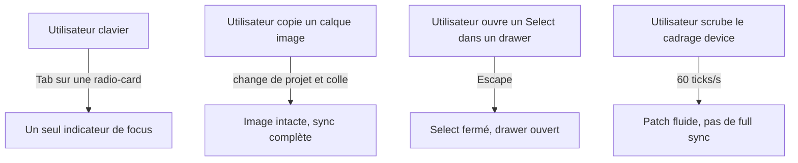

# Instruction: bugs démontrés P1

## Architecture projection

```txt
apps/web/src/
  components/locale-dialog/LocaleDialog.tsx        ✏️ outline-none sur l'input radio invisible
  components/campaign-dialog/AssistantSetup.tsx    ✏️ idem
  components/campaign-dialog/CampaignDialog.tsx    ✏️ idem
  components/ui/select.tsx                         ✏️ stopPropagation Escape sur Content
  components/layers-panel/LayersDrawer.tsx         ✏️ inert + démontage du panel fermé
  components/properties-panel/PropertiesDrawer.tsx ✏️ idem
  hooks/use-keyboard.ts                            ✏️ assets du clipboard, raccourcis T/R/⌘E
  hooks/use-canvas.ts / lib/canvas/canvas-sync.ts  ✏️ throttle rAF du cadrage device
  lib/canvas/canvas-interactions.ts                ✏️ guides de snapping neutres tokenisés
  lib/assets.ts                                    ✏️ ré-enregistrement d'assets au collage
apps/web/e2e/
  dialogs-a11y.spec.ts                             ✏️ double focus, Escape Select, drawers inert
  clipboard.spec.ts                                ✅ collage inter-projets avec calque image
```

## User Journey



## Tasks to do

### `1)` Double indicateur de focus sur les radio-cards

> L'input radio invisible plein-cadre peint l'outline global 2px en plus du ring 1px du label.

1. Ajouter `outline-none` à l'input radio invisible dans `LocaleDialog`, `AssistantSetup`, `CampaignDialog` (re-localiser : audit `LocaleDialog.tsx:281/295`, `AssistantSetup.tsx:212/224`, `CampaignDialog.tsx:834/847`).
2. Vérifier qu'il ne reste qu'un seul indicateur visible au focus clavier dans les trois dialogues.

### `2)` Guides de snapping neutres et tokenisés

> `GUIDE_COLOR = '#ff2d6f'` viole la règle v5 (rien de chromatique sur l'artboard) et ignore le thème.

1. Lire la couleur via `readChromeColors()` comme la sélection/lasso (`canvas-interactions.ts`), ou introduire un token `--color-guide` par thème dans `index.css`.
2. S'assurer d'un contraste visible sur artboard clair comme sombre.

### `3)` Clipboard inter-projets et assets

> Coller un calque image/device copié dans un autre projet laisse un `assetId` orphelin : sync abortée, projet persisté cassé.

1. Au collage (`use-keyboard.ts`), ré-enregistrer dans le registry les payloads des `assetId` référencés (ou vider le clipboard au changement de projet si plus simple et documenté).
2. Couvrir aussi la duplication immédiatement après un switch si le même chemin est concerné.

### `4)` Scrub du cadrage device sans full sync

> Chaque tick de slider Zoom/focus change `placementKey` → `patchCanvas` bail → full sync + re-raster SVG 4×.

1. Throttler en rAF les mises à jour de placement depuis `ScreenshotFraming`, ou mettre en cache le raster par resource key.
2. Garder la coalescence d'historique existante inchangée.

### `5)` Drawers fermés : inertes et démontés

> Panels traduits hors-écran mais montés, abonnés aux stores et focusables sous `aria-hidden`.

1. Ajouter `inert` (ou `invisible`) à l'état fermé des deux drawers.
2. Ne plus rendre `LayersPanel`/`PropertiesPanel` quand le drawer est fermé (après la transition de sortie).

### `6)` Select : Escape ne fuit plus

> Radix Select ferme mais l'événement bubble vers le handler global qui ferme aussi les drawers.

1. Ajouter `onEscapeKeyDown={(e) => e.stopPropagation()}` sur `SelectPrimitive.Content`, comme `dialog.tsx`, `popover.tsx`, `dropdown.tsx`, `ContextMenu.tsx`.

### `7)` Raccourcis annoncés par la palette mais non bindés

> `commands.ts` annonce T (texte), R (rectangle), ⌘E (export) ; `use-keyboard.ts` ne les gère pas.

1. Binder T/R (ajout de calque, hors édition d'input) et ⌘E (ouverture export) dans `use-keyboard.ts`, ou retirer les champs `shortcut` — choix à trancher en faveur du binding.
2. Ajouter `⌘⇧K` au guard existant (`key.toLowerCase()`).

## Test acceptance criteria

| Task | Acceptance criteria |
| ---- | ------------------- |
| 1 | Au focus clavier sur une radio-card, un seul indicateur (ring 1px) est visible dans Locale, Assistant et Campaign — vérifié par capture e2e |
| 2 | Les guides d'alignement canvas sont neutres (aucune teinte) et restent visibles en thème clair comme sombre |
| 3 | Coller dans un projet B un calque image copié dans le projet A affiche l'image ; recharger le projet B la conserve |
| 4 | Pendant un drag continu du slider de cadrage device, aucune full reconciliation ne se déclenche (instrumentation `syncVersion`/patch path) et le rendu reste fluide |
| 5 | Drawer fermé : Tab n'atteint aucun contrôle du panel, axe ne remonte plus de violation aria-hidden-focus, et un scrub canvas ne re-rend pas le panel caché |
| 6 | Escape dans un Select ouvert à l'intérieur du drawer Propriétés ferme le Select seul |
| 7 | T, R et ⌘E déclenchent l'action annoncée par la palette ; ⌘⇧K n'ouvre pas la palette |
