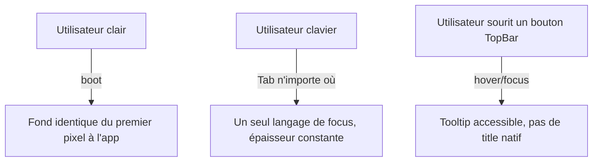

# Instruction: un contrat focus, sélection et thème unique

## Architecture projection

```txt
apps/web/src/
  index.css                                 ✏️ shadow-handle light, color-scheme, token guide
  index.html                                ✏️ boot sombre aligné sur --color-background
  components/vector-picker/VectorPicker.tsx ✏️ ring-1, bg-secondary pour la sélection
  components/template-picker/TemplatePicker.tsx ✏️ focus ring distinct de la sélection
  components/text-editor/FontPicker.tsx     ✏️ ring de focus sur l'input de recherche
  components/ui/command-palette.tsx         ✏️ idem
  components/ui/tooltip.tsx                 ✅ primitive Tooltip manquante
  components/toolbar/TopBar.tsx             ✏️ 16 title= natifs → Tooltip
  components/ui/slider.tsx                  ✏️ focus handle selon contrat décidé
  components/ui/icon-button.tsx             ✏️ commentaire accent→marker
scripts/contrast-audit.mjs                  ✏️ couples warning/card et success/card
```

## User Journey



## Tasks to do

### `1)` Épaisseur et recette de focus unifiées

> Le focus varie de 1px à 2px selon les widgets et VectorPicker utilise la surface hover pour la valeur courante.

1. `VectorPicker` : `ring-2` → `ring-1`, `bg-accent` → `bg-secondary` sur la ligne sélectionnée.
2. Trancher et documenter dans `index.css` : NumberField `focus-within:outline-[1.5px]` et handle de slider — soit alignement sur le ring global, soit exception écrite au contrat.
3. `TemplatePicker` : focus-visible en `ring-1 ring-ring`, la sélection reste sur la bordure (les deux ne doivent plus être confondus).
4. `FontPicker` et `command-palette` : rendre un focus visible sur les inputs de recherche (`outline-none` sans remplacement aujourd'hui).

### `2)` Une seule recette "sélectionné" pour les dialogues

> Quatre grammaires coexistent : marker (layers/écrans), border-foreground/bg-muted (dialogues), border-muted-foreground (templates), border-border/bg-accent (vecteurs).

1. Conserver marker pour canvas/panels (état "you are here").
2. Aligner toutes les cartes sélectionnables de dialogues sur `border-foreground bg-muted` (déjà dominant).
3. Documenter la règle dans `index.css` à côté des tokens concernés.

### `3)` Parité dark/light des ombres et du chrome UA

> `--shadow-handle` sans override clair (40% noir), pas de `color-scheme`, boot sombre 0.145 ≠ body 0.175.

1. Ajouter `--shadow-handle` atténué dans `.light`.
2. `color-scheme: dark` sur `:root`, `light` dans `.light` (scrollbars, autofill, contrôles UA).
3. Aligner `--boot-background` sombre d'`index.html` sur `oklch(0.175 0 0)`.

### `4)` Primitive Tooltip et retrait des `title=`

> AGENTS.md documente un Tooltip qui n'existe pas ; TopBar seul a 16 `title=` natifs inaccessibles au clavier/tactile.

1. Créer `components/ui/tooltip.tsx` sur Radix Tooltip, tokens v5, délai court, sans flèche si le style l'exige.
2. Migrer les `title=` de TopBar (puis tout autre `title=` de l'éditeur) vers la primitive.

### `5)` Hygiène tokens et audits

1. Corriger le commentaire obsolète d'`icon-button.tsx` (accent → marker).
2. Remplacer ou justifier les `z-10` locaux des inputs overlay radio.
3. Ajouter les couples `warning/card` et `success/card` à `scripts/contrast-audit.mjs`.

## Test acceptance criteria

| Task | Acceptance criteria |
| ---- | ------------------- |
| 1 | Le focus clavier a la même épaisseur et la même couleur sur toutes les lignes d'options, champs et pickers ; l'état sélectionné reste visuellement distinct du focus |
| 2 | Toutes les cartes sélectionnables des dialogues partagent la même recette visuelle de sélection dans les deux thèmes |
| 3 | En thème clair, les thumbs de slider et stops de gradient n'ont plus d'ombre noire dure ; les scrollbars Firefox suivent le thème ; aucun double flash sombre au boot |
| 4 | Chaque bouton icône de TopBar affiche un tooltip au hover et au focus clavier, sans `title=` natif restant dans l'éditeur |
| 5 | `pnpm run audit:contrast` couvre et valide warning/card et success/card ; lint et probe visuel passent dans les deux thèmes |
