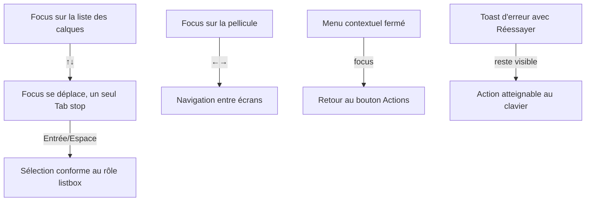

# Instruction: modèles clavier conformes aux rôles annoncés

## Architecture projection

```txt
apps/web/src/
  components/layers-panel/LayersPanel.tsx    ✏️ listbox : flèches + roving tabindex
  components/layers-panel/LayerItem.tsx      ✏️ ↑↓/⇧↑↓/⌘↑↓, un seul Tab stop
  components/screens-bar/ScreensBar.tsx      ✏️ ←/→ entre vignettes
  components/canvas/SelectionToolbar.tsx     ✏️ roving tabindex ou role=group
  components/ui/ContextMenu.tsx              ✏️ retour de focus au bouton invocateur
  components/screens-bar/ScreenThumbnail.tsx ✏️ retour de focus après rename
  components/gradient-editor/GradientEditor.tsx ✏️ Home/End sur les stops
  components/ui/field.tsx                    ✏️ span quand pas d'id
  components/ui/command-palette.tsx          ✏️ focus-restore unifié via dismiss()
  components/ui/shortcuts-overlay.tsx        ✏️ ⌘⇧L/⌘⇧P + source unique
  components/device-picker/DevicePicker.tsx  ✏️ nom accessible = label visible
  hooks/use-keyboard.ts                      ✏️ garde flèches rescopée, branches mortes
  stores/toast.store.ts                      ✏️ durée des toasts avec action
  App.tsx                                    ✏️ closeButton Sonner
apps/web/e2e/
  layers-keyboard.spec.ts                    ✅ modèle listbox complet
  screens-strip.spec.ts                      ✅ ←/→ pellicule + retours de focus
```

## User Journey



## Tasks to do

### `1)` Listbox des calques : le modèle promis

> `role="listbox"` + `role="option"` mais les flèches sont avalées par le guard global et chaque ligne est un Tab stop.

1. Implémenter ↑↓ (déplacement focus), ⇧↑↓ (extension de sélection), ⌘↑↓ si cohérent avec l'existant, avec roving `tabIndex` (un seul stop).
2. Préserver les raccourcis existants (Entrée/Espace/F2/Delete/⌥↑↓ de réordonnancement) et le nudge canvas quand la liste n'a pas le focus.
3. Si le modèle complet s'avère hors proportion, rétrograder en `role="list"` + boutons — mais tenter le listbox d'abord.

### `2)` Pellicule d'écrans : ←/→

> `role="group"` + guard global = flèches mortes sur les vignettes.

1. ←/→ déplacent le focus entre vignettes ; Entrée active (comportement actuel conservé).
2. Rescoper le guard `use-keyboard.ts:32` aux rôles composites (slider/menuitem/option/switch/tab/radio) pour ne plus avaler les flèches partout.

### `3)` SelectionToolbar : toolbar ou group

> `role="toolbar"` sans roving ni flèches — chaque contrôle est un Tab stop.

1. Implémenter roving tabindex + ←/→ entre contrôles, ou rétrograder en `role="group"` si le coût ne se justifie pas ; décision documentée.

### `4)` Retours de focus systématiques

1. `ContextMenu` : rendre le focus au bouton "Actions de …" invocateur (ref optionnel passé au composant).
2. Rename d'écran : `finishRename` rend le focus à la vignette (comme `close(returnFocus=true)` des pickers).
3. Palette : unifier `runCommand` sur le chemin `dismiss()` de restauration de focus.

### `5)` Complétude des widgets et annonces

1. Stops de gradient : Home/End (min/max) en plus de ←/→.
2. `Field` : rendre un `span` quand aucun `id` n'est fourni.
3. `DevicePicker` : nom accessible incluant le modèle visible (WCAG 2.5.3).
4. Overlay raccourcis : ajouter ⌘⇧L/⌘⇧P, idéalement généré depuis le même registre que `commands.ts`.
5. Supprimer les branches Escape mortes de `use-keyboard.ts` (dialogues Radix déjà stopPropagation).

### `6)` Toasts atteignables

1. `toast.store` : tout toast portant une action passe en `duration: Infinity` (ou ≥ 10 s).
2. Sonner : `closeButton` activé, au minimum pour le toast d'erreur de stockage permanent.

## Test acceptance criteria

| Task | Acceptance criteria |
| ---- | ------------------- |
| 1 | Dans la liste des calques : un seul Tab stop, ↑↓ déplacent le focus, ⇧↑↓ étend la sélection, ⌥↑↓ réordonne toujours, le nudge canvas reste intact hors liste — couvert par `layers-keyboard.spec.ts` |
| 2 | ←/→ naviguent entre vignettes d'écrans, Entrée active l'écran, les flèches restent disponibles au nudge quand le focus est sur le canvas |
| 3 | SelectionToolbar expose un seul Tab stop avec ←/→ internes, ou n'expose plus `role="toolbar"` |
| 4 | Après fermeture d'un menu contextuel ou d'un rename, le focus revient sur l'élément invocateur ; exécuter "Basculer le thème" depuis la palette restaure le focus comme un dismiss |
| 5 | Home/End bornent un stop de gradient ; aucun `label` orphelin ; le contrôle vocal peut activer le sélecteur d'appareil par son texte visible ; l'overlay liste ⌘⇧L/⌘⇧P |
| 6 | Un toast avec action "Réessayer" reste affiché jusqu'à interaction ; le toast d'erreur de stockage est fermable |
