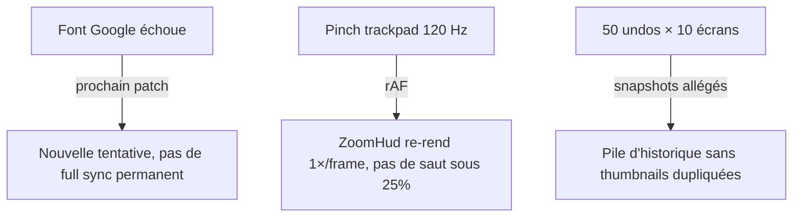

# Instruction: robustesse canvas, historique et stores

## Architecture projection

```txt
apps/web/src/
  lib/canvas/canvas-sync.ts          ✏️ retry font, thumbnails après font tardive
  lib/canvas/install-viewport.ts     ✏️ clamp zoom unifié, setZoom dans le rAF
  lib/editor-transaction.ts          ✏️ withoutThumbnail sur les snapshots
  stores/history.store.ts            ✏️ sameProject sans updatedAt/createdAt
  stores/ui.store.ts                 ✏️ source unique ZOOM_MIN/MAX (déjà là, consommer)
  hooks/use-layer-actions.ts         ✏️ structuredClone à la duplication
  hooks/use-canvas.ts                ✏️ création d'objets en Promise.all au full sync
  lib/zip.ts                         ✏️ revokeObjectURL différé
  components/properties-panel/BackgroundSection.tsx ✏️ sélecteur ciblé
  components/export-dialog/ExportDialog.tsx         ✏️ idem
```

## User Journey



## Tasks to do

### `1)` Police échouée : retry au lieu d'une dégradation permanente

> `fontLoadRequests` garde la clé pour toujours ; un échec réseau transitoire force une full sync à chaque frappe.

1. Retirer la clé de `runtime.fontLoadRequests` quand le statut passe `fallback` (`canvas-sync.ts` / `fonts.ts`).
2. Après un chargement tardif réussi, re-planifier `generateThumbnails` pour rafraîchir les vignettes de la pellicule.

### `2)` Zoom : une seule source de clamps

> Molette clampée à 0.1, store à 0.25 → re-zoom re-centré et saut visuel.

1. Le handler molette consomme `ZOOM_MIN`/`ZOOM_MAX` du store (`install-viewport.ts:165`).
2. Déplacer `setZoom` dans le callback rAF `wheelFrame` existant (un render ZoomHud par frame max).

### `3)` Historique allégé et dédup réelle

> Les transactions enregistrent les thumbnails (dizaines de MB potentiels) ; `sameProject` compare `updatedAt` et ne déduplique jamais.

1. Appliquer `withoutThumbnail` dans `runEditorTransaction` (centraliser la création de snapshot si possible).
2. Exclure `updatedAt`/`createdAt` de `sameProject` comme le fait déjà le chemin écrans.

### `4)` Petites fragilités

1. `use-layer-actions.ts` : `structuredClone` à la duplication (aligné sur les autres chemins).
2. `syncCanvas` full : pré-créer les objets image/device en parallèle (`Promise.all`, modèle déjà dans `export.ts`).
3. `zip.ts` : `revokeObjectURL` différé (~10 s) ou après le dernier téléchargement du batch.
4. `BackgroundSection` et `ExportDialog` : sélecteurs ciblés (écran actif) au lieu de `s.project` entier.

## Test acceptance criteria

| Task | Acceptance criteria |
| ---- | ------------------- |
| 1 | Couper le réseau au chargement d'une font puis le rétablir : la frappe suivante dans le calque texte retente le chargement et reste en patch path ; les vignettes se mettent à jour à l'arrivée de la font |
| 2 | Zoomer à la molette sous 25 % est impossible ; un pinch rapide ne provoque ni saut du viewport ni plus d'un render de l'HUD par frame |
| 3 | La pile d'historique ne contient aucune data URL de thumbnail ; deux snapshots projet identiques consécutifs sont dédupliqués |
| 4 | Dupliquer un calque texte avec `charStyles` ne partage aucune référence imbriquée ; un full sync de 10 calques image décode en parallèle ; un export ZIP suivi d'un second téléchargement ne casse pas le premier |
