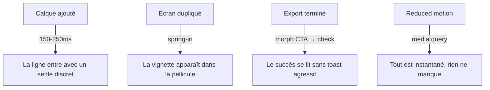

# Instruction: micro-interactions à la Amicro, en CSS natif

## Architecture projection

```txt
apps/web/src/
  index.css                              ✏️ tokens --animate-* spring-like, easings, keyframes
  components/layers-panel/LayerItem.tsx  ✏️ entrée/sortie de ligne
  components/screens-bar/ScreenThumbnail.tsx ✏️ arrivée d'une vignette
  components/canvas/SelectionToolbar.tsx ✏️ apparition sous la sélection
  components/toolbar/TopBar.tsx          ✏️ feedback du CTA Export
  stores/toast.store.ts / App.tsx        ✏️ toast succès export avec check animé
  lib/canvas/controls-patch.ts           ✏️ settle du cadre de sélection (si WAAPI sûr)
apps/web/e2e/
  motion.spec.ts                         ✅ reduced-motion respecté, durées bornées
```

## User Journey



## Tasks to do

### `1)` Fondations motion tokenisées

> Amicro montre la valeur de settles et morphs discrets ; le projet exige 150-300 ms, tokens et reduced-motion.

1. Définir dans `@theme` deux easings spring-like (`linear()` natif ou cubic-bezier) et les tokens `--animate-enter`, `--animate-settle`, `--animate-exit`.
2. Un seul endroit pour `prefers-reduced-motion` qui neutralise toutes les animations ajoutées.

### `2)` Entrées/sorties de listes

1. Ligne de calque : entrée (opacity + translate 4px + settle) à l'ajout, sortie à la suppression — sans perturber le DnD.
2. Vignette d'écran : spring-in à l'ajout/duplication dans la pellicule.

### `3)` Feedback de sélection et d'action

1. SelectionToolbar : apparition douce sous la sélection (opacity + léger translate, une seule fois par sélection).
2. Cadre de sélection canvas : micro-settle à la prise de sélection, uniquement si réalisable sans toucher au chemin de rendu Fabric ni au cache — sinon abandonner ce point et le noter.
   **Abandonné** : tout settle du cadre passe par `drawControls`/`renderCanvas`, donc par du travail Fabric par frame que le critère 3 interdit ; `controls-patch.ts` reste intact et la toolbar porte seule le feedback d'apparition.
3. CTA Export : état de progression puis morph vers un check de succès avant retour à l'état neutre.

### `4)` Toast de succès discret

1. Check dessiné (stroke-dashoffset) sur le toast de succès d'export, couleurs tokens, aucune célébration chromatique supplémentaire.

## Test acceptance criteria

| Task | Acceptance criteria |
| ---- | ------------------- |
| 1 | Toutes les animations ajoutées passent par des tokens `--animate-*` et durent 150-300 ms ; aucune dépendance Motion n'est ajoutée au bundle |
| 2 | Ajouter puis supprimer un calque se lit comme une entrée/sortie fluide sans décaler le DnD ; dupliquer un écran fait apparaître la vignette avec un settle |
| 3 | Sélectionner un calque fait apparaître la toolbar en douceur ; le rendu canvas par frame n'augmente pas (pas de travail Fabric supplémentaire) |
| 4 | Avec `prefers-reduced-motion: reduce`, toutes ces interactions sont instantanées et rien ne clignote — vérifié par `motion.spec.ts` et le probe visuel |
