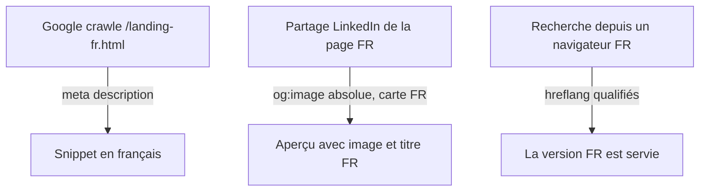

# Instruction: métadonnées prerendues justes et complètes

## Architecture projection

```txt
scripts/
  prerender-landing.mjs   ✏️ regex description multi-ligne, URLs absolues via SITE_ORIGIN,
                             og:locale en_US/fr_FR, og:image par langue, UnitPriceSpecification
  og-card.mjs             ✏️ carte OG déclinée FR (titre FR), sortie og-landing-fr.png
apps/web/
  landing.html            ✏️ og:locale, og:url, favicon ; description raccourcie < 155
  public/                 ✏️ favicon (SVG ou ICO), robots.txt, sitemap.xml (2 URLs)
  src/landing/copy.ts     ✏️ meta.description EN 161 → <155, FR 167 → <155 ;
                             « PNG-24, 8-bit RGBA » → « PNG-24, sRGB, opaque »
```

## User Journey



## Tasks to do

### `1)` BLOQUANT — la description FR sort en anglais

> `prerender-landing.mjs:52` : la regex de `<meta name="description">` exige la balise sur une ligne, or `landing.html:7-10` l'écrit sur quatre. Le remplacement est un no-op silencieux ; prouvé dans `dist/landing-fr.html` (og:description FR, description EN). Le runtime la réécrit après hydratation, ce qui masque le bug partout sauf pour les crawlers.

1. Appliquer à la ligne 52 le même `\s+` que la regex d'`og:description` dix lignes plus bas (le commentaire des lignes 56-60 documente déjà exactement ce piège).
2. Ajouter au prerender une assertion post-écriture : la description de `dist/landing-fr.html` doit contenir un mot français du texte attendu, sinon le build échoue. Un no-op de regex ne doit plus pouvoir sortir en silence.

### `2)` URLs absolues : hreflang, canonical, og:image, og:url

> `prerender-landing.mjs:67-72` écrit des hreflang relatifs (ignorés par Google) ; `landing.html:26` une `og:image` relative (rejetée par les scrapers sociaux alors que `twitter:card summary_large_image` promet une carte).

1. Introduire `SITE_ORIGIN` (env) dans le prerender ; si absente, garder le relatif et l'écrire en avertissement de build.
2. Qualifier hreflang (en, fr, x-default), canonical, `og:image`, et ajouter `og:url` par langue.

### `3)` Conformité OG et JSON-LD

1. `og:locale` : `en` → `en_US`, `fr` → `fr_FR` (`landing.html:20`, `prerender-landing.mjs:65`) ; ajouter `og:locale:alternate`.
2. Décliner la carte OG en FR (`scripts/og-card.mjs:67` n'écrit que le titre EN) et faire pointer la page FR dessus.
3. JSON-LD offre Cloud (`landing.html:56-62`) : encoder l'abonnement annuel en `UnitPriceSpecification` (`price 39`, `billingDuration P1Y`) au lieu d'un prix sec lisible comme un achat unique.

### `4)` Descriptions, robots, sitemap, favicon

1. Raccourcir `meta.description` EN (161) et FR (167) sous ~155 caractères en gardant « pas un abonnement » avant la coupe (`copy.ts` meta des deux langues).
2. Ajouter `public/robots.txt` et `public/sitemap.xml` (les deux documents), et une favicon (`landing.html` **et** `index.html` — 404 `/favicon.ico` à chaque visite aujourd'hui).
3. Corriger la ligne technique « PNG-24, 8-bit RGBA » (`copy.ts:158` EN, `:457` FR) : PNG-24 est sans alpha et la même copy dit « Opaque » — écrire « PNG-24, sRGB, opaque ».

### `5)` Claims à trancher avant lancement indexable

1. « Prices in USD, tax included » (`copy.ts:182`, `:478`) : vérifier la config Polar (merchant of record, TTC ou non) ; sinon reformuler en « taxes gérées au paiement ».
2. « Updates forever » / « à vie » (`copy.ts:218`, `:514`, JSON-LD `landing.html:53`) : décision assumée à consigner ici, ou borne (« toutes les mises à jour de la v1 »).

## Validation

- `pnpm run build` puis : `node -e` d'extraction → description FR en français, hreflang absolus réciproques, `og:image` absolue existante, carte FR 1200×630.
- Validateur schema.org sur le JSON-LD des deux pages.
