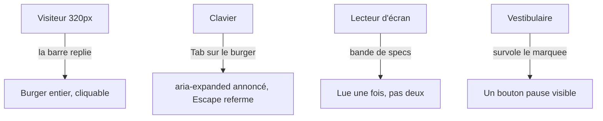

# Instruction: WCAG tenu — nav, contraste, mouvement, ordre

## Architecture projection

```txt
apps/web/src/landing/
  components/Nav.tsx        ✏️ barre qui tient à 320px, ancres inline dès que la place,
                               aria-expanded/controls sur le burger, Escape ferme,
                               hover langues ≥ 4.5:1, cibles langues élargies
  components/Marquee.tsx    ✏️ copie dupliquée aria-hidden, mécanisme de pause (2.2.2)
  components/Pricing.tsx    ✏️ ordre focus = ordre visuel mobile (réordonner le DOM,
                               pas max-md:order-*)
  components/Faq.tsx        ✏️ motion-reduce sur le chevron (comme sa grille sœur :33)
  landing.css               ✏️ (si nécessaire pour la pause marquee)
```

## User Journey



## Tasks to do

### `1)` La barre déborde sous ~371px, burger rogné sans recours

> `Nav.tsx:82-141` : logo 180,6px (mesuré `hmtx` du woff2) + paddings + 2 LangLink + burger = 370,6px incompressibles ; à 320px (plancher WCAG 1.4.10) le burger — seul accès aux ancres — garde ~13px, et `landing.css:141-144` (`overflow-x: clip`) interdit de défiler jusqu'à lui. Constaté en live à 320px.

1. Rendre la rangée compressible sous ~400px : logo `min-w-0` + taille réduite, ou replier les LangLink dans le menu.
2. Vérifier à 320px : burger entier, tout atteignable.

### `2)` Ancres de nav invisibles à toutes les largeurs

> `Nav.tsx:53-65` : L'éditeur/Tarifs/FAQ n'existent que dans le popover, même en desktop. Le commentaire du CTA (`:115-117`) énonce déjà la règle : « l'action reste visible hors du menu dès qu'il y a la place ».

1. Afficher les trois ancres inline au-dessus d'un seuil, burger seul en dessous.

### `3)` Le burger ne dit pas son état, Escape ne ferme pas

> Constaté live : `button "Menu"` sans `aria-expanded` ni `aria-controls` ; Escape laisse le panneau ouvert (le clic extérieur le ferme).

1. `aria-expanded` + `aria-controls` sur le bouton ; Escape ferme et rend le focus au bouton.

### `4)` Hover des langues à 3,82:1 sur le citron

> `Nav.tsx:103,111` : `hover:text-marker-ink/60` composé sur `marker` = 3,82:1 pour du 11px — seul couple de la page sous 4,5:1 (tout le reste calculé conforme).

1. Remplacer l'opacité par un état hover qui tient le ratio (souligné, ou ink pleine + fond).
2. Élargir les cibles langues : `min-w-9` (36px) et `gap-0.5` (2px) sont sous le standard projet 44px/8px (`LangLink.tsx:35`).

### `5)` Marquee : lu deux fois, jamais pausable

> Constaté live : deux copies exposées (`aria-hidden` sur aucune) ; animation 32s/boucle sans mécanisme de pause fourni par la page (échec F16/2.2.2 — la démo, elle, a sa pastille « Prendre la main »).

1. `aria-hidden` sur la copie de boucle.
2. Bouton pause (visible au survol/focus de la bande), qui fige l'animation.

### `6)` Ordre focus ≠ ordre visuel des cartes tarifs mobile

> `Pricing.tsx:184-194` : `max-md:order-1/2/3` affiche Licence d'abord mais Tab parcourt Gratuit → Licence → Cloud (2.4.3).

1. Réordonner le DOM (Licence première) et laisser md rétablir l'ordre visuel desktop par `order`, pour que DOM = mobile.

### `7)` Gardes reduced-motion restantes

1. Chevron FAQ (`Faq.tsx:28-31`) : `motion-reduce:transition-none`, comme la grille voisine (`:33`).
2. (Le `zoom-in` du device de la démo est traité en phase 3 avec le reste de `DemoBoard`.)

## Validation

- Live 320px : burger entier, menu ouvrable, Escape referme.
- Sweep contraste des couples de `landing.css` (script node de l'audit) : zéro sous 4,5:1.
- Lecteur d'écran (VoiceOver) : bande de specs lue une fois ; burger annonce ouvert/fermé.
