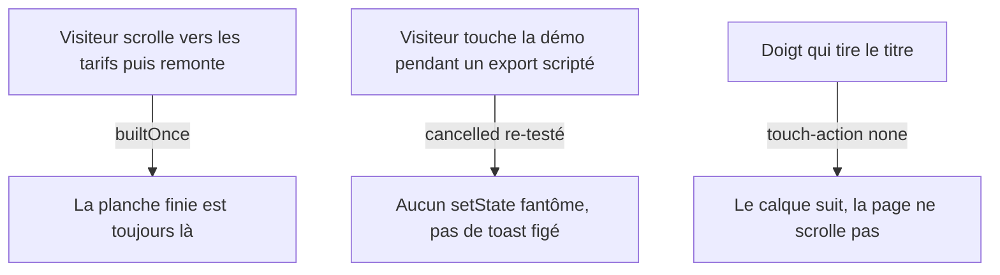

# Instruction: la démo honore ses propres commentaires

## Architecture projection

```txt
apps/web/src/landing/demo/
  DemoEditor.tsx    ✏️ IO en intersectionRatio, ref builtOnce, re-check cancelled par étape,
                       touch-action + pointercancel, editPass sans no-op, down au contact,
                       memo des sous-arbres, visibilitychange
  DemoBoard.tsx     ✏️ touch-action sur les calques draggables, garde reduced-motion
                       sur l'entrée du device (animate-in zoom-in-95 :216)
  demo-script.ts    ✏️ commentaire presets (Emerald est 6e, pas 3e)
```

## User Journey



## Tasks to do

### `1)` SÉRIEUX — le seuil 0.7 est inopérant

> `DemoEditor.tsx:247-249` : `setVisible(entry.isIntersecting)` avec `threshold: 0.7` — `isIntersecting` est vrai dès le premier pixel. Le commentaire :243-246 (« 0.7, pas 0.3 ») décrit un correctif qui n'a jamais agi : le build se joue sous le pli.

1. Lire `entries.at(-1)` et comparer `intersectionRatio >= 0.7` (les entrées arrivent par lot au scroll rapide ; la première peut être périmée).
2. Corollaire fenêtres courtes (viewport < ~560px, devtools ancrés) : le ratio 0.7 devient inatteignable — prendre `min(0.7, viewportHeight / demoHeight × 0.9)` ou un fallback en px.

### `2)` SÉRIEUX — toute re-entrée efface la planche finie

> `DemoEditor.tsx:428-445` : deps `[playing, visible, typed]` → chaque retour dans le viewport relance `run()` → `build()` → `setScene(EMPTY_SCENE)` : la composition finie (« la seule image qui vend », :327-328) est effacée et 12s rejouent.

1. Ref `builtOnce` : le premier tour construit, les suivants reprennent sur `editPass`. Le changement de langue (`typed`) reste un rebuild légitime — le titre doit se retaper.

### `3)` SÉRIEUX — écritures d'état après annulation

> `moveTo`/`click` ne testent jamais `cancelled`, et les `setScene` qui les suivent non plus (`:338,347,353,367,390,396,401,406,412,421` ; les boucles :303,355,369 le testent). Symptômes : mutations scriptées jusqu'à ~900ms après la prise de main ; toast « Rendu de la planche… » figé si takeover pendant `exportRun` (:319-325) ; chevauchement de boucles au restart.

1. Un helper `step(fn)` qui re-teste `cancelled` avant chaque écriture, appliqué à toutes les étapes ; `exportRun` remet `exportState` à `idle` si annulé.

### `4)` SÉRIEUX — drag tactile cassé

> Aucun `touch-action` ni `onPointerCancel` dans `landing/` (grep vide). Sur tactile : tirer le titre scrolle la page (`pointercancel` émis, jamais `pointerup`), et `dragLayer.current` reste armé → le calque suit ensuite la souris sans bouton pressé (`DemoEditor.tsx:462-481`, `DemoBoard.tsx:148-150,204-206`).

1. `touch-action: none` sur les calques draggables ; `onPointerCancel={onLayerPointerUp}`.

### `5)` SÉRIEUX — premier editPass : deux clics sans effet

> `next = (step+1) % length` (`:386`) avec `frameColor: 1` posé par le build (`:347`) et `textSize: 1` initial (`demo-script.ts:74`) : au premier passage le curseur clique deux réglages déjà actifs — sur le premier cycle que tout visiteur voit.

1. Dériver la cible des valeurs courantes (sauter la valeur active), pas du rang du passage.

### `6)` Mineurs groupés

1. `down: true` pendant tout le trajet du drag (`:298`) : le ripple part de l'ancienne position — poser `down` à l'arrivée, puis démarrer le glissé.
2. Zéro `memo` dans `demo/` : chaque `setCursor` re-rend ~400 éléments ; le drag manuel `setScene` à chaque `pointermove`. Mémoïser `DemoBoard`/`DemoPhoneApp`/tuiles, throttler le drag en rAF.
3. `visibilitychange` : onglet caché → pause du script, reprise propre au retour.
4. Reduced-motion : `animate-in fade-in zoom-in-95` du cadre (`DemoBoard.tsx:216`) joue malgré la préférence — y compris à l'hydratation (serveur = `EMPTY_SCENE`, client = `FINAL_SCENE`).
5. Sous `md`, l'editPass mute châssis/taille/fond avec le curseur parqué (panneaux masqués, `moveTo` no-op silencieux `:264-266`) — le motif que le code critique lui-même (:416-418) : ne jouer que les étapes dont la cible existe.
6. `pxPerPercent` mesuré une fois par drag (`:301`) : re-mesurer si resize pendant le geste, ou accepter et le commenter.
7. Commentaire `demo-script.ts:96-97` : « les trois premiers presets réels » — Emerald est 6e (`assets/gradients.ts`), les valeurs CSS sont exactes ; corriger la phrase.
8. A11y : nommer les deux `<aside>` (`:583,752` — `aria-label` ou `div`), `aria-pressed` sur `Swatch` (:105-135), et S/M/L en radiogroup (choix exclusif annoncé comme trois interrupteurs, le motif que `Features.tsx:20-27` corrige pour les onglets).

## Validation

- Scroll aller-retour après le build : la planche finie reste (pas de rejouement).
- Takeover pendant l'export scripté : pas de spinner figé.
- Tactile (émulation mobile) : drag du titre déplace le calque, pas la page.
- `pnpm run test:unit` et lint verts ; aucun nouveau warning React.
