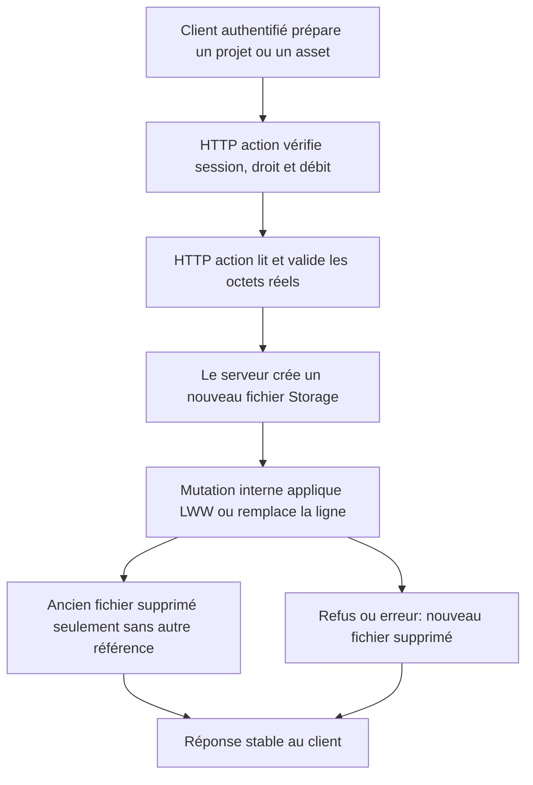
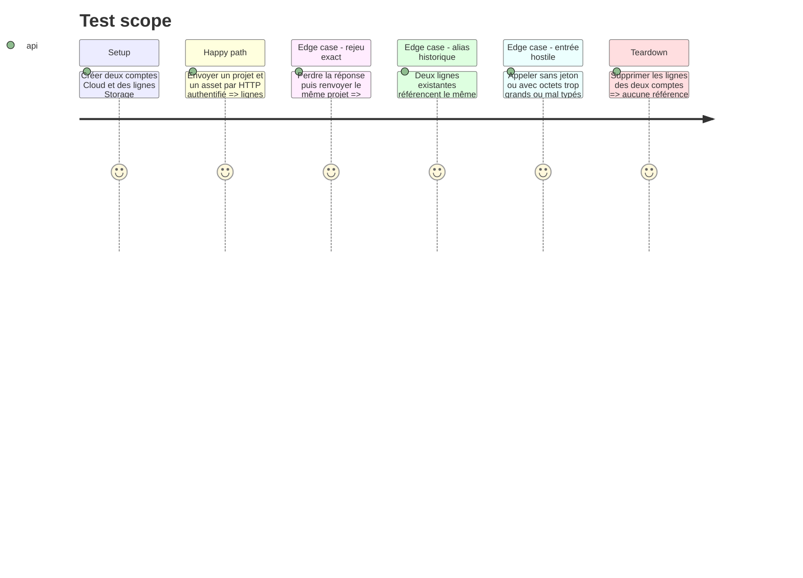

# Instruction: rendre chaque blob possédé et supprimé sans casser une référence

## Architecture projection

> Tree of the final files. ✅ create · ✏️ modify · ❌ delete

```txt
.
├── apps/
│   ├── backend/
│   │   ├── convex/
│   │   │   ├── assets.ts                 ✏️ commit interne d'un upload créé par le serveur
│   │   │   ├── assets.test.ts            ✏️ refus, remplacement et isolation Storage
│   │   │   ├── http.ts                   ✏️ routes POST authentifiées et CORS d'upload
│   │   │   ├── projects.ts               ✏️ LWW interne et suppression sans référence cassée
│   │   │   ├── projects.test.ts          ✏️ rejeu exact, alias et nettoyage LWW
│   │   │   ├── schema.ts                 ✏️ indexes par `storageId` et `blobId`
│   │   │   └── storageReferences.ts      ✅ invariant global et suppression sûre
│   │   └── tests/
│   │       └── stack.ts                  ✏️ fixtures par HTTP action, sans ID client
│   └── web/
│       ├── e2e/
│       │   └── sync.spec.ts              ✏️ upload réel, retry et isolation de compte
│       └── src/lib/
│           └── cloud.ts                  ✏️ POST authentifié des octets et lecture des issues
└── aidd_docs/tasks/2026_08/2026_08_11_migration-convex/
    └── phase-6.md                         ✏️ réalité du transport et nouveaux contre-tests
```

## User Journey



## Test Scope



## Tasks to do

### `1)` Poser l'invariant de référence Storage

> Une seule fonction décide si un fichier peut être détruit.

1. Ajouter les indexes `projects.by_blobId` et `assets.by_storageId` dans `schema.ts`.
2. Vérifier les volumes de préproduction et production avant déploiement; si une table n'est plus vide ou petite, livrer d'abord les indexes en mode staged puis les activer dans un second déploiement.
3. Créer `storageReferences.ts` avec des helpers bornés qui cherchent les références projet et asset, en excluant la ligne en cours.
4. Supprimer un fichier uniquement quand aucune autre ligne ne le référence; laisser l'exception remonter pour que la mutation annule son changement de ligne.
5. Utiliser ce chemin pour remplacement d'asset, remplacement LWW, `removeProject` et données historiques aliasées.

### `2)` Faire appartenir l'upload au serveur

> Le client envoie des octets et des métadonnées métier, jamais un `storageId`.

1. Ajouter deux POST HTTP authentifiés pour projet et asset, avec OPTIONS, Authorization, Content-Type et réponses CORS cohérentes.
2. Avant de lire le corps, appeler une mutation interne qui revalide compte, droit Cloud, barrière de suppression, intention et débit.
3. Lire le `Blob`, vérifier sa taille et son type réels, puis appeler `ctx.storage.store()` dans l'action.
4. Appeler une mutation interne de commit qui revalide le compte et applique remplacement ou LWW dans une transaction.
5. Supprimer le fichier tout juste créé sur refus stale, validation échouée ou commit en erreur; conserver des issues stables côté client.
6. Retirer `beginProjectPush`, `pushProject`, `requestAssetUpload` et `confirmAssetUpload` de l'API publique.

### `3)` Basculer le client et les fixtures

> Tous les appelants prennent le même transport authentifié.

1. Remplacer le POST vers l'URL générée par un POST vers l'origine `.convex.site` avec le bearer courant.
2. Conserver les contrats `pushRemoteProject(): boolean` et `uploadRemoteAsset(): void` pour ne pas toucher à `sync.ts`.
3. Adapter `tests/stack.ts` et les helpers E2E aux routes HTTP.
4. Retirer l'import `GenericId` et toute possibilité de fournir un ID Storage depuis le navigateur.

### `4)` Prouver l'isolation, l'idempotence et le nettoyage

> Chaque ancien trou possède un test qui échoue sur le code actuel.

1. Ajouter le rejeu exact même version, la version plus ancienne et le remplacement accepté.
2. Ajouter des alias historiques dans les deux tables et entre deux comptes, puis supprimer/remplacer une seule référence.
3. Vérifier absence de fichier sur 401, dépassement de taille, type refusé et échec de commit.
4. Vérifier CORS et le parcours 16 MiB contre un backend local réel.
5. Mettre à jour la documentation de migration sans prétendre qu'un ID client est une propriété.

## Test acceptance criteria

| Task | Acceptance criteria |
| --- | --- |
| 1 | Supprimer ou remplacer une ligne ne rend jamais illisible une autre ligne qui référence encore le même fichier. |
| 1 | Le dernier retrait d'une référence supprime exactement une fois le fichier Storage. |
| 2 | Aucune fonction publique n'accepte de `storageId` ou `blobId`; l'ID est créé et consommé côté serveur. |
| 2 | Un upload sans session, sans Cloud, pendant une suppression ou hors limites n'écrit ni ligne ni fichier durable. |
| 2 | Un projet rejoué avec la même version rend `stale` sans supprimer le blob actif. |
| 3 | La synchronisation garde ses contrats et continue de fonctionner avec ou sans réseau sans charger Convex dans le profil local-first. |
| 4 | Deux comptes ne peuvent ni lire ni détruire les octets l'un de l'autre, y compris avec des alias historiques semés par le test. |
| 4 | Un asset réel de 16 MiB fait l'aller-retour et 17 MiB est refusé sans orphelin. |
