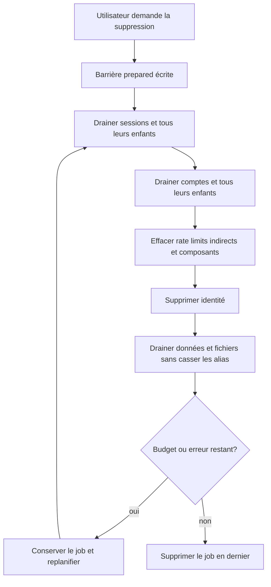
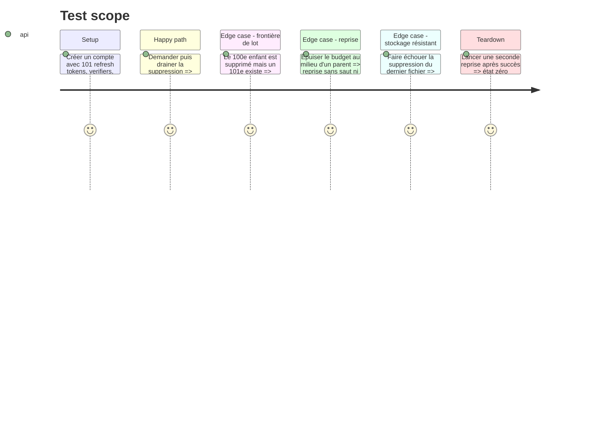

# Instruction: purger entièrement l'identité et ses artefacts

## Architecture projection

> Tree of the final files. ✅ create · ✏️ modify · ❌ delete

```txt
.
└── apps/backend/convex/
    ├── accountDeletion.ts             ✏️ enfants drainés, relations indirectes et compteurs effacés
    ├── accountDeletion.test.ts        ✏️ 101+ enfants, artefacts auth, composant et reprises
    ├── limits.ts                      ✏️ reset centralisé des clés compte et e-mail
    ├── schema.ts                      ✏️ index `authVerifiers.by_sessionId`
    ├── storageReferences.ts           ✏️ purge de fichiers consciente des références
    └── test.helpers.ts                ✏️ observation déterministe du composant rate-limiter
```

## User Journey



## Test Scope



## Tasks to do

### `1)` Drainer les enfants avant chaque parent

> Un parent reste le curseur durable tant qu'un enfant existe.

1. Reboucler sur la même session tant que `authRefreshTokens` rend une page pleine ou non vide.
2. Relire zéro enfant avant de supprimer la session, même quand le budget global reste positif.
3. Appliquer la même règle aux codes de vérification avant `authAccounts`.
4. Conserver le parent et replanifier dès que le budget s'épuise.

### `2)` Classer et supprimer les relations auth indirectes

> Le test de cascade connaît aussi les tables sans `userId` direct.

1. Étendre `authVerifiers` avec un index `by_sessionId` et les supprimer avant leur session.
2. Supprimer `authRateLimits` pour chaque ID de compte et pour l'e-mail normalisé du compte.
3. Classer explicitement chaque table de `authTables` comme identité, enfant indirect, globale ou survivante.
4. Faire échouer le test d'inventaire lorsqu'une prochaine version de Convex Auth ajoute une table non classée.

### `3)` Effacer les compteurs du composant

> Une suppression de compte retire aussi les clés hors du schéma applicatif.

1. Centraliser dans `limits.ts` les limites indexées par `userId` et celles indexées par e-mail.
2. Réinitialiser `checkout`, `assetUpload`, `projectPush`, `accountDeletion`, `magicLinkSend` et `passwordAttempt` avec leurs clés exactes.
3. Ne jamais réinitialiser les limites globales partagées.
4. Mesurer la valeur du composant avant et après suppression dans `convex-test`.

### `4)` Rendre la purge Storage compatible avec les alias

> Le compte part sans supprimer les octets encore référencés ailleurs.

1. Pour chaque projet ou asset, chercher les autres références avant d'effacer le fichier.
2. Supprimer la ligne seule lorsqu'une autre référence existe.
3. Supprimer fichier puis ligne pour la dernière référence, en gardant la reprise sur refus réel.
4. Couvrir les alias même compte et autre compte créés avant la phase 1.

### `5)` Prouver le parcours multi-passes réel

> Le simulateur et un backend local couvrent chacun ce qu'ils savent observer.

1. Étendre `populated` pour créer des quantités par type de relation.
2. Tester 99, 100, 101 et plus d'un budget complet d'enfants.
3. Vérifier les compteurs, verifiers, rate limits, fichiers et jobs dans `leftovers`.
4. Rejouer le cron contre le déploiement local jusqu'à file vide.

## Test acceptance criteria

| Task | Acceptance criteria |
| --- | --- |
| 1 | Une session portant 101 refresh tokens conserve son parent après le premier lot puis disparaît avec les 101 enfants. |
| 1 | Un compte portant plus d'un lot de codes suit la même propriété et aucune reprise ne saute de document. |
| 2 | Après succès, `authVerifiers`, `authRateLimits`, refresh tokens et codes de vérification ne contiennent plus de référence au compte. |
| 2 | Toute nouvelle table Convex Auth non classée fait échouer le test d'inventaire. |
| 3 | Les clés utilisateur et e-mail du composant rate-limiter retrouvent leur état initial, tandis que les limites globales restent intactes. |
| 4 | La suppression d'un compte n'efface pas un fichier encore référencé par un autre compte. |
| 5 | Une suppression interrompue puis reprise termine à zéro; une seconde reprise ne change rien. |
| 5 | Un refus réel de Storage conserve job, ligne, `attempts` et `lastError` jusqu'au prochain succès. |
