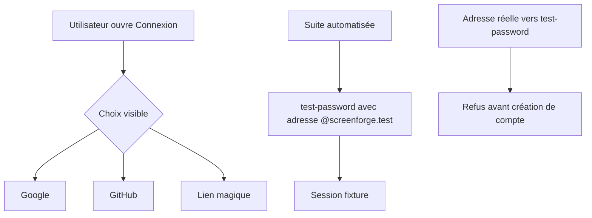
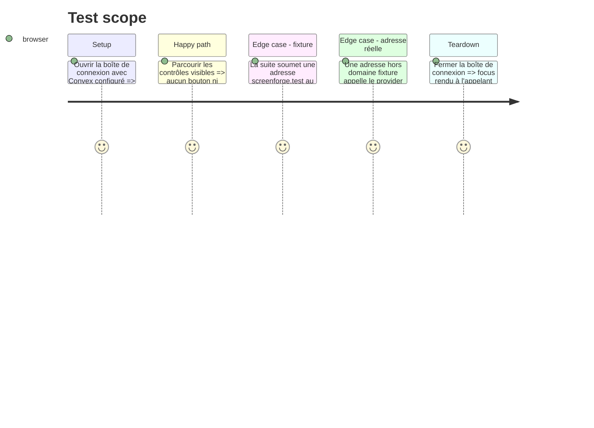

# Instruction: réserver Password aux fixtures et révoquer les identifiants publiés

## Architecture projection

> Tree of the final files. ✅ create · ✏️ modify · ❌ delete

```txt
.
├── apps/
│   ├── backend/
│   │   ├── convex/
│   │   │   ├── accountDeletion.test.ts        ✏️ adresses réservées aux fixtures
│   │   │   ├── auth.test.ts                   ✏️ provider fixture accepté, adresse réelle refusée
│   │   │   └── auth.ts                        ✏️ `test-password` limité à `@screenforge.test`
│   │   └── tests/
│   │       └── stack.ts                       ✏️ sessions E2E via `test-password`
│   └── web/src/
│       ├── components/auth-dialog/
│       │   └── AuthDialog.tsx                 ✏️ retrait du formulaire Password
│       └── lib/
│           └── auth.ts                        ✏️ retrait de `signInWithPassword`
└── aidd_docs/tasks/2026_08/2026_08_11_migration-convex/
    ├── environnements.md                      ✏️ procédure sans identifiant ni secret
    └── phase-6.md                             ✏️ constat du secret remplacé par sa résolution
```

## User Journey



## Test Scope



## Wireframe

```txt
┌──────────────────────────────────────────────┐
│ (1) Connexion                                │
│                                              │
│ (2) [ Fournisseur tiers ] [ Fournisseur ]    │
│                                              │
│ (3) ─────────── séparation ──────────────     │
│                                              │
│ (4) [ Adresse e-mail                    ]     │
│     [ Continuer                         ]     │
│                                              │
│ (5) Information mode local                   │
└──────────────────────────────────────────────┘

1. En-tête : identité de la boîte de connexion existante.
2. Fournisseurs tiers : les deux entrées SSO conservées.
3. Séparation : distingue SSO et connexion par courrier.
4. Lien magique : seule saisie directe proposée aux utilisateurs.
5. Information locale : rappelle que le compte reste optionnel.
```

## Tasks to do

### `1)` Transformer Password en provider de fixture

> Aucun e-mail réel ne peut créer une identité non vérifiée.

1. Renommer l'ID en `test-password` pour invalider les anciens appels `password`.
2. Accepter uniquement les adresses normalisées finissant exactement par `@screenforge.test`.
3. Garder les exigences de mot de passe et les limites d'essai existantes.
4. Adapter `signUpSession` et les tests backend au nouvel ID.
5. Vérifier qu'un domaine ressemblant, une casse inattendue ou une adresse réelle est refusé avant insertion.

### `2)` Retirer Password du produit visible

> La boîte de connexion ne propose que des identités vérifiables.

1. Retirer état, handler, formulaire, champ et bouton Password de `AuthDialog`.
2. Retirer `signInWithPassword` et ses imports du client web.
3. Conserver SSO, lien magique, pending indépendant, erreurs traduites et note local-first.
4. Ajouter un test d'absence du contrôle Password dans le profil commercial et local-first.

### `3)` Révoquer le compte préproduction publié

> Le secret présent dans Git devient inutilisable avant fusion.

1. Supprimer ou réinitialiser le compte préproduction existant et vérifier que l'ancien couple ne connecte plus.
2. Remplacer le besoin par une fixture `@screenforge.test` créée à la demande, sans secret versionné.
3. Retirer l'adresse personnelle et le mot de passe de `environnements.md`, `phase-6.md` et des tests.
4. Documenter seulement la commande/procédure avec placeholders et stockage hors Git.
5. Ne pas réécrire l'historique après rotation; l'ancien secret est rendu inerte par la révocation.

## Test acceptance criteria

| Task | Acceptance criteria |
| --- | --- |
| 1 | `test-password` crée et reconnecte une adresse `@screenforge.test`, mais refuse toute adresse réelle sans document utilisateur. |
| 1 | L'ancien provider `password` ne permet plus de se connecter. |
| 2 | La boîte de connexion expose Google, GitHub et le lien magique, sans champ ni bouton Password. |
| 2 | Le retrait n'affecte ni focus, ni erreurs, ni fermeture, ni mode local-first. |
| 3 | L'ancien identifiant préproduction est révoqué et aucun secret ou e-mail personnel correspondant ne subsiste dans l'arbre courant. |
| 3 | Les E2E créent une fixture unique à la demande et ne dépendent d'aucun mot de passe partagé. |
