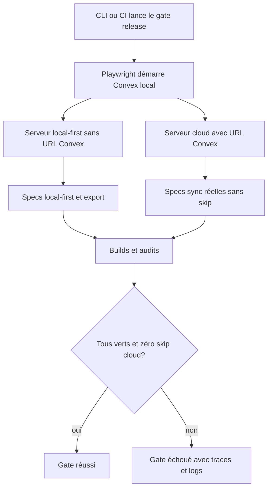
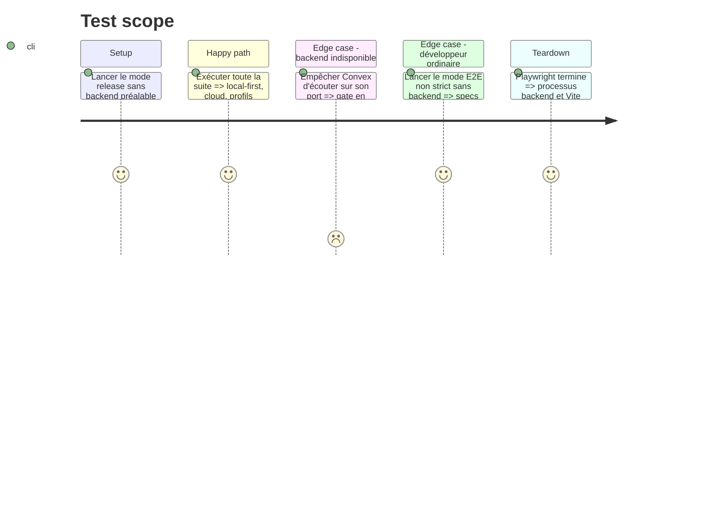

# Instruction: rendre le gate cloud obligatoire et reproductible

## Architecture projection

> Tree of the final files. ✅ create · ✏️ modify · ❌ delete

```txt
.
├── .github/workflows/
│   └── quality.yml                     ✏️ E2E cloud réel obligatoire et logs backend
├── AGENTS.md                           ✏️ commandes de test optionnel et de release explicites
├── README.md                           ✏️ gate cloud documenté
├── package.json                        ✏️ `test:e2e:release` et `test:release` strict
├── apps/web/
│   ├── e2e/
│   │   └── sync.spec.ts               ✏️ absence de backend = échec en mode strict
│   └── playwright.config.ts           ✏️ backend local géré par `webServer`
└── aidd_docs/memory/
    └── testing.md                      ✏️ séparation E2E optionnel / release obligatoire
```

## User Journey



## Test Scope



## Tasks to do

### `1)` Ajouter un mode E2E cloud strict

> Le mode release échoue si le backend ou le serveur cloud manque.

1. Introduire `SCREENFORGE_REQUIRE_CLOUD=1` comme signal de test Node, jamais comme variable produit.
2. En mode strict, ajouter `pnpm run dev:backend` aux `webServer` Playwright et utiliser les ports locaux fixés 3210/3211.
3. Démarrer le Vite cloud avec l'URL locale fixe et attendre les deux serveurs avant de charger les specs.
4. Faire échouer `sync.spec.ts` si `localConvex()` ou l'entrée Compte manque en mode strict; garder les skips du mode ordinaire.
5. Laisser Playwright posséder le cycle de vie et réutiliser un serveur déjà présent.

### `2)` Brancher le gate racine et la CI

> Une seule commande reproduit la preuve de release.

1. Ajouter `test:e2e:release` qui pose le mode strict.
2. Faire appeler cette commande par `test:release` après tests et builds.
3. Utiliser le même gate strict dans le job E2E CI.
4. Capturer le log Convex avec les traces Playwright en cas d'échec.
5. Ne pas ajouter de dépendance de supervision ou de script de sommeil ad hoc.

### `3)` Documenter les deux niveaux de test

> Le test rapide reste pratique, le test de release ne ment plus.

1. Décrire `test:e2e` comme mode local tolérant l'absence de cloud.
2. Décrire `test:e2e:release` et `test:release` comme modes cloud obligatoires.
3. Mettre à jour AGENTS, README et mémoire testing avec commandes depuis la racine.

### `4)` Vérifier le cycle complet

> Le gate doit partir d'une machine sans serveur préalable.

1. Exécuter le mode strict après avoir constaté les ports libres.
2. Vérifier que tous les scénarios cloud auparavant sautés s'exécutent.
3. Relancer avec un backend déjà actif pour vérifier `reuseExistingServer`.
4. Provoquer une URL/backend absent dans un test de configuration et vérifier l'échec explicite.

## Test acceptance criteria

| Task | Acceptance criteria |
| --- | --- |
| 1 | Le mode strict démarre seul Convex et le serveur cloud puis exécute chaque scénario de `sync.spec.ts`. |
| 1 | Un backend indisponible fait échouer le gate avec une erreur explicite et zéro faux vert par skip. |
| 2 | La CI et `test:release` utilisent exactement le même chemin cloud strict. |
| 2 | La fin de la suite ne laisse aucun processus ni port de test occupé. |
| 3 | Les commandes documentées partent toutes de la racine et distinguent clairement test rapide et preuve de release. |
| 4 | Le profil local-first continue de prouver l'absence du SDK Convex pendant que le profil cloud prouve la synchronisation réelle. |
