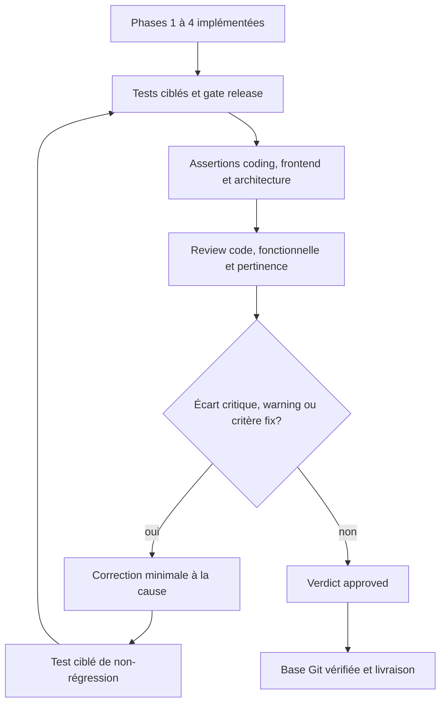
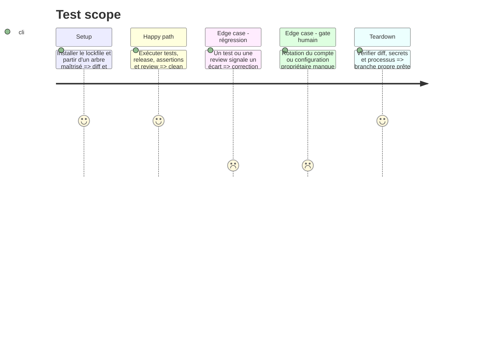

# Instruction: fermer par assert, review et boucle corrective

## Architecture projection

> Tree of the final files. ✅ create · ✏️ modify · ❌ delete

```txt
.
├── apps/                                      ✏️ uniquement si assert, tests ou review trouvent un écart
├── scripts/                                   ✏️ uniquement si un gate existant est réellement incorrect
└── aidd_docs/tasks/2026_08/2026_08_15_convex-migration-review-fixes/
    ├── plan.md                                ✏️ statut piloté par implement puis review
    ├── phase-1.md                             ✏️ critères cochés par l'implémentation
    ├── phase-2.md                             ✏️ critères cochés par l'implémentation
    ├── phase-3.md                             ✏️ critères cochés par l'implémentation
    ├── phase-4.md                             ✏️ critères cochés par l'implémentation
    └── review.md                              ✅ review code, fonctionnelle et pertinence
```

## User Journey



## Test Scope



## Tasks to do

### `1)` Exécuter les preuves techniques complètes

> Aucun résultat n'est inféré d'un test voisin.

1. Installer avec lockfile figé puis exécuter les tests backend ciblés de chaque phase.
2. Exécuter `pnpm test`, `pnpm run build`, `pnpm run build:profiles` et `pnpm run test:release`.
3. Vérifier explicitement zéro skip cloud en mode strict, le 16 MiB réel, le cron réel et l'export 1320×2868 opaque.
4. Exécuter contraste, échelle, landing, `git diff --check` et les greps d'identifiants/secrets.
5. Conserver les sorties ou chemins d'artefacts nécessaires à l'assert et à la review.

### `2)` Exécuter les assertions applicables

> Le comportement, l'interface touchée et l'architecture finissent sur un clean sweep.

1. Exécuter `aidd-dev:03-assert` après les phases 1 à 4, avec la facette coding toujours active.
2. Ajouter la facette frontend sur la boîte de connexion en fonctionnement et la facette architecture sur les frontières HTTP action → mutation interne → Storage.
3. Laisser les facettes correctives réparer puis rejouer leurs assertions jusqu'au clean sweep; garder l'architecture en rapport seul conformément à son contrat.
4. Reporter le verdict et les éventuels écarts d'architecture dans la table Verification de la review finale.
5. Refuser de compter un scénario cloud sauté comme une assertion réussie.

### `3)` Refaire une review indépendante

> Le verdict porte sur le nouveau diff, pas sur l'intention du plan.

1. Exécuter `aidd-dev:05-review` sur la base `feat/saas-foundations...HEAD` avec les axes code, functional et relevancy.
2. Recontrôler spécifiquement ownership Storage, rejeu exact, 101 enfants, tables indirectes, fixture Password, secrets et gate strict.
3. Écrire `review.md` avec un verdict strict et les critères de toutes les phases.

### `4)` Boucler jusqu'à fermeture

> Aucun finding corrigeable n'est reporté à une passe future.

1. Pour chaque assertion encore rouge, écart d'architecture, critical, warning ou critère marqué `fix`, exécuter une correction minimale via `aidd-dev:02-implement`.
2. Ajouter ou renforcer le plus petit test qui échoue avant la correction via `aidd-dev:06-test`.
3. Rejouer le test ciblé, le gate complet, l'assert et la review.
4. Répéter jusqu'à verdict `approved`, zéro critical, zéro warning et aucun critère code non vérifié.
5. Garder comme `not-applicable` uniquement les opérations externes hors périmètre, jamais un défaut de code.

### `5)` Fermer les gates humains et la livraison

> La branche prête ne mélange ni secret actif ni pile Git involontaire.

1. Confirmer la révocation du compte préproduction publié; sans cette preuve, mettre le plan `blocked`.
2. Vérifier que `feat/saas-foundations` est la base de PR tant qu'elle n'est pas fusionnée.
3. Si cette base a rejoint `main`, rebaser la branche de correction sur le nouveau `main` puis rejouer le gate complet.
4. Ne marquer le plan `reviewed` qu'après review approuvée et diff final contrôlé.

## Test acceptance criteria

| Task | Acceptance criteria |
| --- | --- |
| 1 | Tests unitaires, types, lint, builds, E2E cloud strict, export et audits sont tous verts sur le diff final. |
| 1 | Aucun scénario cloud requis n'est sauté et aucun processus de test ne survit à la suite. |
| 2 | Les facettes coding et frontend de `aidd-dev:03-assert` passent un clean sweep final; la facette architecture ne laisse aucun écart corrigeable. |
| 3 | `review.md` conclut `approve` avec zéro critical, zéro warning et zéro critère `fix`. |
| 4 | Tout écart découvert possède un contre-test rouge avant correction et vert après, puis le gate complet reste vert. |
| 5 | L'ancien compte préproduction ne connecte plus et l'arbre courant ne contient plus ses identifiants. |
| 5 | La PR cible la base de la pile réellement revue et son diff ne contient que la migration et ses corrections. |
