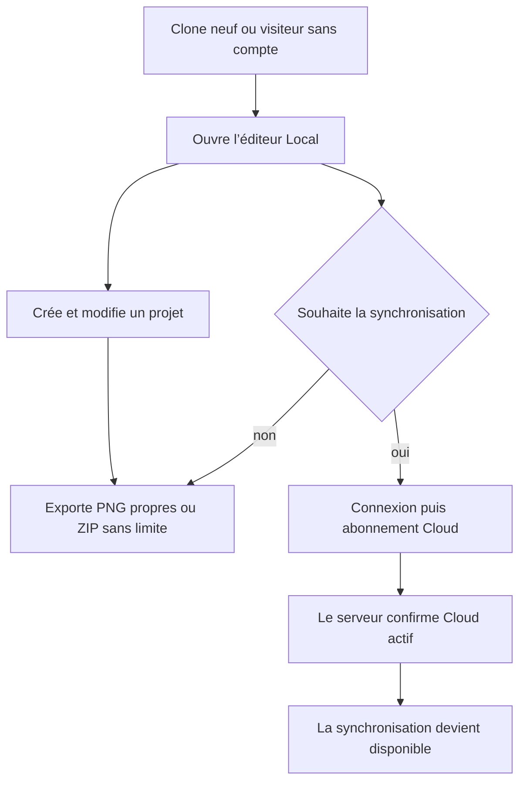
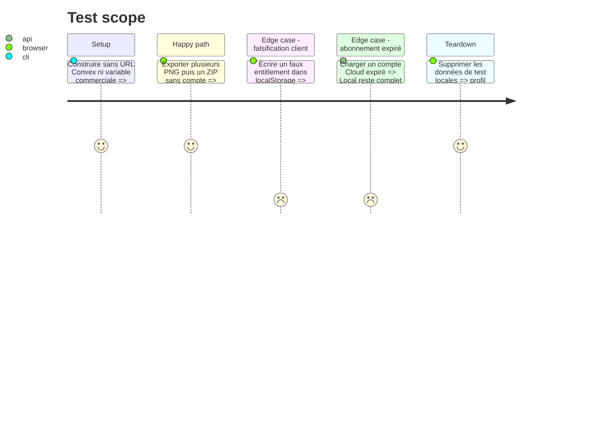

# Instruction: remplacer les droits Local payants par Local gratuit et Cloud seul

## Architecture projection

> Tree of the final files. ✅ create · ✏️ modify · ❌ delete

```txt
.
├── package.json                                      ✏️ un seul build produit, sans profil de paywall
├── .env.example                                     ✏️ retirer le lancement commercial et le produit Polar Local
├── scripts/commercial-profile-audit.mjs             ❌ supprimer l’audit des deux anciens profils
├── apps/backend/convex/
│   ├── entitlements.ts                              ✏️ contrat Cloud unique, sans droit Local
│   ├── entitlements.test.ts                         ✏️ Cloud actif, expiré et dérogation propriétaire
│   ├── authz.ts                                     ✏️ `requireCloud` reste l’unique mur métier
│   ├── authz.test.ts                                ✏️ refus sans session ou Cloud actif
│   ├── polar.ts                                     ✏️ checkout et miroir Cloud uniquement
│   ├── polar.test.ts                                ✏️ produit inconnu et Cloud autonome
│   ├── mirror.ts                                    ✏️ retirer la projection Licence/Local
│   ├── mirror.test.ts                               ✏️ états Cloud signés et événements tardifs
│   └── schema.ts                                    ✏️ retirer le droit Local après migration sûre
└── apps/web/
    ├── playwright.prelaunch.config.ts               ❌ supprimer la variante pré-lancement
    ├── e2e/commercial-launch.spec.ts                ❌ supprimer le scénario de paywall
    ├── e2e/export.prelaunch.spec.ts                 ❌ supprimer le profil d’export spécial
    └── src/
        ├── lib/commercial-launch.ts                 ❌ supprimer l’interrupteur client
        ├── lib/plans.ts                             ✏️ Local gratuit et Cloud payant
        ├── lib/account.ts                           ✏️ checkout Cloud seulement
        ├── lib/entitlements.ts                      ✏️ état Cloud informatif, sans contrôle Local
        ├── lib/export.ts                            ✏️ retirer la fabrication du filigrane
        ├── lib/release.ts                           ✏️ nouvelles releases toujours propres
        ├── hooks/use-export.ts                      ✏️ export et ZIP illimités sans entitlement
        ├── types/index.ts                           ✏️ compatibilité de lecture des releases historiques
        └── lib/__tests__/
            ├── entitlements.test.ts                ✏️ aucun droit client ne débloque Cloud
            ├── account.test.ts                     ✏️ Cloud seul achetable
            └── release.test.ts                     ✏️ nouveaux fichiers jamais filigranés
```

## User Journey



## Test Scope



## Tasks to do

### `1)` Supprimer le paywall Local à sa racine

> Les capacités Local ne consultent plus aucun état commercial.

1. Retirer `FREE_EXPORTS_PER_PROJECT`, les compteurs localStorage, le filigrane et les branches ZIP/export conditionnelles.
2. Faire de `use-export` un chemin unique pour tous les utilisateurs, connecté ou non.
3. Supprimer `VITE_COMMERCIAL_LAUNCH`, les builds `prelaunch/launch` et leurs audits; conserver un seul build reproductible.
4. Garder la lecture des releases historiques `watermarked` seulement pour signaler qu’un lot gelé doit être régénéré; ne jamais produire un nouveau fichier filigrané ni réécrire silencieusement un ancien artifact.
5. Vérifier qu’aucun composant, store ou validation projet ne présente encore un quota Local comme une règle active.

### `2)` Réduire le domaine commercial à Cloud

> Un seul produit acheté, une seule capacité serveur.

1. Remplacer les unions `local | cloud` et `licence | cloud` par `cloud` dans le checkout, le catalogue et les réponses client.
2. Faire de `Entitlements` un état Cloud minimal; `Rights` ne doit plus contenir export propre ou ZIP.
3. Retirer les variables Polar du produit et du bénéfice Local de `.env.example`, de la configuration typée et du healthcheck.
4. Conserver Cloud à 39 USD/an dans la source de présentation actuelle et comparer cette valeur au produit Polar avant ouverture des ventes.
5. Refuser côté serveur tout produit autre que Cloud avant tout appel Polar.

### `3)` Migrer les anciennes données sans réactiver Local

> La compatibilité de données n’est jamais une compatibilité de droits.

1. Mesurer en préproduction puis production le nombre de lignes portant `licenceGrantedAt` ou `complimentaryLocal`, sans exporter identité ni contenu.
2. Déployer d’abord le code qui ignore ces champs pour toutes les capacités.
3. Sauvegarder, retirer les champs devenus inutiles des lignes, puis resserrer le schéma seulement après preuve que leur compte est nul.
4. Remplacer le grant propriétaire par une dérogation Cloud seule, idempotente et révocable; Local est déjà universel et n’a pas de grant.
5. Rejouer les webhooks Cloud récents et tardifs pour garantir que le LWW et la révocation restent exacts.

## Test acceptance criteria

| Task | Acceptance criteria |
| --- | --- |
| 1 | Un visiteur hors ligne exporte plus de trois PNG propres et un ZIP sans compte, compteur, filigrane ni appel Cloud. |
| 2 | Le catalogue, le checkout et le backend ne connaissent qu’un produit achetable Cloud; falsifier le client ne modifie aucun droit serveur. |
| 3 | Les anciennes données Local sont ignorées avant suppression, le schéma est resserré sans perte Cloud et le propriétaire ne reçoit qu’une dérogation Cloud. |

## Implementation evidence

- 2026-08-16 : les décomptes agrégés avant migration étaient de 0 ligne Local en préproduction et 0 en production; aucune identité ni donnée métier n’a été exportée.
- Le déploiement local a migré 252 fixtures historiques, puis le schéma final sans `licenceGrantedAt` ni `complimentaryLocal` a été validé par le moteur Convex réel.
- Le schéma Cloud-only a été déployé en préproduction puis en production; le contrôle agrégé post-déploiement rend `legacy: 0` sur les deux cibles.
- `pnpm test`, le build Local sans URL Convex et le scénario Playwright de quatre exports ZIP successifs passent.
