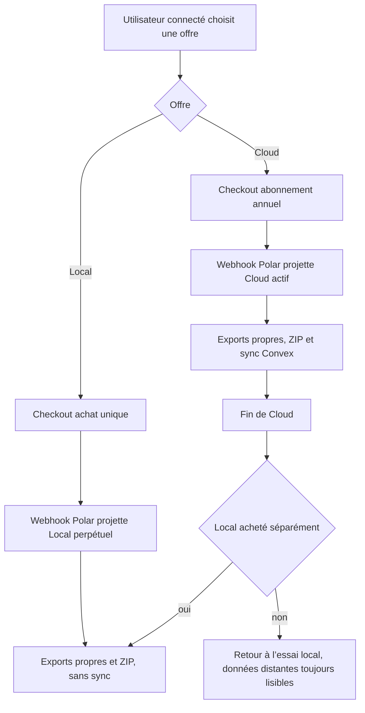
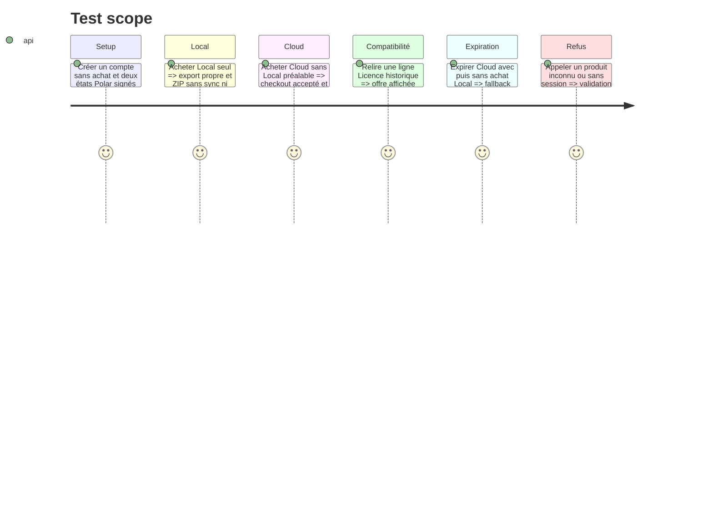

# Instruction: transformer les droits et la facturation en offres Local et Cloud autonomes

## Architecture projection

> Tree of the final files. ✅ create · ✏️ modify · ❌ delete

```txt
.
├── apps/
│   ├── backend/convex/
│   │   ├── entitlements.ts             ✏️ Cloud actif inclut les capacités Local
│   │   ├── entitlements.test.ts        ✏️ projection Local, Cloud seul, expiration et héritage
│   │   ├── authz.ts                    ✏️ mur Cloud indépendant d’un achat Local
│   │   ├── authz.test.ts               ✏️ droits d’écriture des deux offres
│   │   ├── polar.ts                    ✏️ checkout Cloud autonome et projection sans refus Licence
│   │   ├── polar.test.ts               ✏️ deux produits achetables sans ordre imposé
│   │   ├── billing.test.ts             ✏️ webhook et santé de configuration à deux offres
│   │   └── mirror.test.ts              ✏️ contrat de droits compatible avec les lignes existantes
│   └── web/src/lib/
│       ├── account.ts                  ✏️ produits `local | cloud`, sans erreur licence-required
│       ├── plans.ts                    ✏️ catalogue commercial à deux entrées
│       ├── entitlements.ts             ✏️ cache et calcul des droits hérités
│       └── __tests__/
│           ├── account.test.ts         ✏️ deux checkouts indépendants
│           └── entitlements.test.ts    ✏️ Local, Cloud et fin de période hors ligne
├── .env.example                        ✏️ décrire le produit Polar Local et le produit Cloud autonome
└── aidd_docs/tasks/2026_08/2026_08_11_migration-convex/
    └── environnements.md               ✏️ migration du catalogue Polar par environnement
```

## User Journey



## Test Scope



## Tasks to do

### `1)` Définir la règle commerciale une seule fois

> Les données historiques restent compatibles; seules leurs capacités évoluent.

1. Conserver `licenceGrantedAt` comme preuve technique d’un achat perpétuel et le nommer **Local** dans toutes les sorties client.
2. Faire produire à `rightsOf` les capacités d’export et de ZIP si Local est acquis **ou** si Cloud est actif; réserver `sync` à Cloud actif.
3. Faire dépendre `isCloudActive` du statut et de la période Cloud, plus du droit manuel prévu en phase 4, jamais de `licenceGrantedAt`.
4. Garder la limite d’essai existante pour un compte sans droit, sans réintroduire une offre `free` dans `PLANS`.
5. Ajouter les matrices de tests `essai`, `Local`, `Cloud seul`, `Local + Cloud`, `Cloud expiré` et `Local historique`.

### `2)` Rendre Cloud achetable sans Local

> Le checkout et le webhook appliquent la même règle.

1. Remplacer le produit public `licence` par `local` dans le client et l’action de checkout, tout en mappant le produit Polar ponctuel déjà configuré.
2. Retirer `LICENCE_REQUIRED`, son type de refus, sa traduction UI et le garde de `createCheckout`.
3. Supprimer `cloudRefusedWithoutLicence` de la projection du `customer.state_changed`; un abonnement Cloud valide doit être reflété même sans bénéfice Local.
4. Conserver `externalCustomerId = userId`, la validation signée du webhook, le LWW par `sourceUpdatedAt` et les limites de débit existantes.
5. Vérifier que le portail Polar reste accessible dès qu’un compte possède ou a possédé une offre facturée.

### `3)` Migrer le catalogue sans fenêtre incohérente

> La configuration externe précède les boutons qui l’utilisent.

1. Renommer le produit ponctuel en Local dans Polar sans changer son prix ni son bénéfice, ou créer son remplaçant puis poser son ID sur local, préprod et prod.
2. Transformer le produit Cloud en abonnement autonome à 39 $/an et vérifier qu’il peut être acheté par un compte neuf.
3. Mettre à jour les noms et commentaires de variables seulement si les trois environnements peuvent basculer ensemble; sinon conserver les clés `POLAR_LICENCE_*` comme compatibilité interne documentée.
4. Exécuter `billing:healthcheck` sur préprod puis prod avant d’ouvrir le nouveau profil commercial.
5. Tester le checkout et un webhook réel en préprod avant toute modification de production.

## Test acceptance criteria

- `PLANS` et les unions de checkout n’exposent que `local` et `cloud`.
- Un compte sans achat peut acheter Cloud directement; aucun chemin ne renvoie `LICENCE_REQUIRED`.
- Cloud actif donne `cleanExport`, `zip` et `sync`, avec ou sans achat Local séparé.
- Après expiration, un achat Local historique reste actif; Cloud seul ne laisse pas de droit payant permanent.
- Les webhooks plus anciens restent ignorés et une révocation plus récente retire immédiatement Cloud.
- Les lignes Convex existantes ne nécessitent ni réécriture ni migration destructive.
