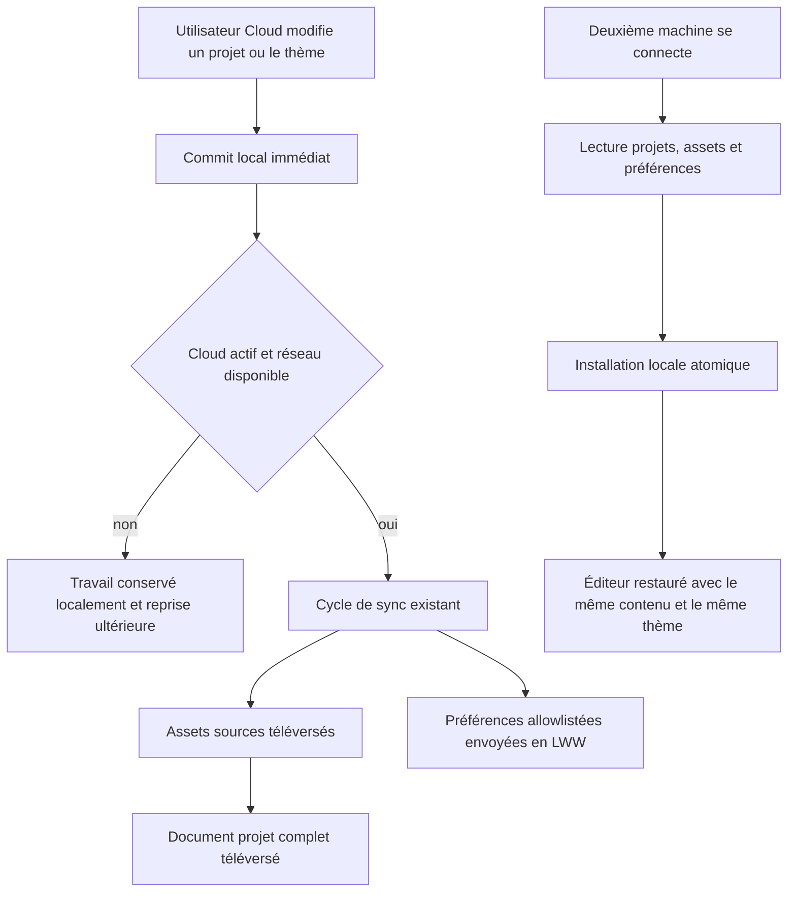
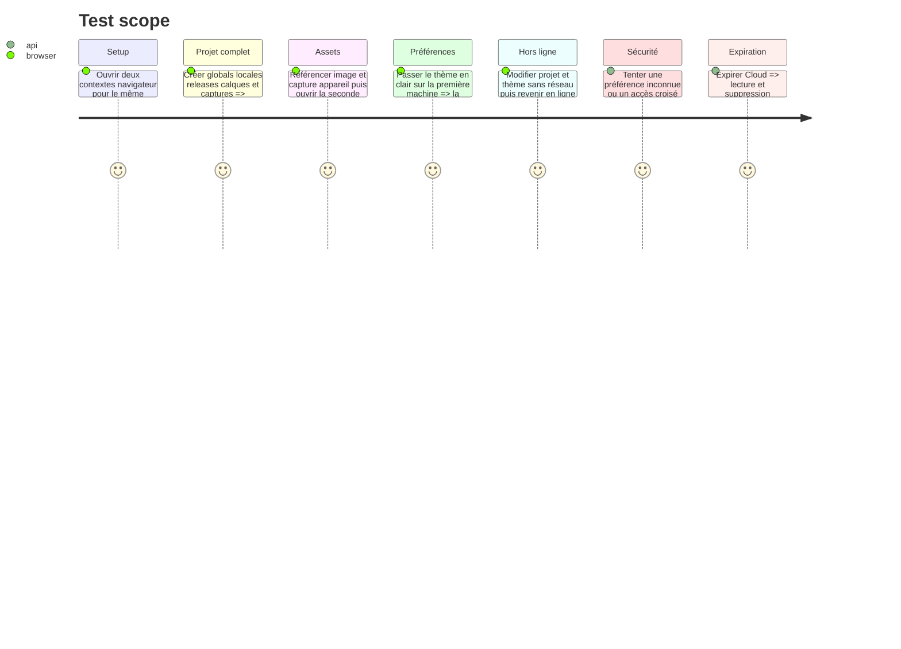

# Instruction: garantir la sauvegarde Cloud complète des projets, assets et préférences durables

## Architecture projection

> Tree of the final files. ✅ create · ✏️ modify · ❌ delete

```txt
.
├── apps/
│   ├── backend/convex/
│   │   ├── schema.ts                   ✏️ table `userSettings` indexée par compte
│   │   ├── settings.ts                 ✅ lecture propriétaire et upsert LWW borné
│   │   ├── settings.test.ts            ✅ isolation, allowlist, LWW, expiration et suppression
│   │   ├── accountDeletion.ts          ✏️ purge des préférences avec le compte
│   │   └── accountDeletion.test.ts     ✏️ inventaire et reprise avec `userSettings`
│   └── web/
│       ├── src/
│       │   ├── lib/cloud.ts            ✏️ transport Convex des préférences
│       │   ├── lib/sync.ts             ✏️ préférences intégrées au cycle existant
│       │   ├── lib/user-settings.ts    ✅ valeur locale datée et allowlist sérialisable
│       │   └── stores/ui.store.ts      ✏️ thème local daté, toujours utilisable hors ligne
│       └── e2e/sync.spec.ts            ✏️ projet complet, assets et thème entre deux navigateurs
└── aidd_docs/memory/
    └── database.md                     ✏️ périmètre exact des données cloud et locales
```

## User Journey



## Test Scope



## Tasks to do

### `1)` Définir ce qui est réellement synchronisé

> Une allowlist courte vaut mieux qu’un sac JSON qui finit par contenir des secrets.

1. Considérer le `Project` sérialisé comme la source de tous ses réglages métier : globals, locales, releases, écrans, layout layers et métadonnées.
2. Prouver par test que tous les `assetId` référencés par les images, captures d’appareil et autres calques binaires sont envoyés avant le projet puis retéléchargés avant son installation.
3. Ajouter une forme `UserSettings` bornée à `theme: light | dark` et `updatedAt`; étendre cette allowlist seulement lorsqu’une nouvelle préférence durable existe réellement.
4. Exclure explicitement clés de fournisseurs IA, JWT/refresh tokens, cache de droits, compteur d’essai, langue marketing, zoom, sélection, panneaux et dialogues.
5. Continuer à omettre les miniatures dérivées du projet : elles se reconstruisent localement et ne sont pas une source utilisateur.

### `2)` Stocker les préférences dans Convex

> Une seule ligne par utilisateur, avec la même règle LWW que les projets.

1. Ajouter `userSettings` avec `userId`, `theme`, `updatedAt` et un index `by_user` unique par chemin d’écriture.
2. Créer une query qui dérive le compte depuis la session et reste lisible après expiration Cloud.
3. Créer une mutation d’upsert qui appelle `requireCloud`, valide l’enum et n’accepte que la version strictement plus récente.
4. Ne jamais accepter de `userId`, d’objet arbitraire ou de clé libre depuis le navigateur.
5. Ajouter la table à l’inventaire et au balayage borné de suppression de compte.

### `3)` Réutiliser le cycle de sync client

> Pas de deuxième moteur, de WebSocket ou de file parallèle.

1. Persister localement le thème avec son `updatedAt` et conserver le défaut sombre actuel quand aucune valeur n’existe.
2. Au premier cycle Cloud vérifié, comparer préférence locale et distante, appliquer la plus récente puis acquitter la version installée.
3. Au changement de thème, commiter localement d’abord puis programmer le cycle `sync.ts` existant; une erreur réseau ne doit ni annuler le thème ni bloquer l’éditeur.
4. Réinitialiser l’état de rapprochement au changement de compte afin qu’aucune préférence ne traverse deux identités.
5. Protéger les écritures tardives : si le compte ou le droit Cloud change pendant l’appel, ne pas appliquer la réponse au compte suivant.

### `4)` Fermer la preuve de contenu cloud

> Le mot « tout » se démontre par un round-trip réel, pas par le nombre de tables.

1. Étendre le scénario E2E Convex strict avec un projet qui exerce globals, locales, releases, plusieurs types de calques et plusieurs assets.
2. Synchroniser depuis un contexte navigateur neuf et comparer le projet normalisé, les dimensions et hashes d’assets, puis le thème.
3. Supprimer le compte et constater la disparition de `projects`, `assets`, `userSettings`, blobs Storage, droits et identité.
4. Garder un contre-test Local sans `VITE_CONVEX_URL` qui édite, recharge et exporte sans charger le SDK cloud.

## Test acceptance criteria

- Un projet riche et tous ses assets sources survivent à un aller-retour entre deux stockages locaux indépendants.
- `userSettings` n’accepte que le thème et sa date; aucune donnée sensible ou éphémère n’est envoyée.
- Le dernier changement de thème gagne et reste utilisable hors ligne.
- Un autre compte ne peut ni lire ni écrire projets, assets ou préférences.
- Après expiration Cloud, les données distantes sont lisibles et supprimables mais aucune nouvelle version n’est acceptée.
- La suppression de compte ne laisse ni ligne `userSettings` ni blob Storage orphelin.
