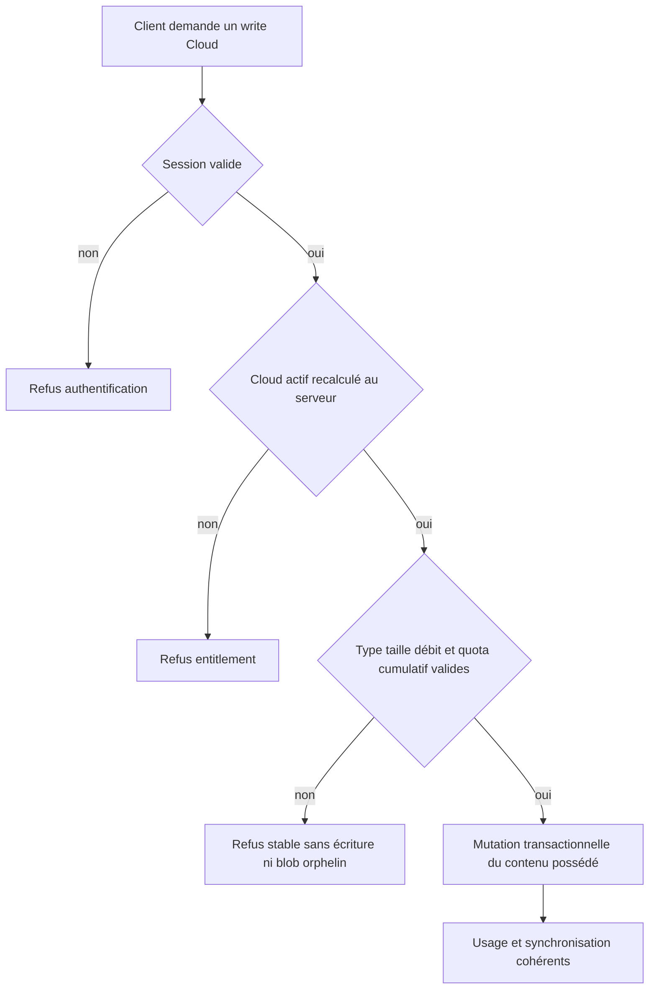
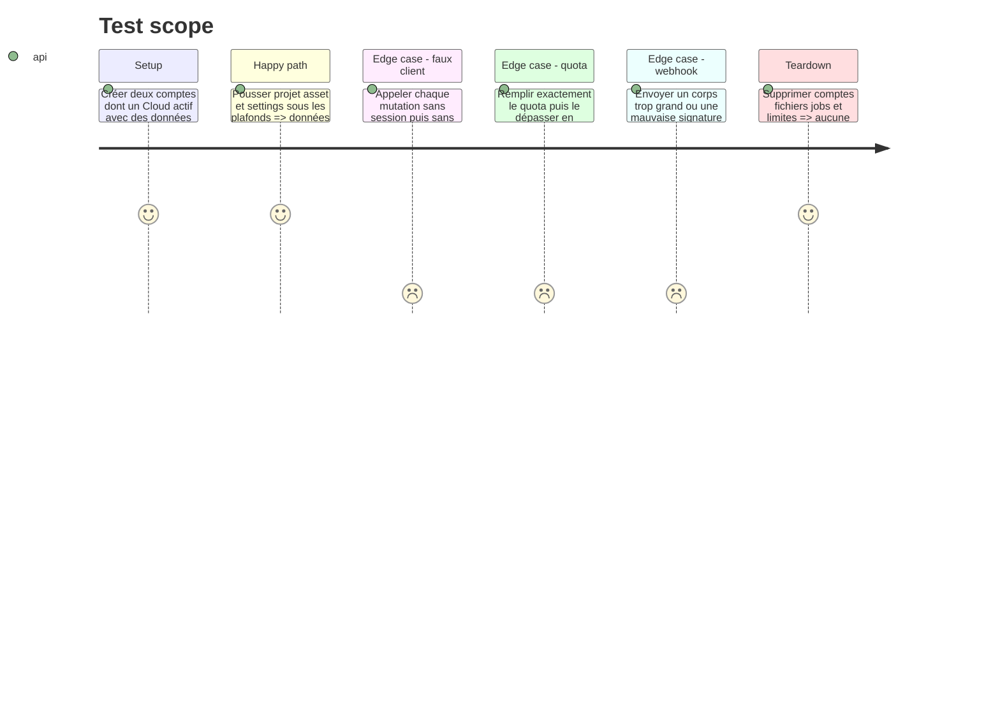

# Instruction: borner et durcir toutes les écritures Cloud

## Architecture projection

> Tree of the final files. ✅ create · ✏️ modify · ❌ delete

```txt
.
└── apps/backend/convex/
    ├── limits.ts                         ✏️ plafonds cumulés Cloud en source unique
    ├── limits.test.ts                    ✏️ limites et erreurs stables
    ├── schema.ts                         ✏️ taille des blobs projet et index nécessaires
    ├── projects.ts                       ✏️ entitlement, comptage transactionnel et remplacement
    ├── projects.test.ts                  ✏️ quota, concurrence, expiration et isolation
    ├── assets.ts                         ✏️ entitlement, total bytes/count et remplacement
    ├── assets.test.ts                    ✏️ quota cumulatif, type, taille et cross-account
    ├── settings.ts                       ✏️ réaffirmer `requireCloud` avant chaque write
    ├── settings.test.ts                  ✏️ refus sans entitlement actif
    ├── account-deletion.ts               ✏️ effacement authentifié après expiration
    ├── account-deletion.test.ts          ✏️ sortie permise sans recréer de droit
    ├── maintenance.ts                    ✅ balayage interne des blobs orphelins
    ├── maintenance.test.ts               ✅ seuls les blobs non référencés sont supprimés
    ├── crons.ts                          ✏️ planifier le balayage borné
    ├── auth.ts                           ✏️ fournisseur test explicitement local/E2E
    ├── auth.test.ts                      ✏️ configuration production fail-closed
    ├── billing.ts                        ✏️ lire le webhook signé avec une borne préalable
    └── billing.test.ts                   ✏️ corps absent, surdimensionné, invalide et signé
```

## User Journey



## Test Scope



## Tasks to do

### `1)` Poser une limite économique cumulative

> Le rate limit protège le rythme; le quota protège le coût durable.

1. Centraliser les plafonds initiaux serveur : 100 projets, 128 MiB de blobs projet, 500 assets et 512 MiB d’assets par compte, en conservant 4 MiB par projet et 16 MiB par asset.
2. Ajouter `byteLength` aux projets avec une migration compatible, puis sommer les lignes du propriétaire dans la même mutation que le write.
3. Pour un remplacement, soustraire la ligne remplacée avant d’ajouter la nouvelle; une suppression libère naturellement le quota.
4. Refuser avant `storage.store` lorsque taille, nombre ou total dépasserait; conserver les rate limits existants comme seconde borne.
5. Retourner des codes stables et non sensibles distinguant taille unitaire, nombre et quota total, puis mapper une phrase actionnable dans le client lors de la phase 3.

### `2)` Fermer l’autorisation de chaque surface persistante

> Le serveur dérive l’identité et Cloud actif à chaque mutation.

1. Inventorier toutes les mutations publiques de projets, assets et settings et faire passer chaque création, remplacement ou mise à jour par `requireCloud` avant effet durable.
2. Ne jamais accepter `userId`, `cloudStatus` ou entitlement dans les arguments client; le propriétaire vient uniquement de la session.
3. Tester sans auth, auth sans achat, Cloud expiré, Cloud actif, dérogation propriétaire, propriété croisée et modification concurrente.
4. Conserver la lecture de ses données après expiration si le contrat actuel le prévoit, mais interdire toute synchronisation sortante.
5. Conserver la suppression de ses propres données et du compte comme chemin destructif séparé, authentifié, limité et incapable de créer ou modifier du contenu.

### `3)` Éliminer les blobs orphelins sans compteur dérivé

> Un cleanup interne récupère les restes; il ne devient pas une API publique.

1. Ajouter une mutation interne bornée qui parcourt un petit lot de métadonnées storage et supprime seulement les blobs absents des index `projects.by_blobId` et `assets.by_storageId`.
2. La planifier à cadence prudente avec curseur; ne jamais scanner ou supprimer depuis le navigateur.
3. Tester un blob projet, un asset, un blob réellement orphelin et une exécution répétée idempotente.
4. Journaliser uniquement les comptes agrégés de blobs visités/supprimés, sans identifiant utilisateur, nom de fichier ni URL storage.

### `4)` Fermer les deux frontières publiques restantes

> Les chemins de test et webhook échouent avant d’engager du coût.

1. N’enregistrer `test-password` que lorsque le flag serveur dédié E2E vaut explicitement vrai; le healthcheck et le déploiement production échouent si ce flag est actif.
2. Garder magic link et SSO comme seuls providers de production.
3. Lire le webhook Polar par chunks avec une limite stricte avant `text`/JSON et avant toute opération métier; vérifier ensuite la signature sur les octets reçus.
4. Refuser `Content-Length` excessif immédiatement, tout en appliquant la borne de flux lorsque l’en-tête est absent ou faux.
5. Tester corps vide, limite exacte, dépassement, UTF-8 invalide, JSON invalide, signature invalide et événement Cloud valide.

## Test acceptance criteria

| Task | Acceptance criteria |
| --- | --- |
| 1 | Chaque compte reste sous les limites unitaires et cumulées; remplacement, suppression et écritures concurrentes ne font ni dériver ni dépasser l’usage. |
| 2 | Aucune mutation de contenu Cloud n’accepte un droit fourni par le client et toutes refusent sans session propriétaire et Cloud actif. |
| 3 | Le cleanup interne supprime uniquement les blobs non référencés, par lots bornés et sans donnée sensible dans les logs. |
| 4 | Production ne peut pas démarrer avec `test-password`; un webhook surdimensionné est refusé avant allocation complète et tout événement accepté reste signé. |

## Evidence

- `pnpm test` : 522 tests unitaires, typecheck et lint passent.
- Les tests couvrent plafonds exacts, cumul, remplacement, concurrence, expiration, propriété et nettoyage idempotent.
- La migration locale a renseigné les 5 projets historiques; préproduction et production contenaient 0 projet à migrer.
- Le schéma final et les fonctions ont été déployés sur `acrobatic-orca-116` puis `colorful-caterpillar-775`.
- `AUTH_TEST_PASSWORD` est absent des deux environnements hébergés; les clés de déploiement temporaires ont été révoquées puis supprimées du disque.
