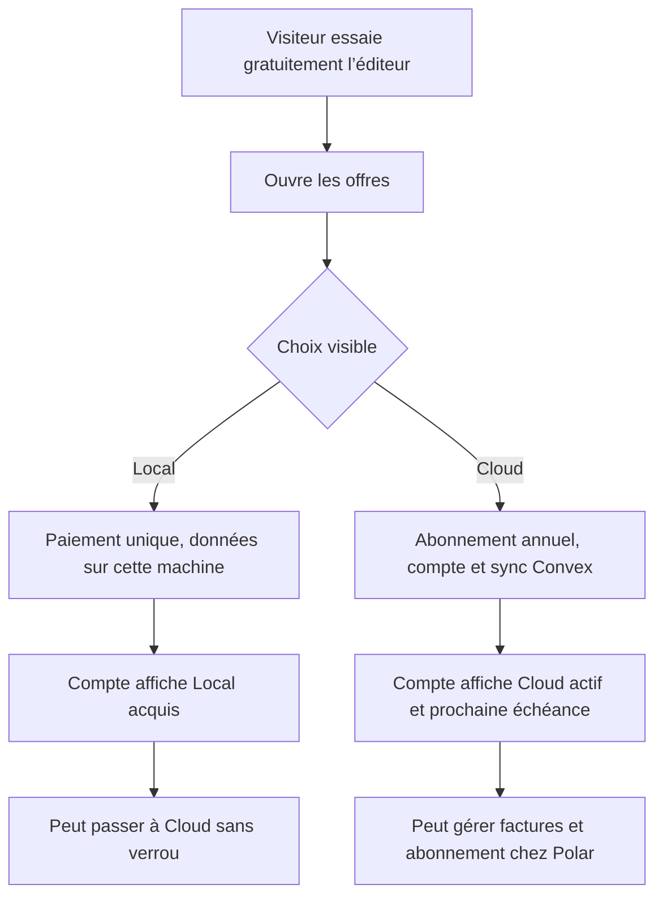
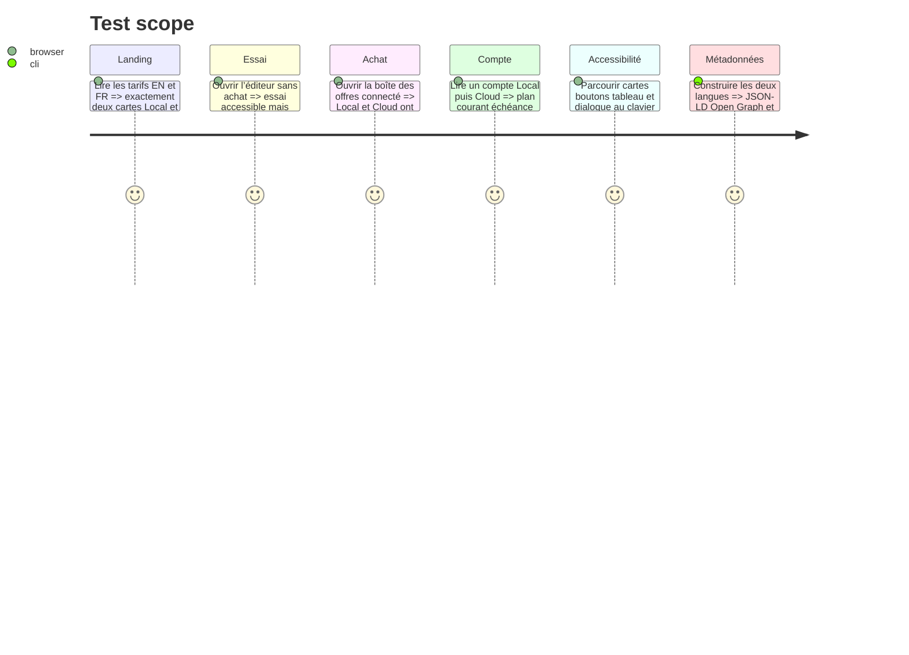

# Instruction: aligner l’éditeur, le compte et la landing sur les deux offres

## Architecture projection

> Tree of the final files. ✅ create · ✏️ modify · ❌ delete

```txt
.
├── apps/web/
│   ├── landing.html                                ✏️ JSON-LD sans offre Free ni add-on
│   ├── src/
│   │   ├── components/pricing-dialog/
│   │   │   └── PricingDialog.tsx                  ✏️ deux cartes achetables, aucun verrou
│   │   ├── components/account-dialog/
│   │   │   └── AccountDialog.tsx                  ✏️ plan courant, sync et gestion client
│   │   ├── landing/
│   │   │   ├── copy.ts                            ✏️ copie EN/FR Local et Cloud
│   │   │   ├── links.ts                           ✏️ identifiants d’offre Local et Cloud
│   │   │   └── components/
│   │   │       ├── Pricing.tsx                    ✏️ deux cartes et comparaison deux colonnes
│   │   │       ├── CostCompare.tsx                ✏️ argument ajusté aux deux modèles
│   │   │       └── FinalCta.tsx                   ✏️ CTA Local et Cloud cohérents
│   │   └── lib/plans.ts                           ✏️ libellés, prix et état Essai hors catalogue
│   └── e2e/
│       ├── commercial-launch.spec.ts              ✏️ surfaces à deux offres dans les deux profils
│       ├── dialogs-a11y.spec.ts                   ✏️ navigation clavier des nouvelles grilles
│       └── export-tiers.spec.ts                   ✏️ essai, Local et Cloud
├── scripts/
│   ├── prerender-landing.mjs                      ✏️ deux offres structurées
│   ├── commercial-profile-audit.mjs               ✏️ textes Local/Cloud attendus
│   └── og-card.mjs                                ✏️ promesse commerciale sans Licence
└── aidd_docs/memory/
    ├── design.md                                  ✏️ surfaces tarifaires à deux choix
    └── project-brief.md                           ✏️ modèle commercial canonique
```

## User Journey



## Test Scope



## Wireframe

```txt
LANDING — TARIFS
┌──────────────────────────────────────────────────────────────────┐
│ (1) Deux façons d’utiliser ScreenForge                           │
│     Essayez dans le navigateur, choisissez seulement au paiement │
│                                                                  │
│ ┌────────────────────────┐  ┌──────────────────────────────────┐ │
│ │ (2) LOCAL              │  │ (3) CLOUD                       │ │
│ │ 49 $ · une fois        │  │ 39 $ / an                       │ │
│ │ Projets sur la machine │  │ Projets + images + réglages     │ │
│ │ Exports propres + ZIP  │  │ sur chaque machine             │ │
│ │ [ Choisir Local ]      │  │ [ Choisir Cloud ]              │ │
│ └────────────────────────┘  └──────────────────────────────────┘ │
│ (4) L’essai gratuit reste disponible avant achat                 │
│ (5) Comparatif détaillé Local | Cloud                            │
└──────────────────────────────────────────────────────────────────┘

BOÎTE OFFRES
┌──────────────────────────────────────────────────────────────────┐
│ (6) Offres ScreenForge                                      [×] │
│ ┌────────────────────────┐  ┌──────────────────────────────────┐ │
│ │ Local · 49 $ une fois  │  │ Cloud · 39 $ / an              │ │
│ │ [ Acheter Local ]      │  │ [ Choisir Cloud ]              │ │
│ └────────────────────────┘  └──────────────────────────────────┘ │
│ (7) Connexion requise / état du plan détenu                      │
│ (8) Factures et abonnement                                      │
└──────────────────────────────────────────────────────────────────┘

BOÎTE COMPTE
┌──────────────────────────────────────────────┐
│ (9) Compte                               [×] │
│     identité vérifiée                         │
│                                              │
│ (10) Plan actuel : Cloud                      │
│      Actif jusqu’au … · inclut Local          │
│ (11) Sync : projets, images et thème           │
│                                              │
│ [ Factures et paiement ]                      │
│ [ Se déconnecter ]                            │
│ ──────────────────────────────────────────── │
│ [ Supprimer mon compte ]                      │
└──────────────────────────────────────────────┘

1. Titre et promesse : deux modèles, pas trois paliers.
2. Local : achat perpétuel et stockage uniquement local.
3. Cloud : abonnement autonome qui inclut toutes les capacités Local.
4. Essai : accessible, mais clairement hors du catalogue payant.
5. Comparaison : seulement les colonnes Local et Cloud.
6. Dialogue : mêmes noms, prix et avantages que la landing.
7. État : demande de connexion ou badge actif, jamais de bouton verrouillé.
8. Portail : facturation déléguée à Polar.
9. Identité : compte Convex vérifié existant.
10. Plan courant : une lecture principale; un Local acheté séparément reste mentionné comme fallback.
11. Sync : périmètre explicite et état existant, sans promettre les secrets ou caches.
```

## Tasks to do

### `1)` Réduire toutes les surfaces commerciales à deux offres

> L’essai est une porte d’entrée, pas une carte concurrente.

1. Retirer `free` de `PLANS` et passer les grilles de trois à deux colonnes.
2. Renommer chaque occurrence utilisateur de Licence en Local et chaque occurrence « complément/add-on » en plan Cloud autonome.
3. Afficher Cloud comme incluant les bénéfices Local, les projets, assets et préférences sur chaque machine.
4. Supprimer verrous, cadenas, messages « nécessite la Licence » et ordre d’achat imposé.
5. Conserver un message discret vers l’essai gratuit et ses trois exports filigranés, sans le présenter comme une troisième formule.

### `2)` Rendre le compte lisible avec les cas historiques

> Une personne doit savoir ce qui reste après une résiliation.

1. Afficher un plan courant unique : Cloud s’il est actif, sinon Local s’il a été acquis, sinon Essai.
2. Pour Cloud, afficher l’échéance et « inclut Local »; si Local a aussi été acheté séparément, préciser qu’il restera après Cloud.
3. Pour Local, afficher la date d’acquisition et un CTA de passage à Cloud sans prérequis.
4. Afficher le périmètre de sync sous forme de texte court : projets, images et thème.
5. Garder le portail Polar, la déconnexion, la suppression en deux temps et l’avertissement de stockage durable existants.

### `3)` Aligner landing, SEO et profils commerciaux

> Un prix ou un nom ne change jamais dans un seul fichier.

1. Mettre à jour les copies EN/FR, FAQ, comparatif, CTA final, liens d’attente et note d’arrêt de Cloud.
2. Faire produire au JSON-LD exactement deux `Offer`, avec les mêmes prix et périodes que les cartes.
3. Adapter `CostCompare` pour ne pas faire croire que seule l’offre Local définit tout le produit; garder uniquement l’argument encore exact.
4. Mettre à jour l’OG card et les audits qui recherchent `Licence`, `Acheter la Licence` ou les trois anciennes cartes.
5. Tester prélaunch et launch : avant ouverture les deux CTA notifient, après ouverture les deux ouvrent le parcours d’achat approprié.

### `4)` Préserver le langage visuel et l’accessibilité

> La structure change; les primitives et les tokens ne changent pas.

1. Réutiliser `Dialog`, `Button`, `SpecLabel` et les styles existants; ne pas créer de nouvelle primitive de carte.
2. Garder un seul CTA principal par carte et un état de chargement identifié par produit.
3. Vérifier les noms accessibles, l’ordre clavier, le focus de fermeture, les tables défilables et les vues mobile/desktop.
4. Capturer landing et dialogues en clair/sombre pour détecter alignements, lignes de base et débordements après le passage à deux colonnes.

## Test acceptance criteria

- Landing, dialogue Offres et compte n’affichent que Local et Cloud comme offres.
- Aucun texte visible, JSON-LD ou audit commercial ne décrit Cloud comme un add-on ou ne demande Licence.
- Les prix sont 49 $ une fois pour Local et 39 $/an pour Cloud dans les deux langues et les deux profils.
- Un compte Cloud seul est affiché comme pleinement actif; un compte Local historique conserve sa date et son fallback.
- Les cartes, CTA et dialogues passent clavier, lecteurs d’écran, mobile, clair/sombre et audits de contraste.
- Le build pré-rendu contient exactement deux offres structurées et aucune offre Free.

