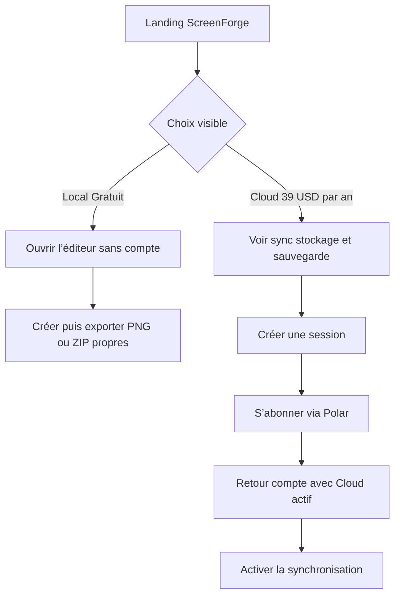
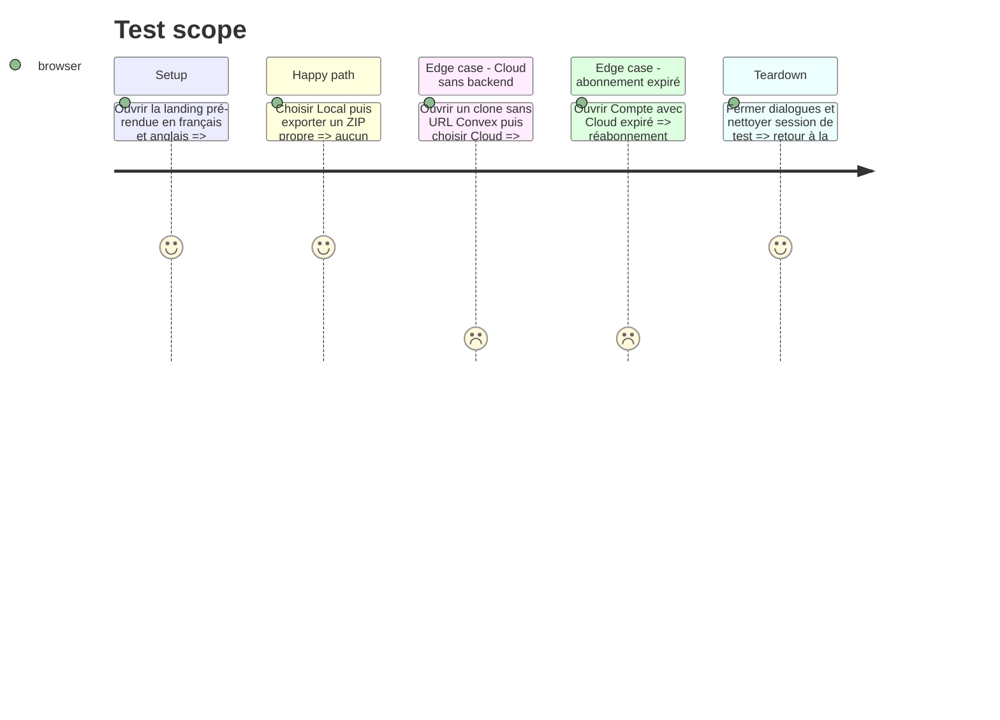

# Instruction: réécrire la landing, le pricing et le compte

## Architecture projection

> Tree of the final files. ✅ create · ✏️ modify · ❌ delete

```txt
.
├── apps/web/
│   ├── e2e/
│   │   ├── landing.spec.ts                         ✏️ deux offres exactes en français et anglais
│   │   ├── export-tiers.spec.ts                    ✏️ Local illimité et Cloud limité à la sync
│   │   ├── account.spec.ts                         ✏️ compte et abonnement Cloud seulement
│   │   └── sync.spec.ts                            ✏️ login et entitlement avant write
│   └── src/
│       ├── App.tsx                                 ✏️ retirer le démarrage commercial conditionnel
│       ├── landing/copy.ts                         ✏️ Local gratuit et Cloud payant
│       ├── landing/links.ts                        ✏️ Local vers l’éditeur, Cloud vers le compte
│       ├── landing/components/Pricing.tsx          ✏️ deux cartes sans faux troisième état
│       ├── landing/components/FinalCta.tsx         ✏️ CTA Local immédiat et CTA Cloud
│       ├── components/pricing-dialog/PricingDialog.tsx ✏️ Local informatif, checkout Cloud seul
│       ├── components/account-dialog/AccountDialog.tsx ✏️ session, état Cloud, portail et déconnexion
│       ├── components/export-dialog/ExportDialog.tsx ✏️ supprimer quota, watermark et upsell
│       ├── components/release-dialog/ReleaseDialog.tsx ✏️ releases nouvelles toujours propres
│       ├── components/publish-dialog/PublishDialog.tsx ✏️ migration des anciens lots filigranés
│       └── lib/__tests__/
│           ├── landing-copy.test.ts                ✏️ vocabulaire et prix cohérents
│           └── plans.test.ts                       ✏️ catalogue visible exact
├── README.md                                       ✏️ Local complet sans backend, Cloud opéré
└── PRD.md                                          ✏️ deux offres et parcours client
```

## User Journey



## Test Scope



## Wireframe

```txt
Landing / section Offres
┌───────────────────────────────────────────────────────────────────────┐
│ Choisissez où vivent vos projets                                     │
│                                                                       │
│ ┌─────────────────────────────┐  ┌─────────────────────────────────┐ │
│ │ Local                       │  │ Cloud                           │ │
│ │ Gratuit                     │  │ 39 USD / an                     │ │
│ │ Sans compte                 │  │ Compte client                   │ │
│ │ ✓ Éditeur complet           │  │ ✓ Tout Local                    │ │
│ │ ✓ Exports illimités         │  │ ✓ Projets, images et settings   │ │
│ │ ✓ Aucun filigrane           │  │ ✓ Sync et sauvegardes Convex    │ │
│ │ ✓ ZIP                       │  │ ✓ Portail de facturation        │ │
│ │ [ Ouvrir l’éditeur ]        │  │ [ Choisir Cloud ]               │ │
│ └─────────────────────────────┘  └─────────────────────────────────┘ │
│ Local fonctionne sans connexion. Cloud nécessite une session et un   │
│ abonnement actif; l’arrêt de Cloud ne bloque jamais l’éditeur Local.  │
└───────────────────────────────────────────────────────────────────────┘

Éditeur / Export                       Éditeur / Compte
┌───────────────────────────────┐      ┌───────────────────────────────┐
│ Exporter                      │      │ Compte ScreenForge           │
│ PNG propres · illimités       │      │ Cloud : actif / expiré       │
│ [ Exporter ] [ Télécharger ZIP ]     │ [ Gérer l’abonnement ]        │
│ Aucun prix ni quota ici.      │      │ [ Se déconnecter ]           │
└───────────────────────────────┘      └───────────────────────────────┘
```

## Tasks to do

### `1)` Présenter exactement deux offres

> Le texte commercial décrit l’architecture réelle.

1. Remplacer essai, Licence, Local payant, watermark et ouverture commerciale par Local gratuit et Cloud payant dans les copies FR/EN, SEO, FAQ et comparatifs.
2. Afficher Local à 0 avec éditeur complet, exports illimités propres et ZIP; son CTA ouvre immédiatement l’éditeur.
3. Afficher Cloud à 39 USD/an avec compte, sync, projets, images, settings et sauvegardes Convex; son CTA ouvre connexion/checkout.
4. Ne pas prétendre que publier le code donne le service Cloud, les secrets opérateur, les sauvegardes ou un entitlement.
5. Faire échouer l’audit landing sur tout ancien vocabulaire commercial ou toute troisième offre.

### `2)` Retirer le commerce des chemins Local

> Export et release n’affichent plus de monétisation.

1. Supprimer quota, exports restants, filigrane, achat Local et upgrade Cloud de l’ExportDialog.
2. Créer les nouvelles releases avec des rendus propres; lorsqu’un lot historique est marqué filigrané, expliquer qu’il doit être régénéré avant publication plutôt que de le déclarer propre.
3. Limiter les appels à Offres/Compte aux actions Cloud : synchroniser, se connecter, gérer l’abonnement.
4. Vérifier navigation clavier, focus, noms accessibles et états de chargement de chaque CTA.

### `3)` Rendre le compte strictement Cloud

> Aucun compte n’est requis pour Local.

1. Afficher session, Cloud actif/expiré, période et portail Polar, sans badge ou achat Local.
2. Si Convex n’est pas configuré dans un clone, désactiver uniquement les CTA Cloud avec une explication; ne jamais bloquer l’éditeur ou l’export.
3. Après checkout, rafraîchir l’état depuis le backend plutôt que depuis le retour URL ou localStorage.
4. Afficher les erreurs de quota Cloud avec la limite atteinte et une action de suppression, sans valeur interne ni donnée d’un autre compte.

### `4)` Aligner les documents produit publics

> Le README d’un clone neuf doit suffire à comprendre Local.

1. Documenter installation, build, lancement et export Local sans Convex.
2. Décrire Cloud comme service opéré distinct exigeant compte et abonnement actif; ne pas publier les procédures ou valeurs secrètes.
3. Mettre PRD, README et mentions tarifaires au même vocabulaire et au même prix.
4. Ajouter les prérequis légaux et licence au gate de publication sans rédiger une licence ad hoc.

## Test acceptance criteria

| Task | Acceptance criteria |
| --- | --- |
| 1 | Landing FR/EN, SEO et FAQ montrent exactement Local gratuit et Cloud à 39 USD/an, sans essai paywall, Licence ou filigrane. |
| 2 | Export, ZIP et nouvelle release fonctionnent sans surface commerciale; un ancien artifact filigrané ne peut être publié comme propre sans régénération. |
| 3 | Le compte ne vend que Cloud, se fie à l’état serveur et son absence ne retire aucune capacité Local. |
| 4 | Un lecteur du README peut lancer Local sans Convex et comprend que le service Cloud opéré reste payant. |
