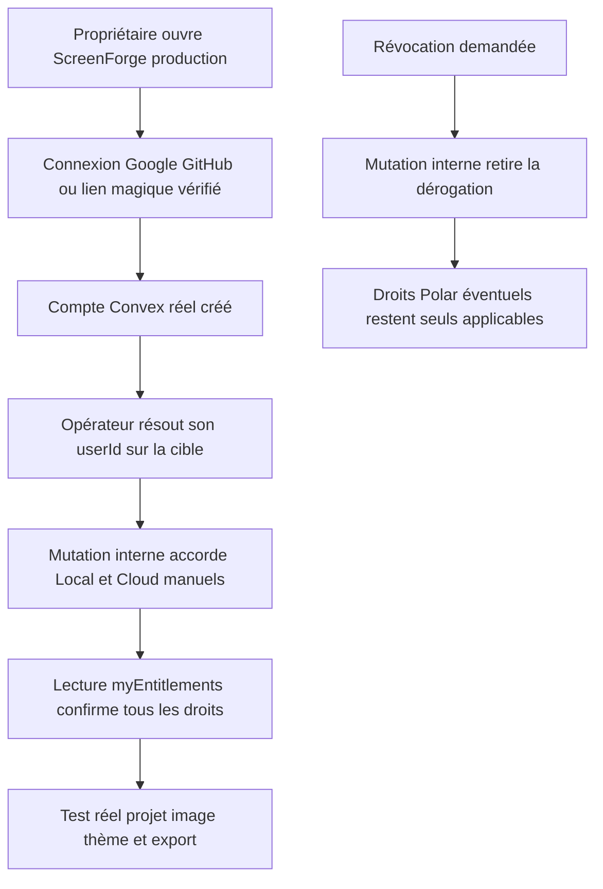
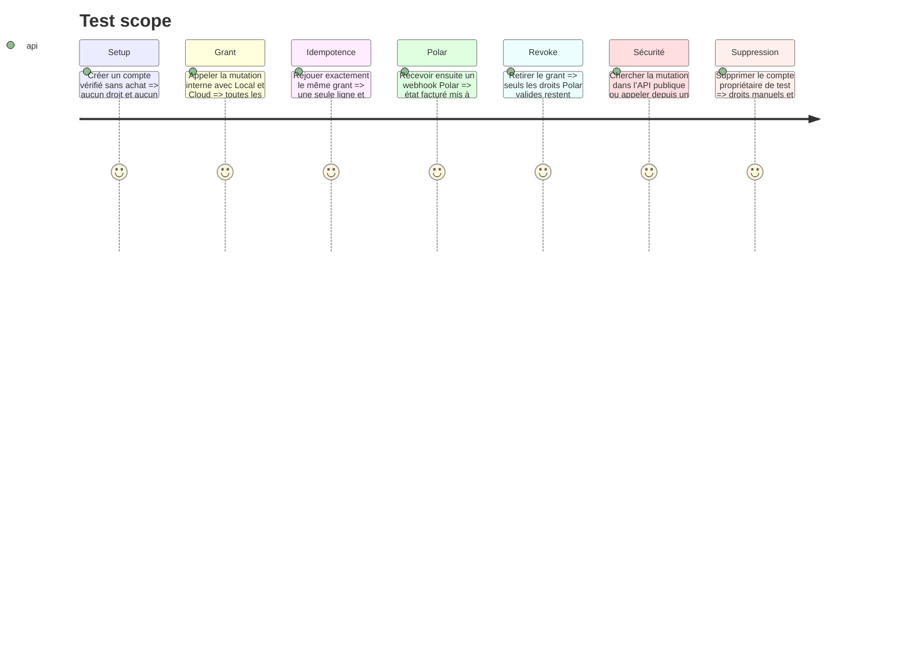

# Instruction: ajouter puis provisionner un accès propriétaire complet et révocable

## Architecture projection

> Tree of the final files. ✅ create · ✏️ modify · ❌ delete

```txt
.
├── apps/backend/convex/
│   ├── schema.ts                         ✏️ champs optionnels de dérogation sur le miroir existant
│   ├── mirror.ts                         ✏️ mutation interne idempotente grant/revoke
│   ├── mirror.test.ts                    ✏️ fusion Polar, révocation et surface non publique
│   ├── entitlements.ts                   ✏️ fusion du droit manuel et de l’état Polar
│   ├── entitlements.test.ts              ✏️ accès complet sans faux abonnement
│   └── accountDeletion.test.ts           ✏️ disparition de la dérogation avec le compte
└── aidd_docs/tasks/2026_08/2026_08_11_migration-convex/
    └── environnements.md                 ✏️ procédure opérateur grant, vérification et revoke
```

## User Journey



## Test Scope



## Tasks to do

### `1)` Ajouter la dérogation minimale au miroir existant

> Pas de faux client Polar, pas de date artificielle, pas de nouvelle table pour une ligne.

1. Ajouter aux entitlements des champs optionnels de droit manuel Local et Cloud, absents pour tous les clients ordinaires.
2. Fusionner ces champs dans `readEntitlements` et `rightsOf` : un grant Cloud manuel donne toutes les capacités client et n’expire pas; un grant Local manuel donne export et ZIP seulement.
3. Laisser `applyEntitlementsIfNewer` modifier uniquement les champs Polar afin qu’un webhook ne puisse ni accorder ni retirer la dérogation.
4. Ajouter une mutation **interne** `setComplimentaryAccess` qui prend un `Id<'users'>`, les deux booléens et une note opérateur courte, puis upsert ou révoque de façon idempotente.
5. Vérifier au niveau des marqueurs Convex et des types générés que la fonction n’existe pas sous `api.*`.

### `2)` Documenter une opération sûre et réversible

> L’identité arrive d’une connexion vérifiée; aucune credential n’est créée par script.

1. Ajouter à `environnements.md` les commandes exactes de lecture du compte, grant, contrôle et revoke avec `--env-file` explicite.
2. Ne jamais écrire l’e-mail réel, un mot de passe, un jeton ou un `userId` de production dans Git; utiliser des placeholders clairement remplacés au moment de l’opération.
3. Exiger un essai sur préprod avec un compte jetable avant la mutation de production.
4. Journaliser dans la note que le grant est « owner complimentary access » sans attribuer de rôle administrateur.
5. Garder la commande de révocation juste à côté de la commande de grant.

### `3)` Provisionner le compte réel

> Cette étape est externe au code et ne s’exécute qu’après connexion du propriétaire.

1. Se connecter une fois sur le déploiement cible avec Google, GitHub ou lien magique afin que Convex crée l’identité vérifiée.
2. Résoudre l’unique `userId` correspondant dans la table `users` de la cible; arrêter si zéro ou plusieurs lignes correspondent.
3. Accorder Local et Cloud via la mutation interne, d’abord en préprod puis en production.
4. Rafraîchir le compte et vérifier dans l’UI le plan Cloud, l’export propre, le ZIP et la sync.
5. Créer un projet avec une image, changer le thème, le reprendre sur un second contexte navigateur puis supprimer ce projet distant de test.

## Test acceptance criteria

- Aucun e-mail propriétaire, mot de passe, userId ou secret n’est versionné.
- La mutation de grant est interne, idempotente, révocable et limitée à un compte existant.
- Le grant complet active export propre, ZIP et Cloud sans conférer d’accès admin.
- Un webhook Polar ultérieur ne retire pas la dérogation; sa révocation restaure exactement les droits Polar en cours.
- Le compte cible est vérifié par identité réelle et réussit un round-trip projet, asset et thème en préprod puis production.
- La procédure de révocation est testée et documentée avant de considérer le provisioning terminé.

