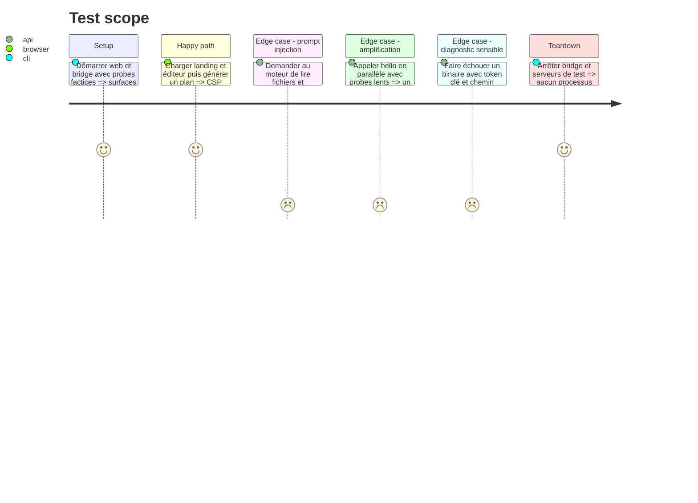

# Instruction: fermer les findings web et bridge

## Architecture projection

> Tree of the final files. ✅ create · ✏️ modify · ❌ delete

```txt
.
├── vercel.json                              ✏️ CSP bloquante et anti-framing appliqué
├── scripts/security-headers-audit.mjs       ✏️ refuser une politique seulement Report-Only
├── apps/web/e2e/security-headers.spec.ts    ✏️ framing et ressources essentielles
└── apps/bridge/
    ├── README.md                            ✏️ frontière locale et moteurs réellement sûrs
    └── src/
        ├── redaction.ts                     ✅ redaction commune des diagnostics
        ├── asc.ts                           ✏️ réutiliser la redaction commune
        ├── claude.ts                        ✏️ nettoyer stderr et erreurs avant exposition
        ├── codex.ts                         ✏️ neutraliser ou désactiver le moteur sans no-tools dur
        ├── server.ts                        ✏️ probes bornés, cache single-flight et erreurs nettoyées
        ├── main.ts                          ✏️ probes bornés au démarrage
        └── bridge.test.ts                   ✏️ injection, secrets, timeout, cache et concurrence
```

## User Journey

```mermaid
flowchart TD
  A[Navigateur ouvre ScreenForge] --> B[CSP bloquante et anti-framing actifs]
  B --> C[Page autorisée charge uniquement ses sources prévues]
  C --> D[Utilisateur contacte le bridge sur 127.0.0.1]
  D --> E[/hello retourne un état mis en cache et borné]
  E --> F{Moteur sans outils locaux garanti}
  F -->|oui| G[Texte non fiable envoyé avec schéma de sortie]
  F -->|non| H[Moteur absent de la liste]
  G --> I[Réponse ou diagnostic expurgé]
```

## Test Scope



## Tasks to do

### `1)` Appliquer réellement la politique navigateur

> `frame-ancestors` doit protéger la réponse servie, pas seulement produire un rapport.

1. Valider la CSP actuelle sur Preview, corriger les dernières violations nécessaires, puis la déplacer de `Content-Security-Policy-Report-Only` vers `Content-Security-Policy`.
2. Conserver `frame-ancestors 'none'`, `object-src 'none'`, `base-uri 'none'` et les sources exactes; refuser jokers et `unsafe-eval`.
3. Ajouter `X-Frame-Options: DENY` comme défense de compatibilité et conserver les headers `nosniff`, referrer et permissions.
4. Faire échouer l’audit build/déployé si seule une CSP report-only existe, si l’anti-framing manque ou si une origine imprévue apparaît.
5. Rejouer landing FR/EN, éditeur, auth, fontes, import, sync et export sous la politique bloquante.

### `2)` Empêcher le bridge de lire la machine pour du texte non fiable

> Un prompt système et un sandbox read-only ne sont pas une interdiction de lecture.

1. Conserver Claude seulement avec sa liste matérielle `--disallowed-tools`, son cwd temporaire, son timeout et son schéma de sortie.
2. Vérifier le protocole Codex épinglé : s’il n’expose pas une allowlist vide des outils intégrés, retirer Codex des moteurs annoncés et de l’UI bridge; ne pas présenter un cwd temporaire comme une isolation de lecture.
3. Ne réactiver Codex que lorsqu’un test d’intégration prouve qu’un prompt injecté ne peut appeler shell, read, glob, grep, web ou MCP.
4. Conserver l’authentification du CLI sur la machine sans lire, copier ou journaliser ses jetons.

### `3)` Borner le probe public sans casser l’appairage

> `/hello` peut rester tokenless, mais pas lancer des processus sans limite.

1. Regrouper les probes Codex, Claude et ASC dans une promesse single-flight partagée avec timeout par processus.
2. Mettre en cache le résultat quelques secondes; une nouvelle tentative après expiration redétecte bien un binaire installé pendant l’assistant.
3. Borner stdout/stderr de chaque version probe, tuer le processus au timeout et résoudre en « absent » sans stack brute.
4. Tester rafale parallèle, cache, expiration, binaire bloqué, sortie énorme et processus absent.

### `4)` Expurger toutes les erreurs qui quittent le bridge

> Une seule fonction de redaction couvre ASC, Claude, Codex et le serveur.

1. Déplacer la fonction existante d’ASC dans `redaction.ts` et la réutiliser à chaque frontière HTTP ou console.
2. Masquer clés privées, JWT, couples `key/token/secret/password`, fichiers P8, chemins personnels et chaînes excessives.
3. Ne jamais renvoyer directement stderr, stdout, `error.message`, commande complète ou environnement d’un binaire.
4. Garder un message utile et court après redaction et tester les combinaisons ainsi que les faux positifs nécessaires.

## Test acceptance criteria

| Task | Acceptance criteria |
| --- | --- |
| 1 | Les réponses Preview et production portent une CSP bloquante avec anti-framing; l’application complète fonctionne sans violation utile. |
| 2 | Aucun moteur annoncé pour du contenu non fiable ne dispose d’un outil de lecture, shell, web ou MCP; Codex reste désactivé tant que ce contrat n’est pas prouvable. |
| 3 | Une rafale `/hello` ne crée qu’un probe par binaire, chaque enfant expire et une installation devient visible après le TTL. |
| 4 | Aucun diagnostic HTTP ou console ne contient secret, clé, JWT, fichier P8, chemin personnel ou sortie brute non bornée. |
