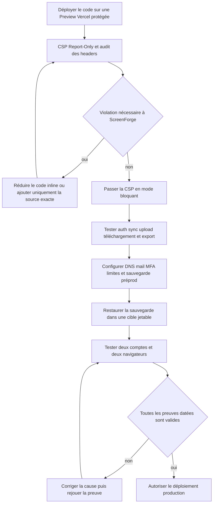
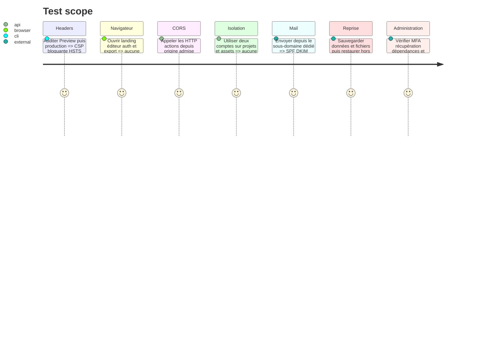

# Instruction: durcir le déploiement et l’exploitation avant production

> État d'exécution au 2026-08-15 : le durcissement local est implémenté et le
> gate `pnpm run test:release` passe après une itération corrective (530 tests
> unitaires, 167 E2E release, 2 E2E prelaunch, audits contraste/échelle/landing).
> La phase reste `in-progress` : aucun projet ScreenForge Vercel ni alias
> préproduction n'existe, les clés de déploiement Convex ne sont pas présentes
> dans ce worktree, et DNS mail, MFA, protection Preview et restore drill exigent
> encore une preuve externe réelle. La CSP reste donc Report-Only sur la future
> Preview ; l'audit refusera la production tant qu'elle n'est pas bloquante.

## Architecture projection

> Tree of the final files. ✅ create · ✏️ modify · ❌ delete

```txt
.
├── vercel.json                                  ✅ headers web après validation de la Root Directory
├── package.json                                 ✏️ audit HTTP déployé explicite
├── .github/
│   └── dependabot.yml                           ✅ mises à jour pnpm et GitHub Actions
├── scripts/
│   └── security-headers-audit.mjs               ✅ assertions CSP, HSTS et headers sur une URL réelle
├── apps/web/
│   ├── index.html                               ✏️ retirer les scripts et handlers inline
│   ├── landing.html                             ✏️ retirer les handlers inline
│   └── public/
│       └── boot.js                              ✅ boot thème et chargement des fontes sous script-src self
├── apps/backend/convex/
│   ├── convex.config.ts                         ✏️ allowlist CORS typée par déploiement
│   ├── http.ts                                  ✏️ origine exacte, Vary Origin et refus explicite
│   ├── assets.test.ts                           ✏️ CORS autorisé, refusé, sans Origin et auth conservée
│   └── projects.test.ts                         ✏️ isolation croisée maintenue
├── aidd_docs/tasks/2026_08/2026_08_11_migration-convex/
│   └── environnements.md                        ✏️ secrets, DNS mail, MFA, sauvegarde et reprise
└── aidd_docs/tasks/2026_08/2026_08_15_local-cloud-plans/
    └── production-security-evidence.md          ✅ preuves datées sans secrets
```

## User Journey



## Test Scope



## Tasks to do

### `1)` Déployer une politique navigateur mesurée

> La CSP commence en observation; elle ne devient bloquante qu’après un passage fonctionnel complet.

1. Confirmer dans Vercel la Root Directory, la commande de build, `apps/web/dist` et un alias préprod stable avant de créer `vercel.json`; reporter les origines exactes préprod/prod dans la politique, jamais `*.vercel.app` ou `*.convex.cloud`.
2. Déplacer le boot thème et les handlers `onload` de `index.html` et `landing.html` dans un unique `public/boot.js` servi par la même origine; ne pas ajouter de dépendance ni de nonce dynamique pour ce site statique. Autoriser le JSON-LD inline restant uniquement par ses hashes CSP déterministes vérifiés sur les deux documents pré-rendus.
3. Poser d’abord `Content-Security-Policy-Report-Only` sur Preview avec au minimum `default-src 'self'`, `script-src 'self'`, `object-src 'none'`, `base-uri 'none'`, `frame-ancestors 'none'`, `form-action 'self'`, les hôtes Google Fonts exacts et les origines HTTPS/WSS Convex exactes. Garder `style-src 'unsafe-inline'` tant que les styles React/Fabric mesurés l’exigent.
4. Tester landing EN/FR, thème, auth, éditeur, chargement de fontes, import d’image, sync, export et téléchargement; corriger toute violation par suppression du code inline ou ajout de la source minimale réellement appelée.
5. Remplacer Report-Only par la CSP bloquante seulement sans violation utile, puis ajouter `X-Content-Type-Options: nosniff`, `Referrer-Policy: strict-origin-when-cross-origin` et une `Permissions-Policy` désactivant caméra, micro et géolocalisation.
6. Ne pas configurer HSTS une seconde fois; `security-headers-audit.mjs` reçoit une URL déployée, suit les redirections et échoue si HSTS Vercel, CSP bloquante ou un header attendu manque, si la CSP autorise un joker, `unsafe-inline` dans `script-src` ou `unsafe-eval`.

### `2)` Remplacer le CORS permissif sans déplacer l’autorisation

> L’allowlist réduit la surface navigateur; les contrôles de propriétaire restent la vraie frontière.

1. Déclarer `CORS_ALLOWED_ORIGINS` dans `convex.config.ts` et poser une liste d’origines HTTPS exactes et distinctes sur préprod et production; local accepte seulement les origines de test documentées.
2. Centraliser dans `http.ts` la résolution de l’Origin : une origine admise est reflétée avec `Vary: Origin`, une origine inconnue reçoit un refus sans `Access-Control-Allow-Origin`, et l’absence d’Origin reste utilisable par les clients non navigateur.
3. Conserver l’en-tête Bearer, `getAuthUserId`, les vérifications propriétaire, taille et type sur upload/download; ne jamais remplacer un refus applicatif par un simple refus CORS.
4. Tester requêtes et preflights pour origine admise, origine hostile, `null`, liste mal configurée et absence d’Origin; asserter qu’aucun chemin n’émet `Access-Control-Allow-Origin: *`.
5. Rejouer les scénarios cross-account projets/assets et la suppression de compte pour prouver que le changement CORS ne masque ni ne remplace l’isolation backend.

### `3)` Séparer secrets et identité d’envoi

> Aucun secret ne passe par Vite; aucune valeur sensible n’est copiée dans la preuve.

1. Laisser côté Vercel uniquement `VITE_CONVEX_URL` et `VITE_COMMERCIAL_LAUNCH`, toutes deux publiques; vérifier le bundle construit avec une recherche de noms/fingerprints, jamais en affichant les valeurs secrètes.
2. Garder JWT/Auth, OAuth, Resend et Polar dans les variables Convex propres à chaque déploiement; comparer seulement la présence et l’empreinte non réversible entre préprod/prod, puis documenter propriétaire, rotation et révocation.
3. Vérifier `auth.screenforge.app` dans Resend avec SPF et DKIM, utiliser un expéditeur dédié tel que `connexion@auth.screenforge.app`, puis publier DMARC en `p=none` avant tout durcissement ultérieur fondé sur les rapports.
4. Remplacer `AUTH_RESEND_KEY` par une clé Resend limitée à `sending_access`; la créer et la saisir via le Dashboard fournisseur lorsque cela évite de laisser le secret dans l’historique shell.
5. Envoyer un lien magique en préprod puis production, vérifier réussite, provenance et absence de secret dans navigateur, logs et fichier de preuve.

### `4)` Fermer les accès administrateur et la supply chain vérifiables

> Le compte propriétaire applicatif reste un client complet, pas un administrateur d’infrastructure.

1. Activer la MFA officiellement disponible sur GitHub, Vercel et Resend, privilégier une passkey quand le fournisseur la propose, conserver au moins deux méthodes de récupération quand il le permet, stocker les codes hors du dépôt et dater uniquement le contrôle réussi.
2. Activer Vercel Standard Protection/Vercel Authentication pour Preview et autres déploiements non production; vérifier en navigation privée qu’une URL Preview n’est pas publique et que `screenforge.app` reste accessible.
3. Vérifier les membres/roles Vercel et GitHub, retirer les accès inutiles, et ne pas ajouter le compte client propriétaire aux équipes d’administration.
4. Ajouter `.github/dependabot.yml` pour le workspace pnpm et GitHub Actions, cadence hebdomadaire; activer Dependabot alerts et security updates dans GitHub puis laisser la CI existante valider chaque PR.
5. Ne pas prétendre couvrir Convex, Polar, le registrar ou Google par MFA tant qu’un contrôle officiel équivalent n’a pas été vérifié dans leurs consoles et ajouté avec sa source.

### `5)` Préparer dépenses, observabilité, sauvegarde et reprise

> Les contrôles indisponibles dans l’offre courante deviennent conditionnels, pas des faux prérequis.

1. Poser des limites d’usage Convex prudentes sur préprod/prod et, si le projet Vercel est Pro, des alertes/seuils de dépense Vercel; sinon consigner explicitement l’absence de ce contrôle payant et la revue manuelle retenue.
2. Utiliser les logs et Request IDs du Dashboard Convex comme preuve de base; brancher Sentry ou un log stream seulement si l’offre Convex le permet et qu’un besoin d’alerte hors Dashboard est confirmé.
3. Créer avant production et avant chaque migration risquée une sauvegarde Convex incluant File Storage; exporter séparément le code versionné et la liste des noms de variables/configurations sans leurs valeurs.
4. Restaurer la sauvegarde uniquement dans un déploiement jetable ou préprod, vérifier comptes, projets et assets, puis nettoyer la cible; ne jamais tester une restauration sur production car elle remplace les données existantes.
5. Activer les sauvegardes périodiques si l’offre Convex Pro est souscrite; sinon consigner la cadence manuelle, le propriétaire et la date de la prochaine sauvegarde.

### `6)` Produire une preuve de lancement sans données sensibles

> La configuration externe est acceptée sur preuve réelle, pas sur case cochée de mémoire.

1. Créer `production-security-evidence.md` avec date, environnement, contrôleur, commande ou écran consulté, résultat et référence officielle pour chaque contrôle; n’y mettre ni secret, e-mail privé complet, code de récupération, token ni export de base.
2. Joindre les sorties nettoyées de l’audit headers Preview/production, des tests CORS/isolation, des DNS SPF/DKIM/DMARC, de la protection Preview et du restore drill.
3. Enregistrer les contrôles conditionnels comme `enabled`, `unavailable-on-current-plan` avec mitigation, ou `not-applicable` justifié; aucun `TODO` silencieux ne permet la production.
4. Faire expirer/révoquer les clés ou comptes jetables créés pour la preuve et noter le nettoyage.
5. Bloquer la phase 6 tant que CSP est seulement Report-Only, que la préprod n’a pas d’origine stable, que la restauration n’a pas été répétée ou qu’un test cross-account échoue.

## Test acceptance criteria

- Une Preview protégée et la production passent l’audit HTTP réel; la CSP de production est bloquante, sans joker, `unsafe-eval` ni `unsafe-inline` dans `script-src`, et HSTS est constaté sans duplication de configuration.
- Landing, éditeur, auth, fontes, sync, upload/download et export fonctionnent sans violation CSP utile dans les deux langues et thèmes.
- Aucune HTTP action n’émet `Access-Control-Allow-Origin: *`; origines admises, hostiles et absentes sont couvertes, tandis que Bearer auth et isolation cross-account restent obligatoires.
- Le bundle ne contient aucun secret; Resend utilise le sous-domaine SPF/DKIM vérifié, DMARC en observation et une clé limitée à l’envoi.
- Preview est inaccessible anonymement, les administrateurs GitHub/Vercel/Resend ont MFA et récupération contrôlées, et Dependabot couvre pnpm plus GitHub Actions.
- Une sauvegarde incluant les fichiers est restaurée hors production; les limites, logs et contrôles payants disponibles sont prouvés ou portent une mitigation explicite.
- `production-security-evidence.md` est daté, reproductible, nettoyé de toute donnée sensible et ne laisse aucun contrôle de lancement dans un état ambigu.
