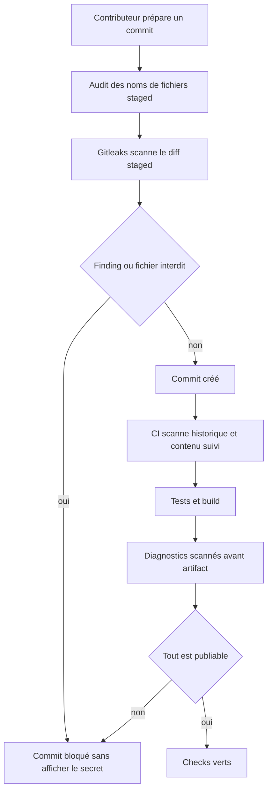
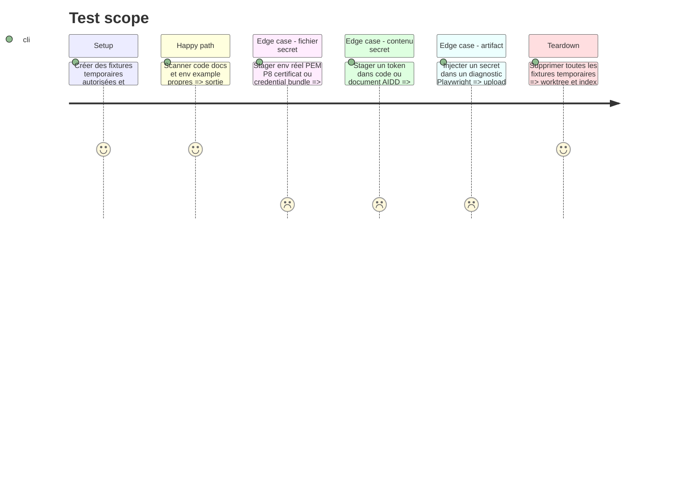

# Instruction: rendre le dépôt et les documents publiables sans secret

## Architecture projection

> Tree of the final files. ✅ create · ✏️ modify · ❌ delete

```txt
.
├── .gitignore                                  ✏️ ignorer `.private/` et caches Gitleaks
├── .gitleaksignore                             ✅ allowlist par fingerprint uniquement si nécessaire
├── .husky/pre-commit                           ✏️ audit fichiers puis Gitleaks sur staged
├── package.json                                ✏️ scripts d’audit publication et test associé
├── README.md                                   ✏️ prérequis contributeur et stores de secrets
├── scripts/
│   ├── publication-audit.mjs                   ✅ contrôle stdlib des noms, contenus et sorties
│   └── publication-audit.test.mjs              ✅ fixtures autorisées et interdites
├── .github/workflows/quality.yml               ✏️ Gitleaks historique et artifacts expurgés
├── apps/bridge/src/bridge.test.ts              ✏️ fixture synthétique non détectée comme vraie clé
└── aidd_docs/
    ├── README.md                               ✅ contrat public et non sensible des documents
    ├── memory/                                 ✏️ retirer informations sensibles ou obsolètes
    └── tasks/                                  ✏️ preuves expurgées seulement
```

## User Journey



## Test Scope



## Tasks to do

### `1)` Interdire les fichiers qui ne doivent jamais entrer dans Git

> `.gitignore` prévient l’accident; l’audit le rend impossible à merger.

1. Autoriser uniquement le fichier racine `.env.example`; refuser tout autre `.env`, même imbriqué ou suffixé.
2. Refuser par nom/extensions PEM, P8, KEY, CRT, CER, P12, PFX, JKS, fichiers SSH privés, credential bundles et exports de console connus.
3. Ajouter `.private/` à `.gitignore` pour les notes, captures et preuves locales sensibles; ne versionner aucun fichier témoin dans ce dossier.
4. Écrire `publication-audit.mjs` en Node stdlib pour contrôler l’index, les fichiers suivis, un build ou un dossier d’artifacts selon le mode demandé.
5. Tester casse, sous-dossiers, noms trompeurs, `.env.example`, certificats publics explicitement requis et chemins avec espaces.

### `2)` Exécuter Gitleaks aux trois frontières

> Le CLI officiel est épinglé; les findings sont toujours redacted.

1. Dans Husky, scanner exactement le diff staged avant `lint-staged`; échouer clairement si le CLI officiel épinglé n’est pas installé.
2. Dans Quality, checkout avec historique complet puis lancer `gitleaks git --redact` sur toutes les refs avant build et E2E.
3. Dans le workflow de tag, répéter le scan complet avant tout déploiement ou accès à un Environment GitHub.
4. Épingler version et SHA256 de l’archive Gitleaks dans les workflows en reprenant le motif actionlint existant; ne pas ajouter de wrapper npm non officiel.
5. N’autoriser une fausse alerte historique que par fingerprint exact dans `.gitleaksignore`, avec justification non sensible; interdire allowlist de dossier, extension ou règle entière.

### `3)` Traiter les documents AIDD comme du contenu public

> Versionné signifie publiable.

1. Créer `aidd_docs/README.md` : jamais de token, clé, valeur d’environnement, e-mail privé, identifiant client, export de base, log brut, code MFA/récupération, capture de console ou chemin personnel.
2. Autoriser noms de variables, URLs publiques, SHA/tag, états `pass/fail`, horodatages et identifiants expurgés nécessaires à une preuve reproductible.
3. Stocker toute preuve brute dans `.private/` ou dans le store sécurisé du fournisseur; le document AIDD ne contient qu’un relevé expurgé.
4. Scanner `aidd_docs/` sans exception Gitleaks et ajouter au contrôle stdlib les motifs sensibles structurés que Gitleaks ne connaît pas.
5. Relire l’ensemble des mémoires et tâches avant publication; remplacer les données personnelles par des rôles génériques, sans affaiblir la preuve technique.

### `4)` Empêcher les fuites par logs et artifacts

> Un dépôt propre ne suffit pas si son historique Actions publie les sorties.

1. Interdire `set -x`, dumps d’environnement, corps webhook, URLs storage signées, objets compte et sorties brutes de CLI dans les workflows et scripts.
2. Masquer toute valeur dérivée qui doit traverser GitHub Actions avec les commandes de masking natives avant usage.
3. Scanner Playwright report, test-results et tout artifact de release avant upload; si le scan échoue, ne rien téléverser et faire échouer le job.
4. Garder une rétention courte pour les diagnostics et ne pas collecter plus que traces/screenshots nécessaires au premier échec.
5. Auditer l’historique existant des runs et artifacts dans le preflight de phase 6, car leur visibilité change avec le dépôt.

## Test acceptance criteria

| Task | Acceptance criteria |
| --- | --- |
| 1 | Seul `.env.example` peut être suivi; tout fichier secret interdit est bloqué en staged et en CI, même sous un autre dossier ou une autre casse. |
| 2 | Gitleaks bloque un secret de test sur staged, historique CI et release, masque sa valeur et n’utilise aucune allowlist large. |
| 3 | Tous les documents AIDD restent versionnés et reproductibles sans secret, donnée personnelle, sortie brute ou chemin local sensible. |
| 4 | Aucun artifact ou log contenant le secret de test n’est uploadé; les diagnostics propres restent disponibles avec une rétention bornée. |
