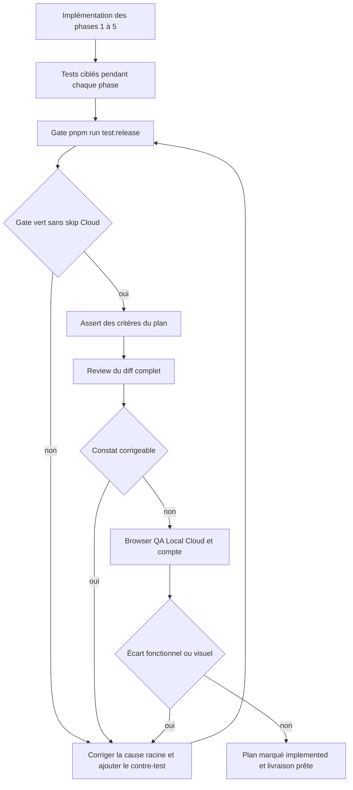
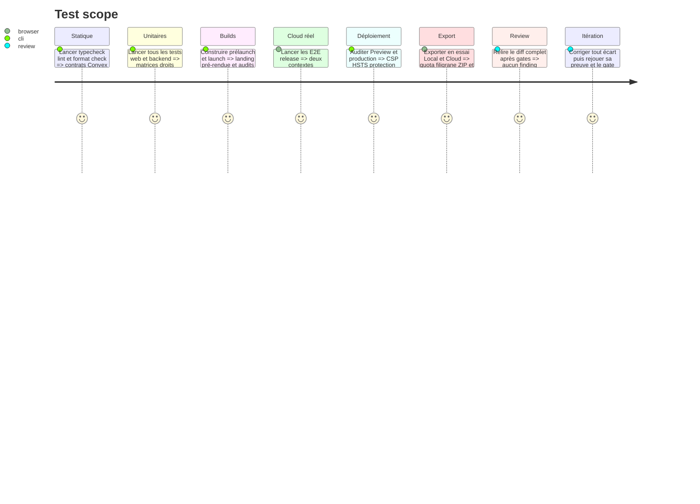

# Instruction: prouver la migration et boucler jusqu’à une review approuvée

## Architecture projection

> Tree of the final files. ✅ create · ✏️ modify · ❌ delete

```txt
.
├── PRD.md                                      ✏️ deux offres et périmètre Cloud final
├── README.md                                   ✏️ comportement Local/Cloud et commandes de preuve
├── aidd_docs/memory/
│   ├── architecture.md                        ✏️ Cloud autonome et héritage des capacités
│   ├── codebase-map.md                        ✏️ settings et grant interne
│   ├── database.md                            ✏️ données synchronisées et exclusions
│   ├── project-brief.md                       ✏️ Local, Cloud et essai
│   └── testing.md                             ✏️ matrice de release commerciale
└── aidd_docs/tasks/2026_08/2026_08_15_local-cloud-plans/
    ├── plan.md                                ✏️ statut après implémentation complète
    └── phase-1.md … phase-6.md                ✏️ statuts et écarts réellement fermés
```

## User Journey



## Test Scope



## Tasks to do

### `1)` Exécuter les preuves ciblées à chaque phase

> Chaque branche métier laisse un test qui échoue si elle régresse.

1. Après la phase 1, exécuter les tests entitlements, authz, Polar, billing, mirror, account et export tiers.
2. Après la phase 2, exécuter settings, account deletion, sync unitaires et E2E Convex strict à deux navigateurs.
3. Après la phase 3, exécuter tests landing, profils commerciaux, accessibilité des dialogues et captures landing clair/sombre.
4. Après la phase 4, exécuter grant/revoke, fusion Polar et contrôle de surface interne.
5. Après la phase 5, exécuter les tests headers déployés, CSP navigateur, CORS/isolation, bundle sans secret et contrôler les preuves externes datées.
6. En cas d’échec, corriger la règle partagée la plus basse qui couvre tous les appelants, puis ajouter ou renforcer le contre-test ciblé.

### `2)` Passer le gate de release complet

> La preuve finale doit inclure le vrai backend local et interdire les skips Cloud.

1. Exécuter `pnpm run format:check` puis `pnpm run test:release` depuis la racine.
2. Vérifier que `test:release` couvre unitaires, typecheck, lint, deux builds commerciaux, E2E Cloud strict et audits contraste, échelle et landing.
3. Valider au moins un ZIP 6,9 pouces avec `pnpm run validate:export -- <zip>` et confirmer 1320×2868, PNG opaque et arborescence attendue.
4. Exécuter l’audit de déploiement documenté sur la Preview protégée puis sur `screenforge.app`; vérifier la CSP bloquante, HSTS fourni par Vercel et les autres headers sans redéfinir HSTS dans le dépôt.
5. Considérer tout skip Cloud, violation CSP utile, warning de configuration Polar, erreur console, wildcard CORS ou requête cross-account comme un échec à corriger.
6. Conserver les logs utiles du premier échec, puis relancer le test ciblé avant le gate complet.

### `3)` Asserter et reviewer le résultat, pas seulement le code

> Le gate vert ne remplace pas la confrontation au plan.

1. Exécuter `aidd-dev:03-assert` sur ce plan et vérifier chaque critère d’acceptation contre une preuve reproductible.
2. Exécuter `aidd-dev:05-review` sur le diff complet, avec priorité aux droits, paiements, isolation, suppression, secrets, CSP/CORS, restauration, LWW, local-first et cohérence des prix.
3. Exécuter `aidd-dev:11-browser-qa` sur landing EN/FR, Offres, Compte, round-trip Cloud et violations CSP en desktop/mobile et clair/sombre.
4. Pour chaque constat, corriger, écrire ou ajuster le test qui l’aurait détecté, puis rejouer assert, review et QA concernés.
5. Ne conclure que lorsque la review est `approved`, l’assertion sans écart et le gate release intégralement vert.

### `4)` Mettre la documentation au même état que le produit

> Une règle commerciale obsolète dans la mémoire redevient un bug à la prochaine modification.

1. Retirer de la PRD et des mémoires les formulations « trois tiers », « Licence » publique, « Cloud add-on » et « Cloud exige Licence ».
2. Décrire l’essai comme état sans achat, Local comme droit perpétuel et Cloud comme abonnement autonome incluant Local pendant sa validité.
3. Documenter précisément les données cloud, les exclusions et la possibilité de lire/supprimer après expiration.
4. Mettre à jour la carte du code avec `settings.ts`, `user-settings.ts` et la mutation interne de grant.
5. Maintenir la procédure d’environnement avec les origines exactes, la séparation des secrets, le domaine Resend, les MFA vérifiées, la sauvegarde/restauration et les contrôles conditionnels au plan fournisseur.
6. Marquer les phases `done` puis le plan `implemented` seulement après fermeture de toutes les preuves, du durcissement de production et du provisioning réel.

## Test acceptance criteria

- `pnpm run format:check` et `pnpm run test:release` passent depuis la racine sans skip Cloud.
- Le ZIP de contrôle reste pixel-exact et valide pour App Store Connect.
- Les deux profils commerciaux, les deux langues et les surfaces compte/offres utilisent les mêmes noms, prix et règles.
- Preview et production passent l’audit de sécurité déployé; CSP bloquante, CORS exact, protection Preview, domaine mail et restauration hors production sont prouvés sans secret.
- L’assertion du plan ne laisse aucun critère sans preuve reproductible.
- La review finale est approuvée sans finding corrigeable et la browser QA ne laisse aucun écart fonctionnel, visuel ou accessible.
- Le compte propriétaire est provisionné et vérifié; tous les tests distants créés pour la preuve sont nettoyés.
