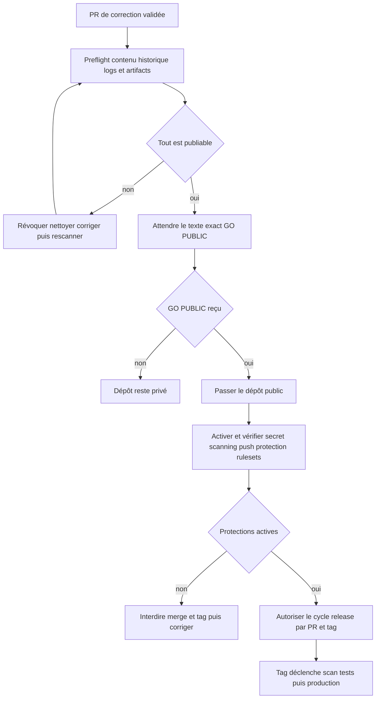
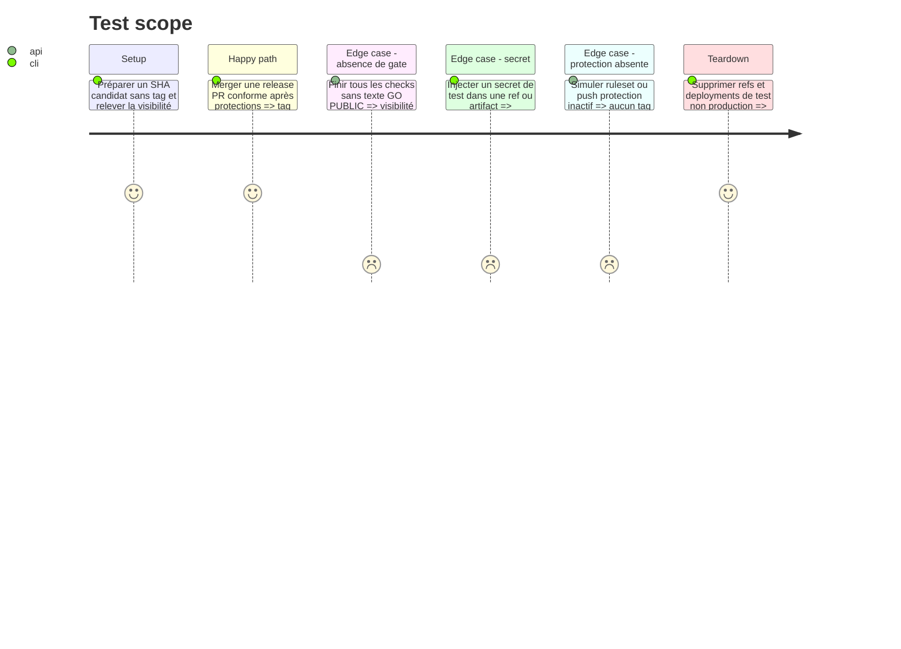

# Instruction: relier CI, releases et publication au gate GO PUBLIC

## Résultat livré

Le gate explicite a été reçu. Le dépôt canonique est public; les rulesets de
branche et de tags, secret scanning et push protection sont actifs. La release
reste déclenchée uniquement par un tag SemVer issu de Release Please, et aucun
tag v1 n'a été créé. Les validations Vercel et fournisseurs restantes sont
centralisées dans
[`2026_08_16_cloud-prelaunch-validation`](../2026_08_16_cloud-prelaunch-validation/plan.md).

## Architecture projection

> Tree of the final files. ✅ create · ✏️ modify · ❌ delete

```txt
.
├── LICENSE                                        ✅ texte validé avant publication
├── SECURITY.md                                    ✅ signalement privé sans contact sensible
├── .github/workflows/
│   ├── quality.yml                                ✏️ checks nommés requis par le ruleset main
│   ├── release-please.yml                         ✏️ release PR puis tag après merge validé
│   └── deploy-production.yml                      ✅ tag seul, Gitleaks puis gate release et Vercel
├── aidd_docs/tasks/2026_08/
│   ├── 2026_08_15_local-cloud-plans/
│   │   └── publication-evidence.md                ✅ relevé expurgé du preflight et des réglages
│   └── 2026_08_16_tagged-vercel-releases/
│       ├── plan.md                                ✏️ dépendance Local/Cloud et GO PUBLIC
│       ├── phase-2.md                             ✏️ changelog sans ancien modèle commercial
│       ├── phase-3.md                             ✏️ secret gate avant déploiement par tag
│       └── phase-4.md                             ✏️ rulesets publics et vérifications finales
└── aidd_docs/memory/vcs.md                        ✏️ publication, tags et protections effectives
```

## User Journey



## Test Scope



## Tasks to do

### `1)` Fermer le preflight public avant toute mutation GitHub

> La visibilité reste privée pendant toute cette tâche.

1. Rejouer Gitleaks sur toutes les refs et l’audit des fichiers suivis; scanner aussi archives de source, bundles, sourcemaps, rapports et artifacts destinés à être publics.
2. Examiner l’historique Actions et ses artifacts existants, car GitHub les rend visibles lors du passage public; supprimer un run/artifact uniquement après identification exacte et conserver une preuve expurgée de l’action.
3. Vérifier qu’aucun secret exploitable n’existe; si un doute apparaît, révoquer d’abord dans le store fournisseur, nettoyer ensuite l’historique concerné, puis rescanner tous les clones/refs.
4. Confirmer que secrets GitHub, Convex, Vercel, Polar et Resend vivent seulement dans leur store respectif et qu’aucune valeur n’est recopiée dans AIDD.
5. Valider licence, mentions légales, prix/devise Cloud et politique de contribution avant de déclarer le candidat publiable.

### `2)` Mettre la release taggée derrière les mêmes gates

> Le plan tagged-release reste propriétaire du mécanisme; ce plan lui impose la sécurité et le nouveau produit.

1. Achever Release Please : changelog dérivé des Conventional Commits, release PR humaine, tag SemVer seulement après merge de cette PR.
2. Créer le workflow production déclenché uniquement par le tag attendu; checkout du tag, Gitleaks historique, audit publication, installation figée, `test:release`, build puis déploiement Vercel avec Environment production.
3. Ne jamais déclencher la production sur un simple push `main`; les previews restent le chemin PR.
4. Donner au workflow les permissions minimales, pinner les actions par SHA et empêcher un fork/PR d’accéder aux secrets de production.
5. Retirer de changelog, release notes et scripts toute mention du Local payant, du profil commercial ou de `VITE_COMMERCIAL_LAUNCH`.

### `3)` Imposer le checkpoint humain littéral

> L’implémentation s’arrête ici tant que le message exact n’a pas été reçu.

1. Produire `publication-evidence.md` avec SHA candidat, scans `pass`, nombre d’artifacts vérifiés, licence validée et état encore privé, sans aucune donnée sensible.
2. Présenter le résultat et demander le gate exact `GO PUBLIC`.
3. Ne pas interpréter « go », « oui », une autorisation générale antérieure ou un merge comme ce gate.
4. Sans le texte exact, terminer la préparation avec le dépôt privé et la phase en attente de checkpoint.

### `4)` Activer les protections immédiatement après GO PUBLIC

> Aucun merge ni tag n’est autorisé dans la fenêtre de configuration.

1. Après `GO PUBLIC`, changer uniquement le dépôt canonique en public et vérifier la visibilité effective par API.
2. Vérifier secret scanning et push protection du dépôt public, activer ce qui ne l’est pas et contrôler qu’un secret de test supporté est bloqué sans contourner la protection.
3. Créer un ruleset `main` actif exigeant PR, checks Quality, conversation résolue, historique linéaire et interdiction force-push/delete; limiter le bypass à l’app release strictement nécessaire.
4. Créer un ruleset tags `v*` actif interdisant update/delete et réservant la création au flux Release Please prévu.
5. Activer le signalement privé de vulnérabilité, vérifier les permissions Actions/Environments et interdire toute release tant que chaque protection n’est pas relue comme `active`.

### `5)` Prouver le premier cycle public sans exposer Cloud

> Le code est public; les autorités et secrets Cloud ne le sont pas.

1. Depuis un clone public neuf, lancer Local et ses tests sans fichier env ni accès Convex.
2. Ouvrir une PR de contrôle non sensible et prouver que les checks requis bloquent son merge tant qu’ils ne sont pas verts.
3. Couvrir un tag de test sans production réelle ou une Preview protégée, puis utiliser la première vraie release seulement après validation explicite du paiement et du domaine.
4. Inspecter source archive, bundle, logs et artifacts publics; toute URL publique est acceptable, toute clé/valeur d’autorité est un échec.
5. Conserver un seul historique canonique; ne créer aucun dépôt privé miroir après publication.

## Test acceptance criteria

| Task | Acceptance criteria |
| --- | --- |
| 1 | Toutes les refs, fichiers, builds, logs et artifacts candidats ont été vérifiés avant le gate, alors que le dépôt était encore privé. |
| 2 | Seul un tag Release Please issu d’une PR validée peut lancer Gitleaks, le gate complet puis le déploiement production. |
| 3 | Sans le texte exact `GO PUBLIC`, aucune API ou console ne change la visibilité. |
| 4 | Après le gate, secret scanning, push protection, ruleset main et ruleset tags sont tous actifs avant le moindre merge ou tag public. |
| 5 | Un clone public neuf exécute Local sans secret ni Convex, tandis qu’aucune archive, bundle, log ou artifact ne contient une autorité Cloud. |
