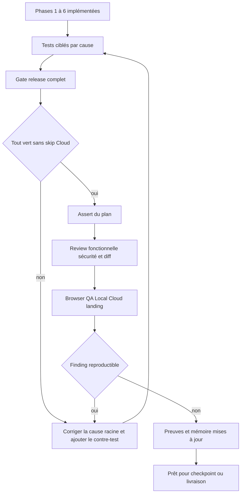
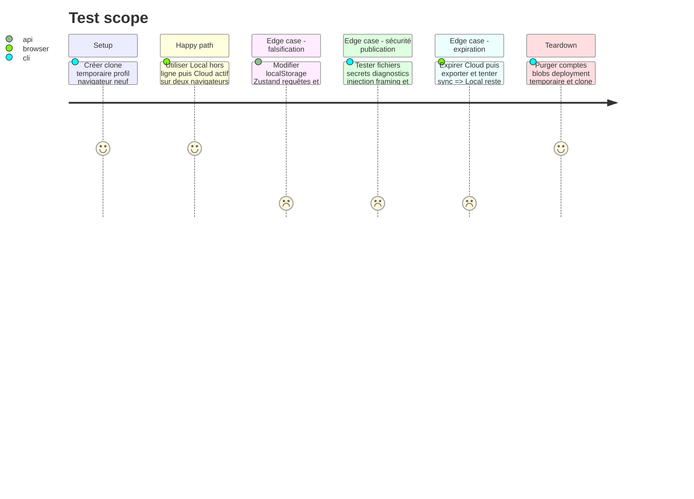

# Instruction: asserter, tester, reviewer et itérer jusqu’au vert

## Frontière de cette phase

Les assertions locales et le gate release sont déjà reproductibles. Les preuves
qui exigent Convex préproduction, Resend, Polar Sandbox, une Preview Vercel ou
une restauration ne sont plus collectées ici : elles appartiennent à
[`2026_08_16_cloud-prelaunch-validation`](../2026_08_16_cloud-prelaunch-validation/plan.md),
dont `verification.md` est l'unique matrice expurgée. Cette phase ne passe à
`done` qu'après retour vert de ce plan directeur.

## Architecture projection

> Tree of the final files. ✅ create · ✏️ modify · ❌ delete

```txt
.
├── AGENTS.md                                      ✏️ commandes et modèle Local/Cloud final
├── README.md                                      ✏️ preuves reproductibles de Local et Cloud
├── PRD.md                                         ✏️ critères produit finaux
├── aidd_docs/memory/
│   ├── architecture.md                           ✏️ Local universel et autorité Cloud serveur
│   ├── codebase-map.md                           ✏️ nouvelles frontières et audits
│   ├── coding-assertions.md                      ✏️ règles anti-paywall et anti-secret
│   ├── database.md                               ✏️ quotas, ownership et cleanup
│   ├── design.md                                 ✏️ deux offres Local gratuit et Cloud payant
│   ├── project-brief.md                          ✏️ modèle économique corrigé
│   ├── testing.md                                ✏️ matrices Local hors ligne, Cloud et publication
│   └── vcs.md                                    ✏️ release par tag et gate GO PUBLIC
└── aidd_docs/tasks/2026_08/2026_08_15_local-cloud-plans/
    ├── plan.md                                   ✏️ statut final fondé sur les preuves
    └── phase-1.md … phase-7.md                   ✏️ statuts et écarts réellement clos
```

## User Journey



## Test Scope



## Tasks to do

### `1)` Exécuter les contre-tests ciblés

> Chaque finding fermé garde le plus petit test qui le ferait revenir au rouge.

1. Phase 1 : matrice Local sans compte, exports >3, ZIP, absence de watermark, Cloud seul et migration des anciennes releases.
2. Phase 2 : authz de chaque mutation, quotas exact/dépassé/concurrent, cleanup orphelin, production sans test-password et webhook borné.
3. Phase 3 : landing FR/EN, deux cartes, prix, CTA, accessibilité, compte Cloud et clone sans backend.
4. Phase 4 : CSP bloquante, anti-framing, prompt injection sans outil, probe single-flight/timeout et redaction.
5. Phases 5-6 : noms interdits, Gitleaks staged/historique/release, artifacts, gate `GO PUBLIC` consigné, rulesets et tag protégé.
6. Corriger à la fonction partagée la plus basse couvrant tous les appelants, puis rejouer le contre-test avant la suite.

### `2)` Passer le gate complet depuis la racine

> Un vert partiel ou un skip Cloud n’est pas une release.

1. Faire inclure à `pnpm run test:release` format, unitaires, typecheck, lint, audit publication, build unique, E2E Cloud strict, contraste, échelle et landing.
2. Exécuter `pnpm run test:release` avec le backend Convex local démarré par la suite et interdire tout skip du projet cloud.
3. Valider un ZIP 6,9 pouces avec `pnpm run validate:export -- <zip>` : 1320×2868, PNG opaque, aucun filigrane et structure attendue.
4. Depuis un clone temporaire sans `.env` ni Convex, exécuter install figé, build, ouverture éditeur et export Local.
5. Sur Preview, exécuter l’audit des headers, les scénarios Cloud à deux comptes et l’inspection bundle/logs/artifacts sans afficher de secret.

### `3)` Asserter les critères de confiance

> Les tests génériques ne prouvent pas seuls le modèle d’autorité.

1. Exécuter `aidd-dev:03-assert` contre chaque critère du plan et relier chaque assertion à une preuve observable.
2. Prouver par appel direct que sans session, sans Cloud et avec un faux entitlement client, projets, assets et settings refusent toute création/mise à jour.
3. Prouver que Local n’importe pas le backend dans son chemin critique, démarre Convex indisponible et conserve exports/ZIP.
4. Prouver que les quotas ne dérivent pas après remplacement, suppression, concurrence et cleanup.
5. Vérifier par lecture API que le dépôt public conserve les protections activées après le gate.

### `4)` Reviewer puis boucler sur chaque finding

> La première review ouvre une boucle, elle ne conclut pas automatiquement.

1. Exécuter `aidd-dev:05-review` sur le diff complet avec priorité à authz, paiement, quota/coût, suppression, webhook, bridge, CSP, secrets et release.
2. Exécuter `aidd-dev:06-test` pour combler tout trou de régression reproductible découvert par la review.
3. Exécuter `aidd-dev:11-browser-qa` en desktop/mobile, clair/sombre, FR/EN sur landing, export, compte, checkout sandbox et sync.
4. Pour chaque finding valide, corriger la cause, ajouter/ajuster le contre-test, puis rejouer test ciblé, gate, assert et review concernés.
5. Utiliser `aidd-dev:09-for-sure` pour répéter la boucle jusqu’à review approuvée, assertion complète, browser QA propre et aucun finding sécurité ouvert.

### `5)` Mettre les documents au même état que le produit

> Une mémoire obsolète recrée le bug à l’itération suivante.

1. Retirer partout « essai », « Licence », « Local payant », héritage Cloud→Local, quota export, filigrane et `VITE_COMMERCIAL_LAUNCH` comme règles actives.
2. Documenter Local gratuit sans compte/Convex, Cloud payant avec entitlement serveur, quotas, effacement, secrets et publication par tag.
3. Vérifier chaque fichier AIDD avec le contrat public de phase 5 avant commit.
4. Marquer une phase `done` seulement avec ses critères observés; marquer le plan `implemented` seulement quand toutes les phases sont fermées.
5. Conserver domaine, paiement réel et v1 derrière les gates du plan Cloud directeur.

## Test acceptance criteria

| Task | Acceptance criteria |
| --- | --- |
| 1 | Chaque ancien finding possède un contre-test rouge sans sa correction et vert avec elle. |
| 2 | Le gate release passe sans skip Cloud, le ZIP est pixel-exact et un clone neuf utilise tout Local sans `.env` ni Convex. |
| 3 | Aucun état client falsifié ne permet un write Cloud et toutes les preuves du plan sont observables sans donnée sensible. |
| 4 | Assert, tests, review et browser QA ont bouclé jusqu’à zéro finding corrigeable et zéro régression. |
| 5 | README, PRD, AGENTS et mémoire AIDD décrivent le même produit et restent entièrement publiables; la visibilité dépend encore du gate explicite. |
