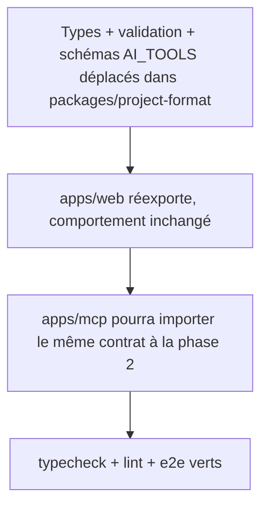

# Instruction: Package partagé `project-format`

## Architecture projection

```txt
packages/
  project-format/
    package.json              ✅ workspace package `@screenforge/project-format`, build tsc
    tsconfig.json             ✅ extends root config
    src/
      index.ts                ✅ barrel explicite
      types.ts                ✅ déplacé de apps/web/src/types/index.ts
      project-validation.ts   ✅ déplacé de apps/web/src/lib/project-validation.ts
      ai-tools.ts             ✅ schémas/constantes de apps/web/src/lib/ai/tools.ts (AI_TOOLS, validateToolCall, PATCHABLE_PROPS) — sans applyToolCalls (il touche Fabric)
      dimensions.ts           ✅ déplacé de apps/web/src/lib/dimensions.ts (constantes Apple)
apps/web/src/
  types/index.ts              ✏️ réexporte depuis @screenforge/project-format
  lib/project-validation.ts   ✏️ réexporte
  lib/dimensions.ts           ✏️ réexporte
  lib/ai/tools.ts             ✏️ importe les schémas du package, garde applyToolCalls (dépendance Fabric)
  package.json                ✏️ ajoute la dep workspace
pnpm-workspace.yaml           ✏️ packages: apps/* + packages/*
```

## User Journey



## Tasks to do

### `1)` Créer le package `packages/project-format`

> Socle de contrat partagé web/mcp : types, validateur projet, schémas d'outils IA, dimensions.

1. Créer `packages/project-format` (package.json `@screenforge/project-format`, build tsc, exports typés) et ajouter `packages/*` à `pnpm-workspace.yaml`.
2. Déplacer `types/index.ts`, `lib/project-validation.ts`, `lib/dimensions.ts` dedans.
3. Extraire de `lib/ai/tools.ts` la partie purement déclarative (noms d'outils, JSON schemas, `validateToolCall`, `PATCHABLE_PROPS`) vers `ai-tools.ts` — **sans** `applyToolCalls` ni aucun import Fabric.

### `2)` Rebaser `apps/web` sur le package

> Réexports uniquement, aucun changement de comportement.

1. Remplacer les fichiers déplacés par des réexports ; `lib/ai/tools.ts` importe les schémas du package et garde l'exécution.
2. Ajouter la dep workspace à `apps/web/package.json` ; corriger les imports internes cassés.

### `3)` Valider la non-régression

1. `pnpm run typecheck` + `pnpm run lint`.
2. `pnpm run test:e2e` — en particulier `e2e/export.spec.ts` (ZIP pixel-exact) et les specs de transform.
3. `pnpm run build`.

## Test acceptance criteria

| Task | Acceptance criteria                                                                                       |
| ---- | --------------------------------------------------------------------------------------------------------- |
| 1    | `packages/project-format` build seul et expose types, `isProject`, dimensions et les schémas `AI_TOOLS` sans dépendance Fabric/DOM. |
| 2    | Typecheck et lint passent sans modification d'appelant ; aucun import web ne pointe vers un chemin déplacé. |
| 3    | La suite e2e passe à l'identique, export 1320×2868 compris.                                                |
