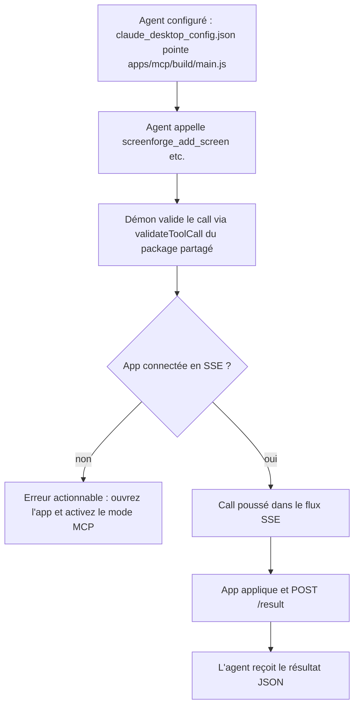

# Instruction: Démon MCP `apps/mcp` — stdio agent + relais HTTP/SSE

## Architecture projection

```txt
apps/mcp/
  package.json               ✅ `@screenforge/mcp`, "type": "module", bin, deps : @modelcontextprotocol/server, zod, hono, @hono/node-server, @screenforge/project-format
  tsconfig.json              ✅ Node16/ES2022 (quickstart officiel)
  README.md                  ✅ config claude_desktop_config.json / codex / opencode + pairing
  src/
    main.ts                  ✅ McpServer + StdioServerTransport + démarre le relais HTTP
    relay/
      server.ts              ✅ hono 127.0.0.1:4591 — POST /pair, GET /events (SSE), POST /result, GET /asset/:id
      pairing.ts             ✅ token bearer minté au démarrage, allowlist Origin (5173/4173/5199), copié du pattern bridge
      session.ts             ✅ file d'appels en attente, corrélation id → Promise, timeout 60s, état app courant
    tools/
      editor-tools.ts        ✅ 1 tool MCP par entrée AI_TOOLS, schéma importé de @screenforge/project-format
      get-state.ts           ✅ tool `screenforge_get_state` : projet/écrans/calques courants (poussés par l'app)
  test/
    relay.test.mjs           ✅ probe node : faux agent → tool call → faux app SSE → résultat
scripts/
  mcp-live-probe.mjs         ✅ probe de bout en bout sans navigateur réel (client SSE simulé)
```

## User Journey



## Tasks to do

### `1)` Scaffolder `apps/mcp`

> Process Node unique : stdio vers l'agent, HTTP/SSE vers l'app. Conventions copiées d'`apps/bridge`.

1. Créer `apps/mcp` (package.json + tsconfig + build tsc vers `build/`, Node ≥ 20).
2. `main.ts` : `McpServer` + `StdioServerTransport` (`@modelcontextprotocol/server` + `…/server/stdio`), logs **stderr uniquement** (stdout corrompt le JSON-RPC).
3. README : snippets `mcpServers` pour Claude Desktop, Codex, opencode — chemins absolus, commande `node`.

### `2)` Relais HTTP/SSE 127.0.0.1:4591

> Miroir du threat model bridge : loopback only, bearer, Origin allowlist.

1. `server.ts` (hono) : `POST /pair` (Origin allowlistée → renvoie le token), `GET /events?token=` (SSE, une seule app connectée à la fois, la nouvelle évince l'ancienne), `POST /result` (bearer, corrélation par id), heartbeat 15s.
2. `pairing.ts` : token minté au démarrage, `crypto.randomUUID` ; aucun fichier, mémoire seule.
3. `session.ts` : file d'attente + `Promise` par call id + timeout 60s ; file vidée avec erreur si l'app se déconnecte.

### `3)` Tools MCP = AI_TOOLS

> Le contrat vient du package partagé — pas de schéma dupliqué.

1. `editor-tools.ts` : pour chaque outil de `AI_TOOLS`, `server.registerTool` avec le schéma du package ; handler = validation (`validateToolCall`) → enqueue → attente du résultat.
2. `screenforge_get_state` : renvoie le dernier état poussé par l'app (projet, écrans, calques, sélection) ou une erreur « app non connectée ».
3. Batch : un call agent peut porter un tableau de tool calls (miroir d'`applyToolCalls`) pour qu'une campagne entière reste atomique.

### `4)` Probe sans navigateur

> Le démon se teste seul, avant toute intégration web.

1. `scripts/mcp-live-probe.mjs` : spawne le démon, joue un client MCP stdio (tools/list + tools/call), joue une fausse app (fetch /pair + EventSource + POST /result), asserte la corrélation et les erreurs (app absente, timeout, id hors catalogue rejeté avec valeurs valides listées).

## Test acceptance criteria

| Task | Acceptance criteria                                                                                              |
| ---- | ---------------------------------------------------------------------------------------------------------------- |
| 1    | Le démon démarre en stdio, répond à `tools/list` depuis Claude Desktop/Codex configuré, et ne logge rien sur stdout. |
| 2    | Une seconde connexion SSE évince la première ; les calls en attente échouent proprement à la déconnexion ; `/pair` refuse une Origin hors allowlist. |
| 3    | Chaque tool `AI_TOOLS` est listé avec son schéma ; un call invalide est rejeté côté démon avec message actionnable ; un batch arrive à l'app en une seule livraison. |
| 4    | La probe passe en CI : round-trip agent → démon → fausse app → résultat, plus les 3 cas d'erreur.                  |
