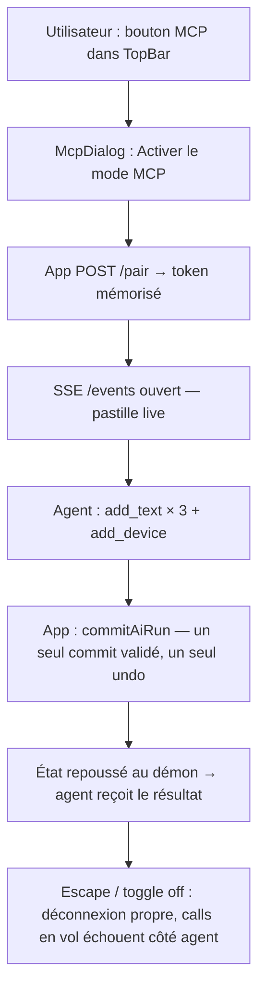

# Instruction: Côté web — mode MCP, pairing, application live + UI

## Architecture projection

```txt
apps/web/src/
  lib/mcp/
    client.ts                 ✅ EventSource /events + POST /result, reconnect backoff, heartbeat
    session.ts                ✅ applique les batches via commitAiRun (runEditorTransaction) ; pousse l'état après chaque commit
  stores/
    mcp.store.ts              ✅ zustand vanilla : status (off/connecting/live/error), token, dernier agent vu
  components/
    mcp/
      McpDialog.tsx           ✅ dialog d'activation/pairing + état de connexion
      McpStatusDot.tsx        ✅ pastille d'état dans TopBar (neutre, jamais accent)
    toolbar/TopBar.tsx        ✏️ bouton icon-only (aria-label « Connexion MCP ») ouvrant McpDialog
  main.tsx                    ✏️ démarre le client SSE quand le mode est activé (persisté en localStorage)
e2e/
  mcp-live.spec.ts            ✅ e2e : faux démon MCP (fixture Playwright) → app connectée → layer ajouté → 1 undo
```

## User Journey



## Wireframe

```txt
TopBar (h-12)                                                          McpDialog (modal, 18px)
┌────────────────────────────────────────────────────────────────┐    ┌──────────────────────────────────┐
│ [projet] ···· outils ···· [Export]                         [◉] │    │ Connexion MCP                    │
│                                                            (1) │    │                                  │
└────────────────────────────────────────────────────────────────┘    │ Statut : ● Connecté — agent actif│
                                                                       │                        (2)     │
(1) IconButton aria-label « Connexion MCP », pastille d'état           │                                  │
    neutre (gris = off, plein = live). Jamais d'accent lime.           │ L'agent externe peut créer et    │
                                                                       │ modifier ce projet tant que le   │
                                                                       │ mode est actif.            (3)   │
                                                                       │                                  │
                                                                       │ [ Désactiver ]      [ Fermer ]   │
                                                                       │        (4)              (5)      │
                                                                       └──────────────────────────────────┘
(2) status line : off / connexion… / connecté (+ nom du client) / erreur actionnable
(3) copy explicative, une phrase, ton neutre — aucun token affiché (pairing automatique au geste)
(4) Button ghost — coupe le SSE, oublie le token   (5) Button default — ferme
```

## Tasks to do

### `1)` Store + client SSE

> Connexion sortante uniquement, reconnecte seule, meurt proprement.

1. `stores/mcp.store.ts` (zustand vanilla) : `status`, `clientName`, `enable()/disable()`, persistance localStorage du flag (jamais du token).
2. `lib/mcp/client.ts` : `POST /pair` au geste utilisateur → token en mémoire ; `EventSource /events?token=` ; backoff exponentiel (1s→15s) ; `close()` net sur disable/unload.
3. Aucun démarrage automatique sans flag persisté — le mode est un choix explicite par session ou mémorisé.

### `2)` Application des batches

> Réutilise l'exécuteur existant — aucun nouveau chemin de mutation.

1. `lib/mcp/session.ts` : batch SSE → `commitAiRun` (même chemin que les runs IA in-app : validation, un commit, un undo).
2. Après chaque commit, pousser l'état (projet sérialisé sans data URLs — assetIds uniquement) via `POST /result`.
3. Erreurs (validation, layer inconnu) renvoyées à l'agent avec le message du validateur.

### `3)` UI — dialog + pastille TopBar

> Primitives `ui/` uniquement, chromie neutre, densité chrome.

1. `McpDialog` : Dialog existant, status line, copy une phrase, boutons Activer/Désactiver/Fermer ; aucun token affiché.
2. `McpStatusDot` + IconButton dans TopBar (aria-label « Connexion MCP », tooltip) ; état via sélecteur dérivé (`status !== 'off'`), pas de re-render brut.
3. Français, pas d'all-caps, focus ring visible, Escape ferme le dialog.

### `4)` e2e live

> Faux démon piloté par Playwright — pas besoin d'un vrai agent.

1. Fixture Playwright : petit serveur MCP-relais lancé par le test (mêmes routes que `apps/mcp`).
2. `e2e/mcp-live.spec.ts` : activer le mode → pousser un batch (fond dégradé + texte + device frame) → asserter canvas/store (`__sfStores`, `__sfCanvas` en DEV) → Ctrl+Z unique annule tout le batch → désactiver coupe le flux.

## Test acceptance criteria

| Task | Acceptance criteria                                                                                          |
| ---- | ------------------------------------------------------------------------------------------------------------ |
| 1    | Mode off par défaut ; l'activation demande un geste utilisateur ; la coupure est nette et l'agent reçoit une erreur explicite sur ses calls suivants. |
| 2    | Un batch agent = un commit validé = un undo ; un call invalide ne touche jamais le projet et revient à l'agent avec la liste des valeurs valides. |
| 3    | Dialog et pastille respectent le design system (primitives `ui/`, neutre, aria-labels FR) et `audit:contrast` reste vert. |
| 4    | Le spec e2e passe, y compris le round-trip undo et la déconnexion.                                            |
