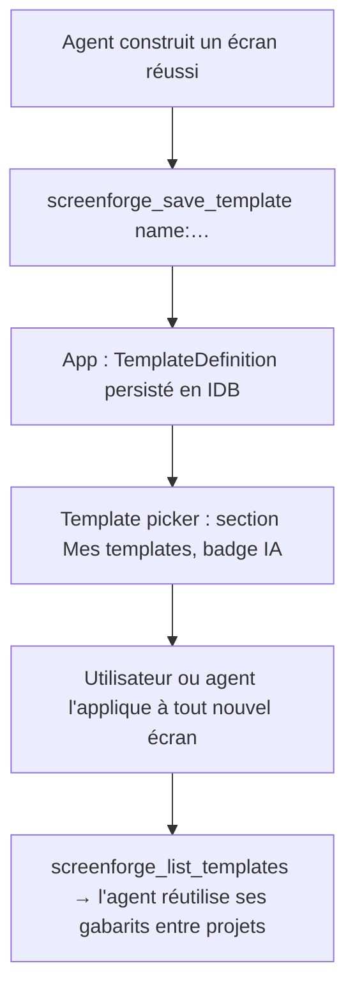

# Instruction: Templates runtime générés par IA

## Architecture projection

```txt
apps/web/src/
  lib/
    custom-templates.ts       ✅ registry IDB (table `templates` ou store dédié) : TemplateDefinition + source: 'ai'|'user'
  stores/
    project.store.ts          ✏️ actions saveCustomTemplate / removeCustomTemplate
  components/
    template-picker/          ✏️ section « Mes templates » au-dessus de TEMPLATES hardcodés, badge neutre « IA »
apps/mcp/src/
  tools/
    save-template.ts          ✅ tool `screenforge_save_template` : depuis l'écran courant ou une spec
    list-templates.ts         ✅ tool `screenforge_list_templates`
e2e/
  mcp-templates.spec.ts       ✅ agent sauvegarde un template → visible dans le picker → applicable à un nouvel écran
```

## User Journey



## Tasks to do

### `1)` Registry IDB de templates custom

> Les templates deviennent une donnée, plus seulement du code.

1. `custom-templates.ts` : table IDB (bump schema v3 : store `templates`, keyPath `id`), valeur = `TemplateDefinition` + `source`, validation `isProject`-style sur les layers.
2. `project.store.ts` : `saveCustomTemplate(name, fromScreenId | definition)`, `removeCustomTemplate(id)`, hydratation au démarrage.
3. Migration douce : aucune donnée existante touchée.

### `2)` Picker : section custom

1. Section « Mes templates » dans le `TemplatePicker` existant, au-dessus du catalogue ; badge neutre « IA » quand `source: 'ai'`.
2. Suppression au survol (IconButton ghost, aria-label FR) ; application = chemin `replaceScreenContent` existant.

### `3)` Tools MCP templates

1. `screenforge_save_template` : `fromScreenId?` (défaut écran actif) ou `definition?` (validée) ; nom requis, collision → suffixe ou refus explicite.
2. `screenforge_list_templates` : ids, noms, source, nombre de layers — pour que l'agent compose avec ses propres gabarits.

### `4)` e2e templates

1. `e2e/mcp-templates.spec.ts` : batch agent → save_template → reload → template toujours là → appliqué à un nouvel écran → rendu identique.

## Test acceptance criteria

| Task | Acceptance criteria                                                                                          |
| ---- | ------------------------------------------------------------------------------------------------------------ |
| 1    | Un template custom survit au reload et à la migration ; un template invalide est refusé à la sauvegarde.      |
| 2    | Le picker affiche « Mes templates » avec badge « IA », suppression accessible au clavier, application immédiate. |
| 3    | L'agent sauvegarde, liste et réapplique un template en une session ; collision de nom gérée explicitement.    |
| 4    | Le spec e2e passe, reload compris.                                                                            |
