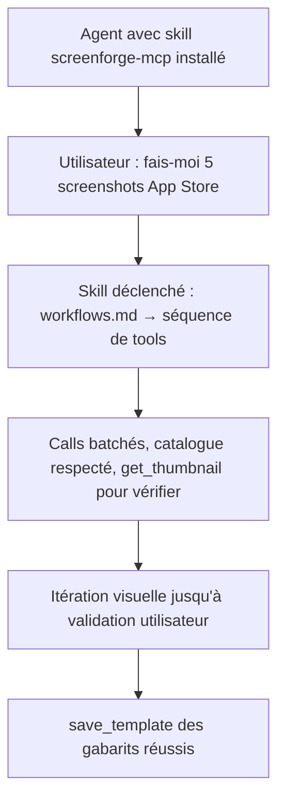

# Instruction: Skill agent « utiliser le MCP ScreenForge »

## Architecture projection

```txt
.opencode/skills/screenforge-mcp/           ✅ généré via la skill aidd-context-04-skill-generate (router cross-tools)
  SKILL.md                                  ✅ router : description + déclencheurs (« screenforge », « app store screenshots »…)
  references/
    tools.md                                ✅ vocabulaire AI_TOOLS : schémas, catalogues fermés, exemples de calls
    workflows.md                            ✅ recettes : projet depuis brief, copie de screenshot, campagne multi-écrans, templates
    pitfalls.md                             ✅ pièges : batch = 1 undo, app non connectée, catalogue fermé, limites de fidélité
.claude/skills/screenforge-mcp/             ✅ généré par la même passe (cross-tool, selon sortie du générateur)
apps/mcp/README.md                          ✏️ lien vers le skill comme documentation d'usage côté agent
```

## User Journey



## Tasks to do

### `1)` Générer le skill via `aidd-context-04-skill-generate`

> Ne pas l'écrire à la main : le générateur produit le router conforme aux conventions cross-tools du poste.

1. Lancer la skill `aidd-context-04-skill-generate` avec pour brief : skill « screenforge-mcp », déclencheurs (création de screenshots App Store, pilotage ScreenForge), cible = agents Claude/Codex/opencode.
2. Sources à fournir au générateur : `apps/mcp/README.md`, les schémas `AI_TOOLS` du package partagé, ce dossier de plan.

### `2)` Contenu de référence

> Le skill enseigne le contrat et les recettes, pas seulement la liste des outils.

1. `references/tools.md` : chaque tool avec schéma, valeurs de catalogue valides, exemple de call JSON — généré depuis `packages/project-format` (script ou copie datée, version affichée).
2. `references/workflows.md` : 4 recettes — projet depuis brief, copie de screenshot (décomposition + `add_image` + itération `get_thumbnail`), campagne cohérente, cycle templates.
3. `references/pitfalls.md` : batcher pour un undo propre, ne jamais inventer d'id hors catalogue, gérer « app non connectée », fidélité structurelle ≠ pixel-perfect.

### `3)` Validation

1. Le skill se déclenche sur une demande « crée des screenshots App Store avec ScreenForge » (test manuel avec opencode et Claude).
2. Un agent frais, sans autre contexte, produit un projet 3 écrans valide en suivant le skill seul.

## Test acceptance criteria

| Task | Acceptance criteria                                                                                              |
| ---- | ---------------------------------------------------------------------------------------------------------------- |
| 1    | Le skill est produit par `aidd-context-04-skill-generate` et installé pour les outils hôtes du poste.              |
| 2    | `tools.md` reflète exactement les schémas du package partagé (version affichée, régénération documentée).         |
| 3    | Un agent frais suit le skill et produit un projet 3 écrans appliqué en live sans erreur de validation, avec itération visuelle via `get_thumbnail`. |
