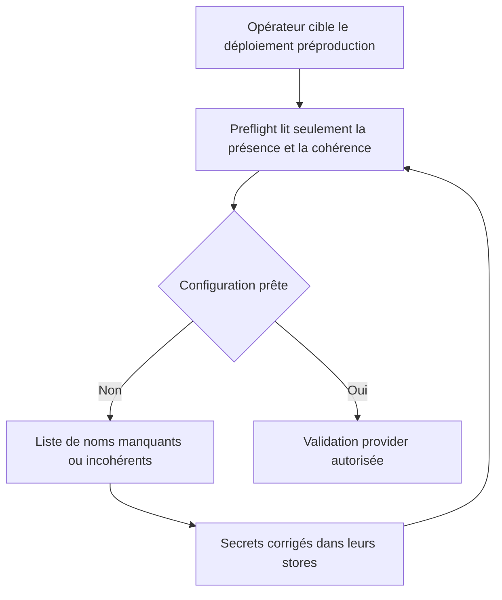
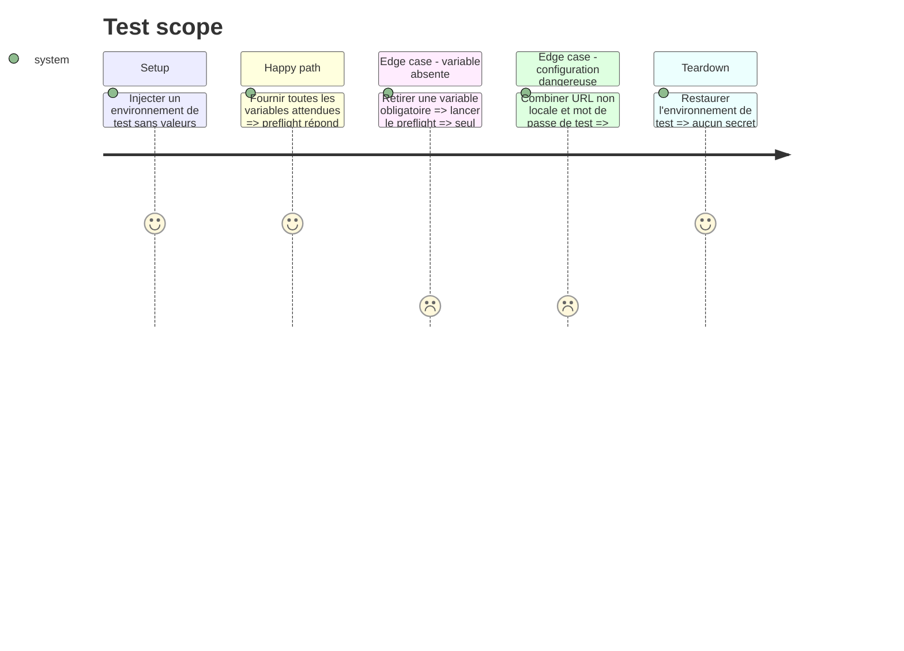

# Instruction: Aligner le runbook Cloud et ajouter un preflight sans fuite

## Architecture projection

> Tree of the final files. ✅ create · ✏️ modify · ❌ delete

```txt
.
├── apps/backend/convex/
│   ├── ✅ preflight.ts
│   └── ✅ preflight.test.ts
└── aidd_docs/tasks/2026_08/
    ├── 2026_08_11_migration-convex/
    │   └── ✏️ environnements.md
    ├── 2026_08_15_local-cloud-plans/
    │   ├── ✏️ plan.md
    │   ├── ✏️ phase-6.md
    │   └── ✏️ phase-7.md
    └── 2026_08_16_cloud-prelaunch-validation/
        └── ✅ verification.md
```

## User Journey



## Test Scope



## Tasks to do

### `1)` Ajouter un preflight Cloud interne

> Refuser une configuration incomplète ou dangereuse avant tout test externe, sans jamais retourner ni journaliser une valeur secrète.

1. Créer une query interne qui accepte la cible `preproduction` ou `production` et retourne uniquement `ready`, les noms manquants et les règles incohérentes.
2. Couvrir auth, origine, Resend et Polar avec les noms déjà définis par `convex.config.ts`; garder l’absence de `POLAR_SERVER` équivalente à Sandbox.
3. Refuser `AUTH_TEST_PASSWORD` dès que `SITE_URL` n’est pas une origine loopback et refuser Polar production pendant un preflight préproduction.
4. Ajouter un test unitaire minimal pour le cas prêt, le manque d’une variable et les deux configurations dangereuses.

### `2)` Corriger les runbooks et ouvrir la preuve publique

> Faire des documents versionnés une procédure exacte et non un dépôt de secrets.

1. Supprimer de `environnements.md` les anciens produits Local payants, variables `POLAR_LICENCE_*` et signatures de commandes obsolètes.
2. Documenter uniquement le produit Cloud et la mutation actuelle `setComplimentaryAccess` avec `cloud` et une note non sensible.
3. Réconcilier l’ancien plan Local/Cloud avec l’état réellement livré et renvoyer les validations externes vers ce nouveau plan.
4. Créer `verification.md` avec une matrice rouge/verte, les dates, commits et URLs publiques; interdire jetons, emails personnels, payloads, cookies et captures de consoles sensibles.

## Test acceptance criteria

| Task | Acceptance criteria |
| --- | --- |
| 1 | Une configuration complète renvoie `ready`; chaque absence ou combinaison dangereuse connue bloque le preflight et aucune valeur de secret n’apparaît dans la sortie ou les logs. |
| 2 | Les documents n’annoncent plus de Local payant, utilisent les noms et commandes actuels, et la preuve peut être publiée sans donnée personnelle ni secret exploitable. |
