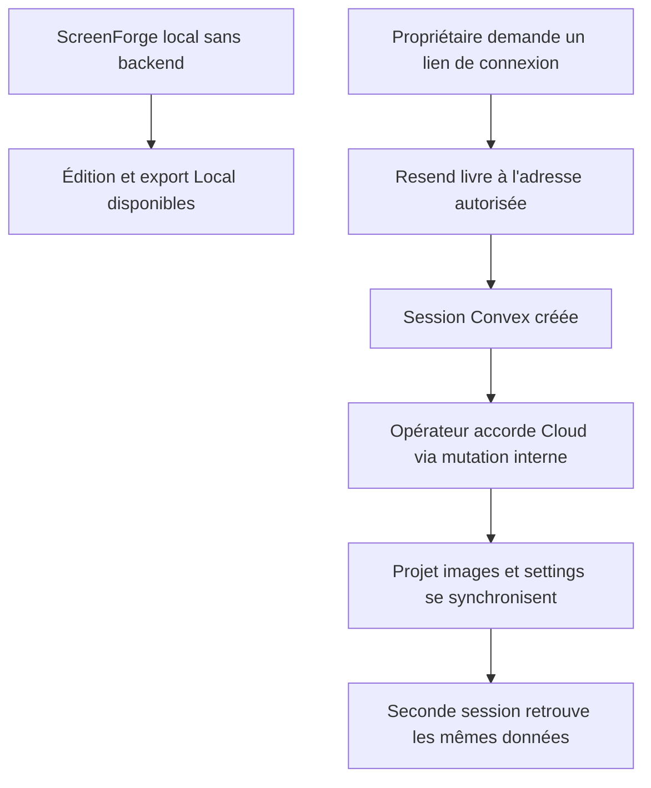
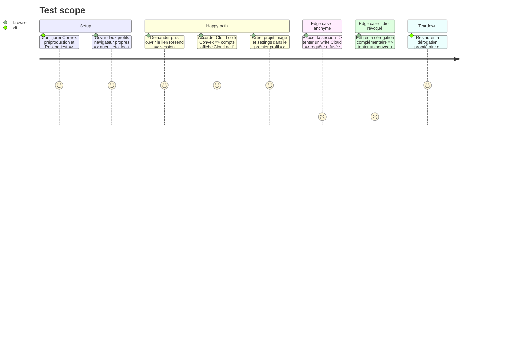

# Instruction: Valider Convex, Resend et le compte propriétaire en préproduction

## Architecture projection

> Tree of the final files. ✅ create · ✏️ modify · ❌ delete

```txt
.
└── aidd_docs/tasks/2026_08/2026_08_16_cloud-prelaunch-validation/
    └── ✏️ verification.md
```

## User Journey



## Test Scope



## Tasks to do

### `1)` Préparer Convex préproduction et Resend test

> Rendre l’authentification réelle testable sans domaine ni destinataire externe.

1. Poser les secrets dans le déploiement Convex fixe de préproduction, avec `POLAR_SERVER` absent ou `sandbox` et une origine loopback pour le premier test.
2. Utiliser `ScreenForge <onboarding@resend.dev>` et l’adresse propriétaire autorisée par le compte Resend; ne consigner ni cette adresse ni la clé dans Git.
3. Déployer le backend du commit candidat puis exécuter le preflight contre ce déploiement.
4. Vérifier dans Resend la livraison et dans les logs Convex l’absence de lien magique, token, cookie ou adresse complète.

### `2)` Créer le compte propriétaire Cloud

> Donner au propriétaire tous les droits client Cloud, sans privilège d’administration.

1. Se connecter une fois par lien magique afin que Convex crée le compte réel.
2. Identifier ce compte dans la table `users` du dashboard, sans copier son email dans les documents.
3. Appeler la mutation interne `mirror:setComplimentaryAccess` avec `cloud: true` et une note opérationnelle non sensible.
4. Vérifier que `mirror:myEntitlements` annonce Cloud actif pour cette session et qu’aucune fonction client ne peut appeler la mutation interne.

### `3)` Prouver Local et la synchronisation Cloud

> Tester le contrat produit sur deux profils indépendants et par refus serveur.

1. Démarrer l’app sans URL Convex et vérifier création, édition, image, export PNG et ZIP sans compte ni paywall.
2. Avec préproduction active, créer un projet, importer une image et modifier des settings dans un premier profil connecté.
3. Ouvrir le compte dans un second profil et comparer projet, asset et settings, puis modifier un champ et vérifier le retour dans le premier.
4. Révoquer temporairement Cloud, falsifier l’état client et tenter chaque write; constater le refus serveur et l’absence de mutation.
5. Réaccorder la dérogation et supprimer les fixtures de validation.

## Test acceptance criteria

| Task | Acceptance criteria |
| --- | --- |
| 1 | Un lien magique réel atteint uniquement l’adresse propriétaire autorisée, ouvre la bonne origine et aucun secret ou lien d’authentification n’est publié dans un log ou artifact. |
| 2 | Le compte propriétaire possède Cloud actif comme client complémentaire, sans rôle admin, et le droit ne peut être accordé ou retiré depuis le navigateur. |
| 3 | Local reste complet sans Convex; deux profils synchronisent projet, image et settings; anonyme, droit révoqué et état client falsifié ne produisent aucun write Cloud. |
