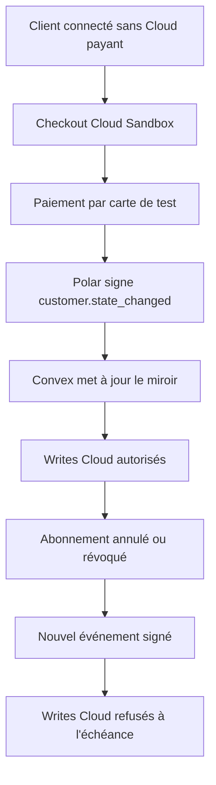
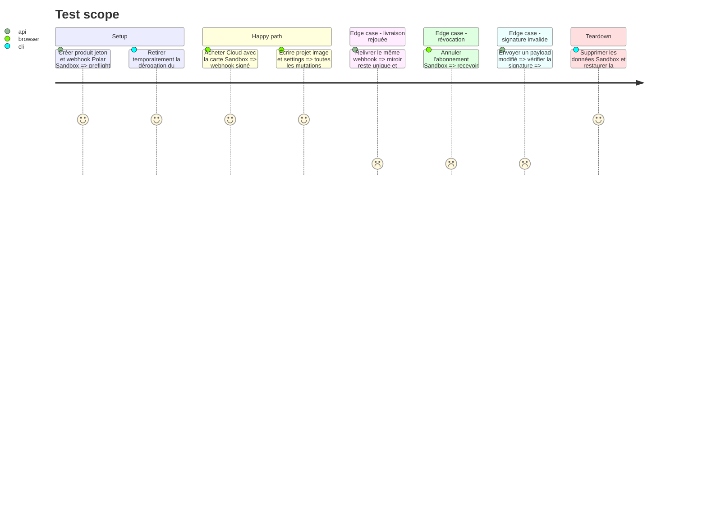

# Instruction: Valider Polar Sandbox et les entitlements réels

## Architecture projection

> Tree of the final files. ✅ create · ✏️ modify · ❌ delete

```txt
.
└── aidd_docs/tasks/2026_08/2026_08_16_cloud-prelaunch-validation/
    └── ✏️ verification.md
```

## User Journey



## Test Scope



## Tasks to do

### `1)` Configurer Polar Sandbox

> Reproduire le futur produit Cloud sans toucher à la production Polar.

1. Créer ou vérifier une organisation Sandbox, un unique produit Cloud au prix commercial candidat et un token limité à cette organisation.
2. Enregistrer l’endpoint webhook Convex de préproduction et l’événement `customer.state_changed`.
3. Poser token, secret webhook et identifiant du produit dans Convex préproduction; garder `POLAR_SERVER=sandbox` explicite pendant la preuve.
4. Exécuter le preflight et noter uniquement les quatre derniers caractères de l’identifiant produit dans `verification.md`.

### `2)` Prouver achat, miroir et révocation

> Vérifier le vrai parcours provider jusqu’à l’autorisation serveur.

1. Retirer temporairement la dérogation complémentaire d’un compte de test et confirmer Cloud inactif.
2. Lancer le checkout depuis ScreenForge, payer avec la carte Sandbox officielle et confirmer que le succès revient sur l’origine configurée.
3. Vérifier que le webhook signé cible l’utilisateur Convex attendu, qu’une seule ligne entitlement existe et que les writes Cloud deviennent possibles.
4. Relivrer le même événement depuis Polar et confirmer l’idempotence, puis exécuter les tests unitaires d’ordre inversé déjà présents.
5. Annuler l’abonnement Sandbox, vérifier l’état et l’échéance propagés, puis constater le refus des nouveaux writes après expiration.
6. Restaurer la dérogation du propriétaire indépendamment de l’état Polar et supprimer les fixtures de test.

### `3)` Vérifier les frontières publiques

> Confirmer que seul Polar peut modifier le miroir commercial.

1. Rejouer le payload sans signature, avec signature altérée et au-delà de la limite de taille.
2. Vérifier les statuts 403 ou 413 attendus, l’absence d’écriture et l’absence du corps brut dans les logs.
3. Tenter d’appeler le miroir interne depuis un client authentifié puis anonyme et confirmer qu’aucune route publique ne l’expose.

## Test acceptance criteria

| Task | Acceptance criteria |
| --- | --- |
| 1 | Polar Sandbox contient un seul produit Cloud, le webhook cible uniquement Convex préproduction et le preflight est vert sans secret exposé. |
| 2 | Un paiement test accorde Cloud au bon compte, une relivraison ne duplique rien, une annulation retire le droit selon l’échéance et la dérogation propriétaire reste indépendante. |
| 3 | Les payloads non signés, altérés ou trop grands sont refusés sans mutation ni donnée sensible dans les logs; aucune API client ne peut modifier le miroir. |
